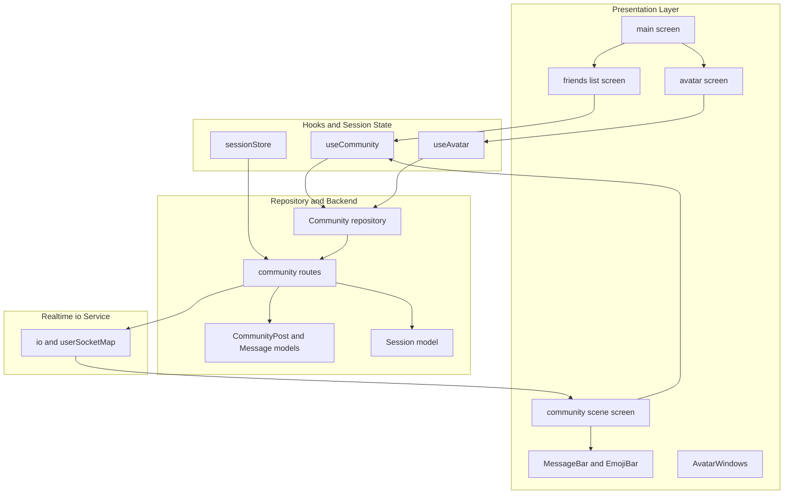
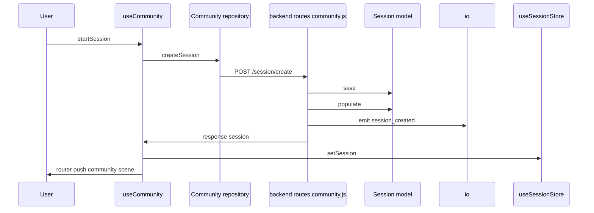
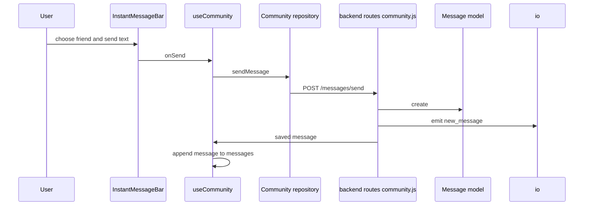
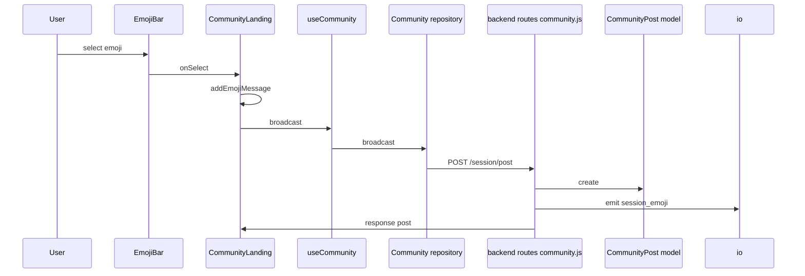

# Community, Sessions, and Avatar Personalization

## Overview

This feature set connects the community menu, friend management, direct chat, and in-session emoji broadcast into a single social loop. On the client, the community landing menu opens the avatar editor, the friends list, and the live community scene; on the server, the community router persists friends, messages, and sessions with Mongoose models and pushes realtime updates through `io`.

The session flow is the bridge between the repository layer and backend persistence. `app/community/hooks/sessionStore.ts` keeps the active session in Zustand, `app/repositories/Community.ts` creates and leaves sessions through `backend/routes/community.js`, and the backend writes to `backend/models/Chat/Session.js` while broadcasting socket events for joins, direct messages, and emoji posts. Avatar personalization is wired through `app/community/components/avatar.tsx`, `app/community/components/AvatarWindows.tsx`, and `app/community/hooks/useAvatar.ts`, where the selected hair and skin are loaded, edited, and saved.

## Architecture Overview



## Repository to Route Contract

### Community Repository

*`app/repositories/Community.ts`*

The repository is the client-side contract for friends, messages, broadcasts, and sessions. Every request pulls the token from `AsyncStorage`, adds `Authorization` and `Content-Type`, and targets the shared community base URL.

| Method | Description | Backend route |
| --- | --- | --- |
| `getFriends` | Loads the current user's friends list from the server | `GET /friends/:userId` |
| `createSession` | Creates a community session for the current user and selected friends | `POST /session/create` |
| `leaveSession` | Leaves an active session for a user | `POST /session/leave` |
| `broadcast` | Posts a session emoji or other session-scoped content | `POST /session/post` |
| `addFriend` | Adds a friend by friend code | `POST /friends/add` |
| `getMyFriendCode` | Reads the current user's friend code | `GET /friendcode/:userId` |
| `getFriendRequests` | Loads pending friend requests | `GET /friends/requests/:userId` |
| `removeFriend` | Removes an existing friend connection | `POST /friends/remove` |
| `approveFriendRequest` | Accepts a pending friend request | `POST /friends/approve` |
| `denyFriendRequest` | Rejects a pending friend request | `POST /friends/deny` |
| `sendMessage` | Sends a direct message to a friend | `POST /messages/send` |
| `getMessagesWithFriend` | Loads direct-message history for a selected friend | client fetch only |


### Session Store Mapping

> **Note:** `communityroutes.post("/friends/add")` and `communityroutes.post("/friends/approve")` only update the current user's `friends` array. The reciprocal update is commented out in `/friends/add` and absent in `/friends/approve`, so the stored friend relationship is one-sided in those handlers.

*`app/community/hooks/sessionStore.ts`*

`useSessionStore` is the local session cache for community gameplay. `startSession` in `useCommunity` writes the created session into this store, `leave` clears it, and `hydrateSession` reloads it from the backend session document.

| Store method | Backend contract | Effect |
| --- | --- | --- |
| `setSession` | Uses the session returned by `POST /session/create` | Stores the active session in Zustand |
| `clearSession` | Used after leaving a session | Resets `session` to `null` |
| `hydrateSession` | `GET /session/:sessionId` | Replaces local session state with the backend session payload or clears it on failure |


## API Integration

### Get Friends List

*`backend/routes/community.js`*

```api
{
    "title": "Get Friends List",
    "description": "Loads the current user's friends with selected profile fields",
    "method": "GET",
    "baseUrl": "http://localhost:5000/api/community",
    "endpoint": "/friends/{userId}",
    "headers": [
        {
            "key": "Authorization",
            "value": "Bearer <token>",
            "required": true
        },
        {
            "key": "Content-Type",
            "value": "application/json",
            "required": true
        }
    ],
    "queryParams": [],
    "pathParams": [
        {
            "key": "userId",
            "value": "66f100000000000000000001",
            "required": true
        }
    ],
    "bodyType": "none",
    "requestBody": "",
    "formData": [],
    "rawBody": "",
    "responses": {
        "200": {
            "description": "Friends returned",
            "body": "{\n    \"friends\": [\n        {\n            \"_id\": \"66f100000000000000000002\",\n            \"name\": \"Amina\",\n            \"username\": \"amina7\",\n            \"level\": 12,\n            \"avatar\": {\n                \"skin\": \"skin3\",\n                \"hair\": \"hair5\"\n            }\n        }\n    ]\n}"
        },
        "404": {
            "description": "User not found",
            "body": "{\n    \"message\": \"User not found\"\n}"
        },
        "500": {
            "description": "Server error",
            "body": "{\n    \"message\": \"Server error\"\n}"
        }
    }
}
```

### Add Friend

*`backend/routes/community.js`*

```api
{
    "title": "Add Friend",
    "description": "Adds a friend using a friend code",
    "method": "POST",
    "baseUrl": "http://localhost:5000/api/community",
    "endpoint": "/friends/add",
    "headers": [
        {
            "key": "Authorization",
            "value": "Bearer <token>",
            "required": true
        },
        {
            "key": "Content-Type",
            "value": "application/json",
            "required": true
        }
    ],
    "queryParams": [],
    "pathParams": [],
    "bodyType": "json",
    "requestBody": "{\n    \"userId\": \"66f100000000000000000001\",\n    \"friendCode\": \"F-9910\"\n}",
    "formData": [],
    "rawBody": "",
    "responses": {
        "200": {
            "description": "Friend added",
            "body": "{\n    \"message\": \"Friend added!\",\n    \"friend\": {\n        \"name\": \"Noor\",\n        \"username\": \"noor2\",\n        \"friendCode\": \"F-9910\"\n    }\n}"
        },
        "400": {
            "description": "Invalid request",
            "body": "{\n    \"message\": \"You can't add yourself\"\n}"
        },
        "404": {
            "description": "User or friend code not found",
            "body": "{\n    \"message\": \"No user found with that code\"\n}"
        },
        "500": {
            "description": "Server error",
            "body": "{\n    \"message\": \"Server error\"\n}"
        }
    }
}
```

### Get My Friend Code

*`backend/routes/community.js`*

```api
{
    "title": "Get My Friend Code",
    "description": "Returns the current user's friend code",
    "method": "GET",
    "baseUrl": "http://localhost:5000/api/community",
    "endpoint": "/friendcode/{userId}",
    "headers": [
        {
            "key": "Authorization",
            "value": "Bearer <token>",
            "required": true
        },
        {
            "key": "Content-Type",
            "value": "application/json",
            "required": true
        }
    ],
    "queryParams": [],
    "pathParams": [
        {
            "key": "userId",
            "value": "66f100000000000000000001",
            "required": true
        }
    ],
    "bodyType": "none",
    "requestBody": "",
    "formData": [],
    "rawBody": "",
    "responses": {
        "200": {
            "description": "Friend code returned",
            "body": "{\n    \"friendCode\": \"F-4821\"\n}"
        },
        "404": {
            "description": "User not found",
            "body": "{\n    \"message\": \"User not found\"\n}"
        },
        "500": {
            "description": "Server error",
            "body": "{\n    \"message\": \"Server error\"\n}"
        }
    }
}
```

### Remove Friend

*`backend/routes/community.js`*

```api
{
    "title": "Remove Friend",
    "description": "Removes a friend from both friend lists",
    "method": "POST",
    "baseUrl": "http://localhost:5000/api/community",
    "endpoint": "/friends/remove",
    "headers": [
        {
            "key": "Authorization",
            "value": "Bearer <token>",
            "required": true
        },
        {
            "key": "Content-Type",
            "value": "application/json",
            "required": true
        }
    ],
    "queryParams": [],
    "pathParams": [],
    "bodyType": "json",
    "requestBody": "{\n    \"userId\": \"66f100000000000000000001\",\n    \"friendId\": \"66f100000000000000000002\"\n}",
    "formData": [],
    "rawBody": "",
    "responses": {
        "200": {
            "description": "Friend removed",
            "body": "{\n    \"message\": \"Friend removed\"\n}"
        },
        "400": {
            "description": "Missing fields",
            "body": "{\n    \"message\": \"Missing userId or friendId\"\n}"
        },
        "500": {
            "description": "Server error",
            "body": "{\n    \"message\": \"Server error\"\n}"
        }
    }
}
```

### Get Friend Requests

*`backend/routes/community.js`*

```api
{
    "title": "Get Friend Requests",
    "description": "Loads pending friend requests for a user",
    "method": "GET",
    "baseUrl": "http://localhost:5000/api/community",
    "endpoint": "/friends/requests/{userId}",
    "headers": [
        {
            "key": "Authorization",
            "value": "Bearer <token>",
            "required": true
        },
        {
            "key": "Content-Type",
            "value": "application/json",
            "required": true
        }
    ],
    "queryParams": [],
    "pathParams": [
        {
            "key": "userId",
            "value": "66f100000000000000000001",
            "required": true
        }
    ],
    "bodyType": "none",
    "requestBody": "",
    "formData": [],
    "rawBody": "",
    "responses": {
        "200": {
            "description": "Requests returned",
            "body": "{\n    \"requests\": [\n        {\n            \"_id\": \"66f100000000000000000003\",\n            \"name\": \"Noor\",\n            \"username\": \"noor2\",\n            \"level\": 8,\n            \"avatar\": {\n                \"skin\": \"skin4\",\n                \"hair\": \"hair2\"\n            },\n            \"friendCode\": \"F-9910\"\n        }\n    ]\n}"
        },
        "404": {
            "description": "User not found",
            "body": "{\n    \"message\": \"User not found\"\n}"
        },
        "500": {
            "description": "Server error",
            "body": "{\n    \"message\": \"Server error\"\n}"
        }
    }
}
```

### Approve Friend Request

*`backend/routes/community.js`*

```api
{
    "title": "Approve Friend Request",
    "description": "Accepts a pending request and returns the accepted friend profile",
    "method": "POST",
    "baseUrl": "http://localhost:5000/api/community",
    "endpoint": "/friends/approve",
    "headers": [
        {
            "key": "Authorization",
            "value": "Bearer <token>",
            "required": true
        },
        {
            "key": "Content-Type",
            "value": "application/json",
            "required": true
        }
    ],
    "queryParams": [],
    "pathParams": [],
    "bodyType": "json",
    "requestBody": "{\n    \"userId\": \"66f100000000000000000001\",\n    \"friendId\": \"66f100000000000000000003\"\n}",
    "formData": [],
    "rawBody": "",
    "responses": {
        "200": {
            "description": "Request approved",
            "body": "{\n    \"message\": \"Friend approved\",\n    \"friend\": {\n        \"_id\": \"66f100000000000000000003\",\n        \"name\": \"Noor\",\n        \"username\": \"noor2\",\n        \"level\": 8,\n        \"avatar\": {\n            \"skin\": \"skin4\",\n            \"hair\": \"hair2\"\n        }\n    }\n}"
        },
        "404": {
            "description": "Request not found",
            "body": "{\n    \"message\": \"No request found\"\n}"
        },
        "500": {
            "description": "Server error",
            "body": "{\n    \"message\": \"Server error\"\n}"
        }
    }
}
```

### Deny Friend Request

*`backend/routes/community.js`*

```api
{
    "title": "Deny Friend Request",
    "description": "Removes the requester from the current user's friend list",
    "method": "POST",
    "baseUrl": "http://localhost:5000/api/community",
    "endpoint": "/friends/deny",
    "headers": [
        {
            "key": "Authorization",
            "value": "Bearer <token>",
            "required": true
        },
        {
            "key": "Content-Type",
            "value": "application/json",
            "required": true
        }
    ],
    "queryParams": [],
    "pathParams": [],
    "bodyType": "json",
    "requestBody": "{\n    \"userId\": \"66f100000000000000000001\",\n    \"friendId\": \"66f100000000000000000003\"\n}",
    "formData": [],
    "rawBody": "",
    "responses": {
        "200": {
            "description": "Request denied",
            "body": "{\n    \"message\": \"Request denied\"\n}"
        },
        "500": {
            "description": "Server error",
            "body": "{\n    \"message\": \"Server error\"\n}"
        }
    }
}
```

### Send Direct Message

*`backend/routes/community.js`*

```api
{
    "title": "Send Direct Message",
    "description": "Creates a persisted direct message and emits it to the receiver socket",
    "method": "POST",
    "baseUrl": "http://localhost:5000/api/community",
    "endpoint": "/messages/send",
    "headers": [
        {
            "key": "Authorization",
            "value": "Bearer <token>",
            "required": true
        },
        {
            "key": "Content-Type",
            "value": "application/json",
            "required": true
        }
    ],
    "queryParams": [],
    "pathParams": [],
    "bodyType": "json",
    "requestBody": "{\n    \"senderId\": \"66f100000000000000000001\",\n    \"receiverId\": \"66f100000000000000000002\",\n    \"content\": \"Meet me near the slide\"\n}",
    "formData": [],
    "rawBody": "",
    "responses": {
        "201": {
            "description": "Message saved",
            "body": "{\n    \"_id\": \"66f200000000000000000001\",\n    \"senderId\": \"66f100000000000000000001\",\n    \"receiverId\": \"66f100000000000000000002\",\n    \"content\": \"Meet me near the slide\",\n    \"moderation\": {\n        \"status\": \"pending\",\n        \"flagReasons\": [],\n        \"reviewedAt\": null,\n        \"autoModerated\": true\n    },\n    \"isDelivered\": false,\n    \"readAt\": null,\n    \"createdAt\": \"2026-05-12T12:00:00.000Z\",\n    \"updatedAt\": \"2026-05-12T12:00:00.000Z\"\n}"
        },
        "400": {
            "description": "Missing fields",
            "body": "{\n    \"message\": \"senderId, receiverId, and content are required\"\n}"
        },
        "500": {
            "description": "Failed to send message",
            "body": "{\n    \"message\": \"Failed to send message\"\n}"
        }
    }
}
```

### Create Session

*`backend/routes/community.js`*

```api
{
    "title": "Create Session",
    "description": "Creates a community session, populates member profiles, emits session_created, and joins sockets to the session room",
    "method": "POST",
    "baseUrl": "http://localhost:5000/api/community",
    "endpoint": "/session/create",
    "headers": [
        {
            "key": "Authorization",
            "value": "Bearer <token>",
            "required": true
        },
        {
            "key": "Content-Type",
            "value": "application/json",
            "required": true
        }
    ],
    "queryParams": [],
    "pathParams": [],
    "bodyType": "json",
    "requestBody": "{\n    \"hostId\": \"66f100000000000000000001\",\n    \"friendIds\": [\n        \"66f100000000000000000002\"\n    ]\n}",
    "formData": [],
    "rawBody": "",
    "responses": {
        "201": {
            "description": "Session created",
            "body": "{\n    \"session\": {\n        \"_id\": \"66f300000000000000000001\",\n        \"host\": {\n            \"_id\": \"66f100000000000000000001\",\n            \"name\": \"Amina\",\n            \"username\": \"amina7\",\n            \"level\": 12,\n            \"avatar\": {\n                \"skin\": \"skin3\",\n                \"hair\": \"hair5\"\n            }\n        },\n        \"participants\": [\n            {\n                \"_id\": \"66f100000000000000000001\",\n                \"name\": \"Amina\",\n                \"username\": \"amina7\",\n                \"level\": 12,\n                \"avatar\": {\n                    \"skin\": \"skin3\",\n                    \"hair\": \"hair5\"\n                }\n            },\n            {\n                \"_id\": \"66f100000000000000000002\",\n                \"name\": \"Noor\",\n                \"username\": \"noor2\",\n                \"level\": 8,\n                \"avatar\": {\n                    \"skin\": \"skin4\",\n                    \"hair\": \"hair2\"\n                }\n            }\n        ],\n        \"status\": \"active\",\n        \"createdAt\": \"2026-05-12T12:00:00.000Z\",\n        \"endedAt\": null\n    }\n}"
        },
        "500": {
            "description": "Server error",
            "body": "{\n    \"message\": \"Server error\"\n}"
        }
    }
}
```

### Broadcast Session Emoji

*`backend/routes/community.js`*

```api
{
    "title": "Broadcast Session Emoji",
    "description": "Creates a visible session post for emoji content and emits session_emoji to the session room",
    "method": "POST",
    "baseUrl": "http://localhost:5000/api/community",
    "endpoint": "/session/post",
    "headers": [
        {
            "key": "Authorization",
            "value": "Bearer <token>",
            "required": true
        },
        {
            "key": "Content-Type",
            "value": "application/json",
            "required": true
        }
    ],
    "queryParams": [],
    "pathParams": [],
    "bodyType": "json",
    "requestBody": "{\n    \"sessionId\": \"66f300000000000000000001\",\n    \"senderId\": \"66f100000000000000000001\",\n    \"content\": \"happy\",\n    \"type\": \"emoji\"\n}",
    "formData": [],
    "rawBody": "",
    "responses": {
        "201": {
            "description": "Post created",
            "body": "{\n    \"post\": {\n        \"_id\": \"66f400000000000000000001\",\n        \"sessionId\": \"66f300000000000000000001\",\n        \"senderId\": \"66f100000000000000000001\",\n        \"content\": \"happy\",\n        \"moderation\": {\n            \"status\": \"pending\",\n            \"flagReasons\": [],\n            \"reviewedAt\": null,\n            \"autoModerated\": true\n        },\n        \"likes\": [],\n        \"isVisible\": true,\n        \"createdAt\": \"2026-05-12T12:00:00.000Z\",\n        \"updatedAt\": \"2026-05-12T12:00:00.000Z\"\n    }\n}"
        },
        "400": {
            "description": "Missing fields",
            "body": "{\n    \"message\": \"Missing required fields\"\n}"
        },
        "500": {
            "description": "Failed to send",
            "body": "{\n    \"message\": \"Failed to send\"\n}"
        }
    }
}
```

### Get Session

> **Note:** `communityroutes.post("/session/post")` only creates a `CommunityPost` when `type === "emoji"`. Other values do not reach a response path, and the created document does not persist the submitted `type` field.

*`backend/routes/community.js`*

```api
{
    "title": "Get Session",
    "description": "Loads a session document by id",
    "method": "GET",
    "baseUrl": "http://localhost:5000/api/community",
    "endpoint": "/session/{sessionId}",
    "headers": [
        {
            "key": "Authorization",
            "value": "Bearer <token>",
            "required": true
        },
        {
            "key": "Content-Type",
            "value": "application/json",
            "required": true
        }
    ],
    "queryParams": [],
    "pathParams": [
        {
            "key": "sessionId",
            "value": "66f300000000000000000001",
            "required": true
        }
    ],
    "bodyType": "none",
    "requestBody": "",
    "formData": [],
    "rawBody": "",
    "responses": {
        "200": {
            "description": "Session returned",
            "body": "{\n    \"session\": {\n        \"_id\": \"66f300000000000000000001\",\n        \"host\": \"66f100000000000000000001\",\n        \"participants\": [\n            \"66f100000000000000000001\",\n            \"66f100000000000000000002\"\n        ],\n        \"status\": \"active\",\n        \"createdAt\": \"2026-05-12T12:00:00.000Z\",\n        \"endedAt\": null\n    }\n}"
        },
        "404": {
            "description": "Session missing",
            "body": "{\n    \"message\": \"Session not found\"\n}"
        },
        "500": {
            "description": "Server error",
            "body": "{\n    \"message\": \"Server error\"\n}"
        }
    }
}
```

### Leave Session

*`backend/routes/community.js`*

```api
{
    "title": "Leave Session",
    "description": "Removes a user from a session, deletes empty sessions, reassigns host when needed, and emits member_left",
    "method": "POST",
    "baseUrl": "http://localhost:5000/api/community",
    "endpoint": "/session/leave",
    "headers": [
        {
            "key": "Authorization",
            "value": "Bearer <token>",
            "required": true
        },
        {
            "key": "Content-Type",
            "value": "application/json",
            "required": true
        }
    ],
    "queryParams": [],
    "pathParams": [],
    "bodyType": "json",
    "requestBody": "{\n    \"sessionId\": \"66f300000000000000000001\",\n    \"userId\": \"66f100000000000000000002\"\n}",
    "formData": [],
    "rawBody": "",
    "responses": {
        "200": {
            "description": "Leave handled",
            "body": "{\n    \"success\": true\n}"
        },
        "404": {
            "description": "Session missing",
            "body": "{\n    \"message\": \"Session not found\"\n}"
        },
        "500": {
            "description": "Server error",
            "body": "{\n    \"message\": \"Server error\"\n}"
        }
    }
}
```

## Backend Persistence Models

### Chat Moderation and Post Models

*`backend/models/Chat/community.js`*

#### `ModerationSchema`

| Property | Type | Description |
| --- | --- | --- |
| `status` | `String` | Moderation state. Enum values: `pending`, `approved`, `flagged`, `blocked`. Default: `pending`. |
| `flagReasons` | `[String]` | Moderation reasons. Enum values: `inappropriate_language`, `bullying`, `personal_info_detected`, `adult_content`, `other`. Default: `[]`. |
| `reviewedAt` | `Date` | Timestamp for moderation review. |
| `autoModerated` | `Boolean` | Indicates AI review. Default: `true`. |


#### `CommunityPostSchema`

| Property | Type | Description |
| --- | --- | --- |
| `sessionId` | `Schema.Types.ObjectId` | Session reference. Ref: `Session`. |
| `senderId` | `Schema.Types.ObjectId` | Author reference. Ref: `User`. Required: `true`. |
| `content` | `String` | Post content. Required: `true`. |
| `type` | `String` | Post type. |
| `imageUrl` | `String` | Optional image reference. |
| `sanitizedContent` | `String` | Moderation output shown when content is sanitized. |
| `moderation` | `ModerationSchema` | Moderation payload. Default: `() => ({})`. |
| `likes` | `[Schema.Types.ObjectId]` | User references for likes. Ref: `User`. |
| `isVisible` | `Boolean` | Visibility gate. Default: `false`. |


Schema notes:

- `timestamps: true`
- Indexes:- `CommunityPostSchema.index({ sessionId: 1, createdAt: -1 })`
- `CommunityPostSchema.index({ "moderation.status": 1 })`

#### `MessageSchema`

| Property | Type | Description |
| --- | --- | --- |
| `senderId` | `Schema.Types.ObjectId` | Sender reference. Ref: `User`. Required: `true`. |
| `receiverId` | `Schema.Types.ObjectId` | Receiver reference. Ref: `User`. Required: `true`. |
| `content` | `String` | Direct message text. Required: `true`. |
| `moderation` | `ModerationSchema` | Moderation payload. Default: `() => ({})`. |
| `isDelivered` | `Boolean` | Delivery flag. Default: `false`. |
| `readAt` | `Date` | Read timestamp. |


Schema notes:

- `timestamps: true`
- Index: `MessageSchema.index({ senderId: 1, receiverId: 1, createdAt: -1 })`

### Session Model

*`backend/models/Chat/Session.js`*

#### `SessionSchema`

| Property | Type | Description |
| --- | --- | --- |
| `host` | `mongoose.Schema.Types.ObjectId` | Host reference. Ref: `User`. Required: `true`. |
| `participants` | `[mongoose.Schema.Types.ObjectId]` | Participant references. Ref: `User`. |
| `status` | `String` | Session state. Enum values: `active`, `ended`. Default: `active`. |
| `createdAt` | `Date` | Creation timestamp. Default: `Date.now`. |
| `endedAt` | `Date` | Session end timestamp. |


The route layer uses this model in two ways:

- `POST /session/create` saves a new session and populates `host` and `participants`.
- `GET /session/:sessionId` returns the raw session document without population.

## Community and Session Hooks

### Community Orchestration Hook

*`app/community/hooks/useComm.ts`*

`useCommunity` is the client-side orchestration layer for friend management, session creation, chat history, and direct messages. It consumes the repository methods, updates local state, and navigates between the community screens.

#### Friend and Session State

| Property | Type | Description |
| --- | --- | --- |
| `friends` | `Friend[]` | Current friend list. |
| `myFriendCode` | `string` | Current user's friend code. |
| `loading` | `boolean` | Shared loading flag for network operations. |
| `error` | `string \ | null` | Last error message. |
| `requests` | `Friend[]` | Pending friend requests. |
| `messages` | `any[]` | Direct message history and optimistic message append target. |


#### `Friend`

| Property | Type | Description |
| --- | --- | --- |
| `_id` | `string` | User id. |
| `name` | `string` | Display name. |
| `username` | `string` | Handle used in lists and chat. |
| `level` | `number` | Progress level shown in the friends list. |
| `avatar` | `{ skin: string \ | null; hair: string \ | null; }` | Avatar surface data used by the friends and session UI. |


#### `Session`

| Property | Type | Description |
| --- | --- | --- |
| `host` | `Friend` | Session host profile. |
| `participants` | `Friend[]` | Session participants displayed in the scene and friend filters. |


#### Public Methods

| Method | Description |
| --- | --- |
| `startSession` | Creates a session with selected friends, stores the returned session, and navigates to the community scene. |
| `broadcast` | Reuses the repository broadcast call for session emoji posts. |
| `handleAddFriend` | Sends a friend request by friend code and appends the returned friend to local state. |
| `loadFriends` | Refreshes the current friend list. |
| `handleDeny` | Denies a friend request and removes it from local requests. |
| `leave` | Leaves the current session, clears the store, and returns to the community menu. |
| `handleApprove` | Approves a friend request and moves the friend from requests into friends. |
| `handleRemoveFriend` | Removes a friend from local state after the server call succeeds. |
| `send` | Sends a direct message and appends the returned message optimistically. |
| `loadMessages` | Loads direct-message history for a selected friend. |


Initialization flow:

- `loadFriends()` and `loadMyFriendCode()` run on mount.
- `loadRequests()` runs on mount.
- A second empty-dependency `useEffect` also calls `loadFriends()` and `loadMyFriendCode()`.

### Session Store

*`app/community/hooks/sessionStore.ts`*

The store is a small session cache backed by Zustand and hydrated from the backend session document.

#### `SessionStore`

| Property | Type | Description |
| --- | --- | --- |
| `session` | `any \ | null` | Current community session or `null`. |


#### Public Methods

| Method | Description |
| --- | --- |
| `setSession` | Writes the active session into the store. |
| `clearSession` | Resets the active session to `null`. |
| `hydrateSession` | Fetches `/session/:sessionId` with the stored token and replaces the local session with `data.session`. |


Hydration flow:

1. Read `token` from `AsyncStorage`.
2. Call `GET /session/:sessionId` with `Authorization` and `Content-Type`.
3. If the response is not ok, clear `session`.
4. If the response succeeds, assign `data.session`.
5. On exception, log `Failed to hydrate session` and clear `session`.

## Realtime io Service

### Event Fanout and Room Management

*`backend/routes/community.js` and `app/community/hooks/useComm.ts`*

`backend/routes/community.js` imports `io` and `userSocketMap` from `../app.js` and uses them to deliver realtime updates from persisted chat and session writes. `useComm.ts` calls `getSocket()` before creating a session and logs `connected` and `id`, which confirms the client socket is available before the create call runs.

| Event | Emitted by | Target | Payload |
| --- | --- | --- | --- |
| `new_message` | `POST /messages/send` | Receiver socket from `userSocketMap` | Saved `Message` document |
| `session_created` | `POST /session/create` | Each participant socket | `sessionId` and populated `session` |
| `session_emoji` | `POST /session/post` | Session room | `senderId`, `content`, `postId`, `sessionId` |
| `member_left` | `POST /session/leave` | Session room | `userId`, `message` |


### Realtime Flow



## Community and Session Flows

### Direct Message Send



### Session Emoji Broadcast



## Presentation Layer

### Community Menu

*`app/community/main.tsx`*

This is the top-level community entrypoint. It shows the branded menu and routes the user into avatar editing, the friends list, or the join flow.

| Action | Route |
| --- | --- |
| `Customize` | `/community/components/avatar` |
| `Join` | `/community/components/friendsList` |
| `Friends List` | `/community/components/friendsList` |


### Friends and Session Lobby

*`app/community/components/friendsList.tsx`*

`CommunityFriends` combines friend search, friend code sharing, session entry, and request moderation. It reads the active session from `useCommunitySession`, uses `useWindowDimensions` to switch between stacked and two-column layouts, and uses local state for friend-code sharing and search feedback.

#### Local State

| State | Type | Description |
| --- | --- | --- |
| `showCode` | `boolean` | Toggles the friend code reveal card. |
| `myCode` | `string` | Loaded from `AsyncStorage`. |
| `copied` | `boolean` | Copy feedback flag. |
| `activeTab` | `'friends' \ | 'requests'` | Chooses the visible panel. |
| `searchCode` | `string` | Input value for adding a friend. |
| `searching` | `boolean` | Search request in progress. |
| `searchResult` | `'sent' \ | 'not_found' \ | 'already_friends' \ | null` | Search feedback state. |


#### UI Behavior

- `handleSearch` trims the code and calls `handleAddFriend`.
- `Create` calls `startSession([friend._id])`.
- `Join` pushes to `/community/components/communityLanding` when there is an active session and the user is a participant.
- `Approve` and `Deny` operate on `requests`.
- `Remove` calls `handleRemoveFriend`.

### Community Scene

*`app/community/components/communityLanding.tsx`*

This screen renders the session-aware world. It uses the current session to derive the `friends` array for direct messages, keeps a `sceneMessages` overlay for bubbles, and attaches `EmojiBar` and `InstantMessageBar` to the fixed top layer.

#### Scene Button Props

| Property | Type | Description |
| --- | --- | --- |
| `name` | `string` | Visible button label. |
| `x` | `number` | Absolute left coordinate. |
| `y` | `number` | Absolute top coordinate. |
| `style` | `ViewStyle` | Optional override styling. |


#### Scene Flow

- `addEmojiMessage` appends a local message bubble with `name: "You"`.
- If `sessionId` and `currentUserId` exist, it calls `broadcast(sessionId, currentUserId, emoji, "emoji")`.
- The DM effect converts the latest `messages` item into a floating `MessageBar`.
- The emoji effect converts the latest `emojis` item into a floating `MessageBar`.
- `handleLeave` calls `leave(sessionId, currentUserId)` and returns the user to the menu.

### Message and Emoji Surfaces

*`app/community/components/Messages&Posts.tsx`*

#### `MessageBarProps`

| Property | Type | Description |
| --- | --- | --- |
| `name` | `string` | Label shown above the message. |
| `content` | `React.ReactNode` | Message body or a custom render node. |
| `style` | `ViewStyle` | Optional placement and styling override. |


#### Public Functions

| Function | Description |
| --- | --- |
| `InstantMessageBar` | Opens a friend picker and text input for direct messages. |
| `MessageBar` | Renders a floating labeled bubble for text or custom content. |
| `EmojiBar` | Exposes the emoji picker and forwards the selected emoji id. |


`EmojiBar` uses the internal `EMOJIS` list with these ids: `happy`, `angry`, `sleepy`, `heart`, `wow`, `kiss`.

### Avatar Personalization

*`app/community/components/avatar.tsx`, `app/community/components/AvatarWindows.tsx`, `app/community/hooks/useAvatar.ts`*

The avatar screen lets the player open a selector window for hair, skin, and other cosmetic groups, preview the selected parts on the base avatar, and save the active selection. The current persistence path stores `hair` and `skin` through `saveAll`.

#### `ActionOption`

| Property | Type | Description |
| --- | --- | --- |
| `id` | `string` | Action identifier. |
| `label` | `string` | Long-press label. |
| `icon` | `React.ReactNode` | Icon shown inside the action button. |
| `onPress` | `() => void` | Opens the matching personalization window. |


#### `WindowProps`

| Property | Type | Description |
| --- | --- | --- |
| `onClose` | `() => void` | Closes the selector window. |
| `activeWindow` | `ActiveWindow` | Active personalization group. |
| `onSelect` | `(id: string) => void` | Applies the selected asset id. |


#### Avatar Window Constants

| Constant | Description |
| --- | --- |
| `BASE_W` | Base avatar width. |
| `BASE_H` | Base avatar height. |
| `AVATAR_SCALE` | Global render scale. |
| `RENDERED_W` | Scaled render width. |
| `RENDERED_H` | Scaled render height. |


`LAYER_CONFIG` defines the layer offsets and sizes for `skin` and `hair`. The hair layer also overrides SVG sizing with `svgW: 320` and `svgH: 320`.

#### `useAvatar` Public Methods

| Method | Description |
| --- | --- |
| `handleAccessory` | Opens the accessory window. |
| `handleBottom` | Opens the bottom window. |
| `handleHair` | Opens the hair window. |
| `handleSkin` | Opens the skin window. |
| `handleTop` | Opens the top window. |
| `handleFeet` | Opens the feet window. |
| `closeWindow` | Closes the active window. |
| `saveAll` | Persists the selected hair and skin values. |


State managed by `useAvatar`:

- `activeWindow`
- `selectedSkin`
- `selectedHair`
- `saving`
- `saveError`

## State Management

| Container | Fields | Behavior |
| --- | --- | --- |
| `useSessionStore` | `session` | Holds the current session document and resets it on failed hydration. |
| `useCommunity` | `friends`, `myFriendCode`, `loading`, `error`, `requests`, `messages` | Coordinates repository calls and local UI state. |
| `useAvatar` | `activeWindow`, `selectedSkin`, `selectedHair`, `saving`, `saveError` | Manages avatar editing and save feedback. |
| `CommunityFriends` | `showCode`, `myCode`, `copied`, `activeTab`, `searchCode`, `searching`, `searchResult` | Drives friend-code sharing, request browsing, and add-friend feedback. |
| `CommunityLanding` | `sceneMessages` | Keeps floating messages in the world layer. |


## Error Handling

The repository, hooks, and route handlers all surface failure states directly:

- `app/repositories/Community.ts` throws on failed friend, session, and message requests, except `broadcast`, which logs the error and returns `null`.
- `backend/routes/community.js` returns `400`, `404`, and `500` responses with `message` payloads.
- `hydrateSession` clears the session on non-ok responses and on exceptions.
- `useCommunity` stores thrown messages in `error`.
- `useAvatar` stores save failures in `saveError`.
- `friendsList.tsx` turns add-friend failures into `sent`, `not_found`, or `already_friends` feedback.

## Dependencies

- `AsyncStorage` from `@react-native-async-storage/async-storage` in `app/repositories/Community.ts` and `app/community/hooks/sessionStore.ts`
- `create` from `zustand` in `app/community/hooks/sessionStore.ts`
- `express` in `backend/routes/community.js`
- `mongoose` in `backend/models/Chat/community.js` and `backend/models/Chat/Session.js`
- `io` and `userSocketMap` from `../app.js` in `backend/routes/community.js`
- `getSocket` from `../../services/useSocket` in `app/community/hooks/useComm.ts`
- `loadAvatar` and `saveAvatar` from `../../repositories/Avatar` in `app/community/hooks/useAvatar.ts`
- `router` from `expo-router` in the community screens and hooks
- `NavBar` and `Footer` in the presentation components

## Integration Points

- Auth and identity data come from `AsyncStorage` keys `token` and `user`.
- Session state moves from `POST /session/create` into `useSessionStore`, then into the community scene.
- Direct messages write to `Message` and emit `new_message` to the receiver socket.
- Session emoji posts write to `CommunityPost` and emit `session_emoji` to the session room.
- Avatar editing uses the shared community menu and the avatar windows to persist the selected look.
- `friendsList.tsx` uses the active session to decide whether to show the `Join` action.

## Key Classes Reference

| Class | Location | Responsibility |
| --- | --- | --- |
| `Community.ts` | `Community.ts` | Client repository for friends, messages, broadcasts, and sessions. |
| `sessionStore.ts` | `sessionStore.ts` | Zustand-backed session cache and hydration bridge. |
| `useComm.ts` | `useComm.ts` | Orchestrates friend lists, requests, sessions, messages, and navigation. |
| `useAvatar.ts` | `useAvatar.ts` | Loads, edits, and saves avatar selections. |
| `community.js` | `community.js` | Backend routes for friends, messages, sessions, and socket fanout. |
| `community.js` | `community.js` | Defines `ModerationSchema`, `CommunityPostSchema`, and `MessageSchema`. |
| `Session.js` | `Session.js` | Session persistence model for active community rooms. |
| `avatar.tsx` | `avatar.tsx` | Avatar editing screen and action buttons. |
| `AvatarWindows.tsx` | `AvatarWindows.tsx` | Avatar layer rendering and selection grid. |
| `Messages&Posts.tsx` | `Messages&Posts.tsx` | Floating message bubbles, direct-message picker, and emoji picker. |
| `communityLanding.tsx` | `communityLanding.tsx` | Session scene and in-world chat overlay. |
| `friendsList.tsx` | `friendsList.tsx` | Friend management, requests, and session entry. |
| `main.tsx` | `main.tsx` | Community entry menu and navigation hub. |
