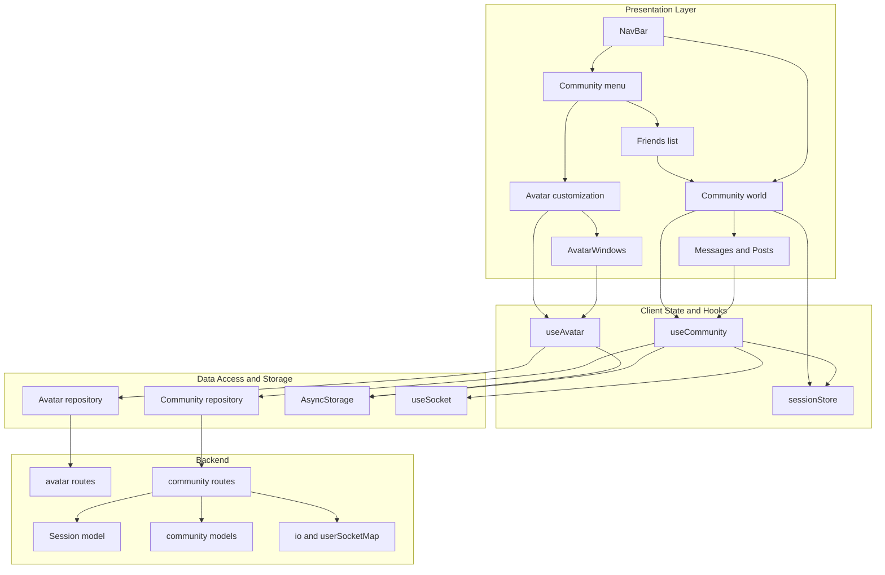
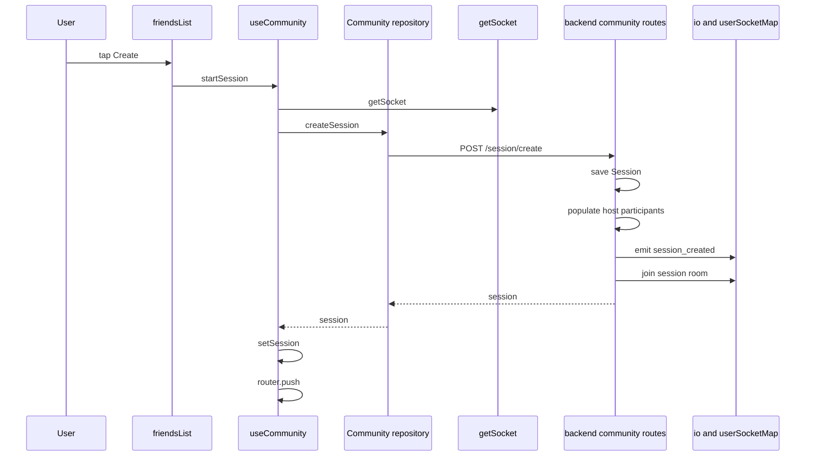
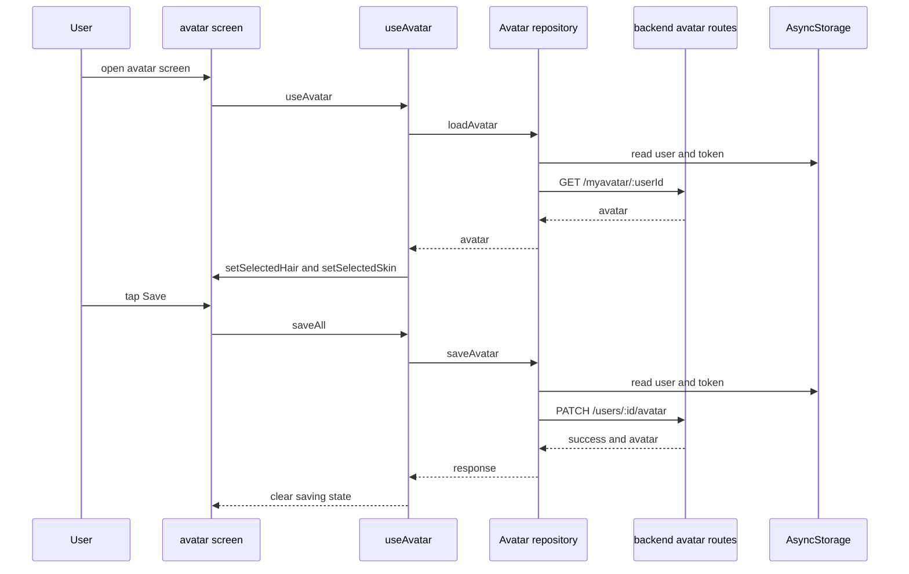
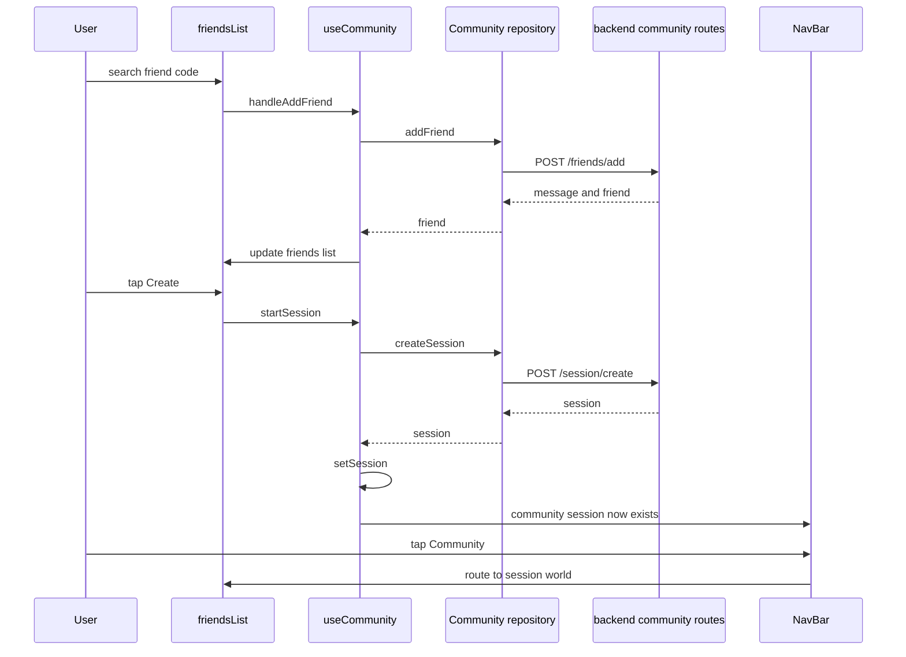
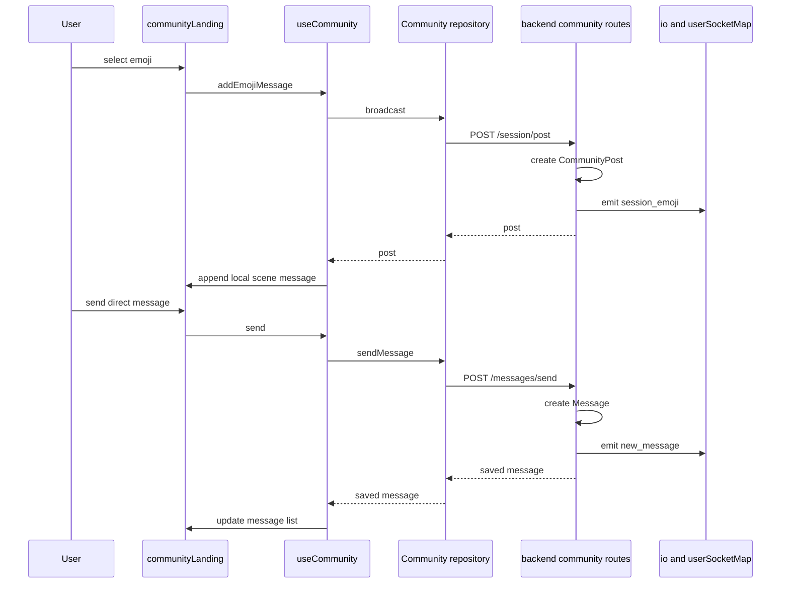

# Community, Sessions, and Avatar Personalization

## Overview

This section covers the client-side community entry points, avatar customization flow, friend management screen, and the session-aware community world used for shared chat and emoji activity. The screens are split into a lightweight community menu, a character editor, a friends and session hub, and a horizontally scrollable community scene that renders messages and interaction buttons over a four-page world.

The feature set is coordinated by local Zustand session state, avatar state hooks, and repository functions that talk to the backend community and avatar routes. On the client, the current user is read from `AsyncStorage`, the active community session is stored separately from the auth user store, and the community world updates itself from direct messages, session chat, and socket-backed session events.

## Architecture Overview



## Screen and Component Structure

### Community Menu Screen

*`app/community/main.tsx`*

This is the landing screen for the community area. It renders the branded `Zarf` scene, a profile graphic, and three navigation buttons: `Customize`, `Join`, and `Friends List`.

- `Customize` routes to `/community/components/avatar`
- `Join` routes to `/community/components/friendsList`
- `Friends List` routes to `/community/components/friendsList`

The component uses `useWindowDimensions` so the layout scales with screen size. It has no local state beyond the viewport-driven measurements.

### Avatar Personalization Screen

*`app/community/components/avatar.tsx`*

This file exports the avatar editor screen, whose default export is named `CommunityLanding` in the source. It reads the stored user record from `AsyncStorage`, pulls avatar selections from `useAvatar`, and renders the editable avatar preview with the `Window` picker from `AvatarWindows.tsx`.

Key behavior:

- loads the stored `user` object from `AsyncStorage`
- displays `Name: {name}`
- renders action buttons for `hair`, `skin`, `top`, `bottom`, `feet`, and `bow`
- opens the selection window through `useAvatar`
- shows the avatar base image `Bald2`
- overlays `AvatarLayer` for `selectedSkin` and `selectedHair`
- saves changes with `saveAll`
- shows `saveError` in red when saving fails

#### `ActionOption`

*`app/community/components/avatar.tsx`*

| Property | Type | Description |
| --- | --- | --- |
| `id` | `string` | Identifier used by the button list. |
| `label` | `string` | Text shown in the long-press label bubble. |
| `icon` | `React.ReactNode` | Icon rendered inside the button. |
| `onPress` | `() => void` | Action fired when the button is tapped. |


`ActionButton` uses a local `showLabel` state so the label bubble appears on long press and hides on press out. `Buttons` maps the action list into stacked buttons.

### Friends and Session Screen

*`app/community/components/friendsList.tsx`*

This screen manages friend discovery, friend requests, and session creation. It combines community data from `useCommunity`, session presence from the community session store, and the current user from the auth user store.

User-facing capabilities:

- show and share the user’s friend code
- search by friend code and send a friend request
- view pending requests
- approve or deny requests
- remove friends
- create a session with selected friends
- enter the active community world when the session is available

Local UI state in this file:

- `showCode`
- `myCode`
- `copied`
- `activeTab`
- `searchCode`
- `searching`
- `searchResult`

The screen also tracks responsive layout with `isWide` from `useWindowDimensions`.

### Community World Screen

*`app/community/components/communityLanding.tsx`*

This is the session-aware shared world. It uses the active community session, direct messages, session emojis, and community actions to populate a four-page scrollable scene.

Important pieces:

- `useCommunitySession((state) => state.session)` supplies the active session
- `useSessionStore((state) => state.user?.id)` supplies the logged-in user id
- `useSessionChat(sessionId, currentUserId ?? null)` supplies `emojis`
- `useDirectMessages(currentUserId ?? null)` supplies direct `messages`
- `useCommunity()` supplies `friends`, `send`, `leave`, and `broadcast`

- `id`
- `name`
- `content`
- `x`
- `y`

The scene itself is a horizontal `ScrollView` with four pages:

- Page 1: house, character, slide
- Page 2: swing, seesaw, tree
- Page 3: boat, fish, character
- Page 4: animals, trees, bushes, feed button

#### `SceneButtonProps`

*`app/community/components/communityLanding.tsx`*

| Property | Type | Description |
| --- | --- | --- |
| `name` | `string` | Button label rendered in the world. |
| `onPress` | `() => void` | Tap handler for the scene button. |
| `x` | `number` | Horizontal placement in scene coordinates. |
| `y` | `number` | Vertical placement in scene coordinates. |
| `style` | `ViewStyle` | Optional style override passed into the touch target. |


### Import Only Support Surfaces

| File | Imported by | Role |
| --- | --- | --- |
| `app/community/components/AvatarWindows.tsx` | `app/community/components/avatar.tsx` | Provides avatar selection windows and layered avatar rendering. |
| `app/community/components/Messages&Posts.tsx` | `app/community/components/communityLanding.tsx` | Provides floating message cards, emoji selection, and instant message composition. |


`AvatarWindows.tsx` is used as a render helper for hair and skin choice windows, while `Messages&Posts.tsx` supplies the message and emoji widgets used in the community world.

## Client State and Hooks

### Community Session Store

*`app/community/hooks/sessionStore.ts`*

This Zustand store holds the active community session separately from the auth user store. It exposes a `hydrateSession` helper that fetches a session by id and stores it in memory.

#### `SessionStore`

| Property | Type | Description |
| --- | --- | --- |
| `session` | `any \ | null` | Active community session tracked by the store. |
| `setSession` | `(session: any) => void` | Replaces the current session. |
| `clearSession` | `() => void` | Clears the current session. |
| `hydrateSession` | `(sessionId: string) => Promise<void>` | Fetches `GET /session/:sessionId` and stores the returned session. |


Behavior:

- reads `token` from `AsyncStorage`
- sends `Authorization` and `Content-Type` headers
- sets `session` to `null` on non-OK responses
- logs and clears the session on fetch failure

### Avatar Hook

*`app/community/hooks/useAvatar.ts`*

This hook coordinates avatar editing state and persistence.

Returned actions and state:

| Method | Description |
| --- | --- |
| `handleHair` | Opens the hair picker window. |
| `handleSkin` | Opens the skin picker window. |
| `handleTop` | Opens the top picker window. |
| `handleBottom` | Opens the bottom picker window. |
| `handleFeet` | Opens the feet picker window. |
| `handleAccessory` | Opens the accessory picker window. |
| `closeWindow` | Closes the active picker window. |
| `saveAll` | Persists the current avatar selections through `saveAvatar`. |
| `saveLayer` | Internal save helper used by `saveAll`. |


State tracked by the hook:

- `activeWindow`
- `selectedSkin`
- `selectedHair`
- `saving`
- `saveError`

On mount, the hook calls `loadAvatar()` and hydrates `selectedHair` and `selectedSkin` from the stored avatar.

#### `ActiveWindow`

saveAll only forwards hair and skin to saveLayer, even though the hook exposes handleTop, handleBottom, handleFeet, and handleAccessory, and the backend avatar route accepts top, bottom, shoes, and accessory.

The picker window state uses this union:

- `hair`
- `skin`
- `top`
- `bottom`
- `feet`
- `accessory`
- `null`

### Community Hook

*`app/community/hooks/useComm.ts`*

This hook coordinates friends, friend requests, session creation, direct messages, emoji broadcast, and session exit. It is the central client-side community facade.

#### `Friend`

| Property | Type | Description |
| --- | --- | --- |
| `_id` | `string` | User id used across friend and session actions. |
| `name` | `string` | Display name returned by the backend. |
| `username` | `string` | Username shown in UI lists and message widgets. |
| `level` | `number` | User level shown in the friends list. |
| `avatar` | `{ skin: string \ | null; hair: string \ | null; }` | Populated avatar shape used by the client after friend fetches and session creation. |


#### `Session`

| Property | Type | Description |
| --- | --- | --- |
| `host` | `Friend` | Host returned by the populated session create response. |
| `participants` | `Friend[]` | Session participants returned by the populated session create response. |


#### Returned actions

| Method | Description |
| --- | --- |
| `loadFriends` | Loads the friend list from the backend. |
| `loadMyFriendCode` | Loads the current user’s friend code. |
| `loadRequests` | Loads pending friend requests. |
| `handleAddFriend` | Sends a friend request using a friend code. |
| `handleApprove` | Approves a pending friend request. |
| `handleDeny` | Denies a pending friend request. |
| `handleRemoveFriend` | Removes a friend from the list. |
| `startSession` | Creates a session and routes to the community world. |
| `leave` | Leaves the current session and routes back to the community menu. |
| `send` | Sends a direct message to a friend. |
| `loadMessages` | Loads direct messages with a friend. |
| `broadcast` | Sends a session post through the community repository. |


State tracked by the hook:

- `friends`
- `myFriendCode`
- `loading`
- `error`
- `requests`
- `messages`

The hook also calls `getSocket()` in `startSession` and logs the socket connection state before creating a session.

### Community Menu and Session-Aware Navigation

useCommunity contains two empty-dependency effects that both call loadFriends() and loadMyFriendCode(), so those requests are issued twice on mount.

*`app/components/navbar.tsx`*

The navbar coordinates top-level routing with the community session store. It reads `communitySession` from `app/community/hooks/sessionStore.ts` and changes the Community navigation target based on whether a session is active.

- if `communitySession` exists, tapping Community routes to `/community/components/communityLanding`
- otherwise it routes to `/community/main`

The same navbar also shows the current user name and level from the auth user store and opens a dropdown anchored to the profile image.

## Session-aware Client Behavior

The client keeps user identity, community session state, and avatar state in separate stores and hooks:

- `useSessionStore` from `app/services/userSession` supplies the logged-in user
- `useSessionStore` from `app/community/hooks/sessionStore.ts` supplies the active community session
- `useAvatar` owns avatar picker state and persistence
- `useCommunity` owns friend and session actions
- `NavBar` switches Community navigation based on the session store
- `friendsList.tsx` creates or enters sessions based on friend and session state
- `communityLanding.tsx` turns session activity into floating scene messages

This split lets the community menu stay lightweight while the world screen reacts to session presence and chat activity.

## Local Persistence with AsyncStorage

### Storage usage

| Key | Used by | Purpose |
| --- | --- | --- |
| `user` | `app/community/components/avatar.tsx`, `app/community/components/friendsList.tsx`, `app/repositories/Avatar.ts`, `app/repositories/Community.ts`, `app/community/hooks/sessionStore.ts` | Stores the current user record, including `id`, `name`, and `friendCode`. |
| `token` | `app/repositories/Avatar.ts`, `app/repositories/Community.ts`, `app/community/hooks/sessionStore.ts` | Added to request headers as `Authorization`. |


`AsyncStorage` is used in three places for client persistence:

- to load the avatar and save avatar selections
- to read the friend code for sharing
- to read the token and user id for authenticated community requests
- to hydrate the community session from the backend

## Data Access and API Coordination

### Avatar Repository

*`app/repositories/Avatar.ts`*

This repository handles avatar persistence.

| Method | Endpoint | Description |
| --- | --- | --- |
| `saveAvatar` | `PATCH /users/:id/avatar` | Sends avatar updates for the current user. |
| `loadAvatar` | `GET /myavatar/:userId` | Loads the current user’s saved avatar. |


The repository reads `user` and `token` from `AsyncStorage`, uses `BASE_URL` set to `http://localhost:5000/api/avatar`, and sends JSON for save requests.

### Community Repository

*`app/repositories/Community.ts`*

This repository is the client-side transport layer for friends, sessions, messaging, and session posts.

| Method | Endpoint | Description |
| --- | --- | --- |
| `getFriends` | `GET /friends/:userId` | Loads populated friend records for the current user. |
| `createSession` | `POST /session/create` | Creates a community session from the host and selected friend ids. |
| `leaveSession` | `POST /session/leave` | Removes the user from a session. |
| `broadcast` | `POST /session/post` | Sends a session post payload, currently used for emoji. |
| `addFriend` | `POST /friends/add` | Sends a friend request by friend code. |
| `getMyFriendCode` | `GET /friendcode/:userId` | Fetches the current user’s shareable friend code. |
| `getFriendRequests` | `GET /friends/requests/:userId` | Loads pending incoming friend requests. |
| `removeFriend` | `POST /friends/remove` | Removes a friend connection. |
| `approveFriendRequest` | `POST /friends/approve` | Approves an incoming request. |
| `denyFriendRequest` | `POST /friends/deny` | Denies an incoming request. |
| `sendMessage` | `POST /messages/send` | Sends a direct message to a friend. |
| `getMessagesWithFriend` | `GET /messages/:userId/:friendId` | Loads direct messages with one friend. |


The repository builds headers with `getHeaders()`, which reads `token` from `AsyncStorage`, and `getUserId()`, which reads `user` from `AsyncStorage`.

## Real-Time Socket Delivery

### Socket-backed flow

`useCommunity` calls `getSocket()` before session creation, and the backend uses `io` plus `userSocketMap` to target session and message events.

| Event | Trigger | Payload |
| --- | --- | --- |
| `session_created` | `POST /session/create` after saving and populating the session | `{ sessionId, session }` |
| `new_message` | `POST /messages/send` when the receiver socket exists in `userSocketMap` | The created `msg` document |
| `session_emoji` | `POST /session/post` for the emoji branch | `{ senderId, content, postId, sessionId }` |
| `member_left` | `POST /session/leave` after the session is updated or removed | `{ userId, message }` |


The backend also joins each session participant socket to the `sessionId` room after session creation.

### Session creation and socket join flow



## Backend Models Behind the Community API

### Session Model

communityroutes.post("/friends/add") only updates the requesting user’s friends array in the shown code because the reverse $addToSet is commented out. The response still reports a friend payload. [!NOTE] POST /session/post only returns a response inside the type === "emoji" branch in the shown route. The client helper broadcast accepts any type, but the current route implementation only completes the emoji path.

*`backend/models/Chat/Session.js`*

| Field | Type | Description |
| --- | --- | --- |
| `host` | `mongoose.Schema.Types.ObjectId` | Required reference to `User`. |
| `participants` | `mongoose.Schema.Types.ObjectId[]` | Participant references to `User`. |
| `status` | `String` | Enum with `active` and `ended`, default `active`. |
| `createdAt` | `Date` | Set to the creation time by default. |
| `endedAt` | `Date` | Optional end time. |


### Moderation and Community Message Models

*`backend/models/Chat/community.js`*

#### `ModerationSchema`

| Field | Type | Description |
| --- | --- | --- |
| `status` | `String` | Enum with `pending`, `approved`, `flagged`, and `blocked`, default `pending`. |
| `flagReasons` | `[String]` | Enum list with `inappropriate_language`, `bullying`, `personal_info_detected`, `adult_content`, and `other`, default empty array. |
| `reviewedAt` | `Date` | Date of review. |
| `autoModerated` | `Boolean` | Indicates whether AI moderation created the record. |


#### `CommunityPostSchema`

| Field | Type | Description |
| --- | --- | --- |
| `sessionId` | `Schema.Types.ObjectId` | Reference to `Session`. |
| `senderId` | `Schema.Types.ObjectId` | Required reference to `User`. |
| `content` | `String` | Required post content. |
| `type` | `String` | Post type used by the session post route. |
| `imageUrl` | `String` | Optional image reference. |
| `sanitizedContent` | `String` | Optional moderated content. |
| `moderation` | `ModerationSchema` | Moderation object with default values. |
| `likes` | `Schema.Types.ObjectId[]` | User references that liked the post. |
| `isVisible` | `Boolean` | Defaults to `false`, set to `true` for emoji posts in the shown route. |


#### `MessageSchema`

| Field | Type | Description |
| --- | --- | --- |
| `senderId` | `Schema.Types.ObjectId` | Required reference to `User`. |
| `receiverId` | `Schema.Types.ObjectId` | Required reference to `User`. |
| `content` | `String` | Required message content. |
| `moderation` | `ModerationSchema` | Moderation object with default values. |
| `isDelivered` | `Boolean` | Defaults to `false`. |
| `readAt` | `Date` | Optional read timestamp. |


## API Integration

### Patch Avatar

```api
{
    "title": "Patch Avatar",
    "description": "Saves avatar layers for the user record",
    "method": "PATCH",
    "baseUrl": "http://localhost:5000/api/avatar",
    "endpoint": "/users/:id/avatar",
    "headers": [
        {
            "key": "Content-Type",
            "value": "application/json",
            "required": true
        }
    ],
    "queryParams": [],
    "pathParams": [
        {
            "key": "id",
            "value": "user-1001",
            "required": true
        }
    ],
    "bodyType": "json",
    "requestBody": "{\n    \"hair\": \"hair2\",\n    \"skin\": \"skin4\",\n    \"top\": \"top1\",\n    \"bottom\": \"bottom2\",\n    \"shoes\": \"shoes3\",\n    \"accessory\": \"bow1\"\n}",
    "formData": [],
    "rawBody": "",
    "responses": {
        "200": {
            "description": "Avatar saved",
            "body": "{\n    \"success\": true,\n    \"avatar\": {\n        \"hair\": \"hair2\",\n        \"skin\": \"skin4\",\n        \"top\": \"top1\",\n        \"bottom\": \"bottom2\",\n        \"shoes\": \"shoes3\",\n        \"accessory\": \"bow1\"\n    }\n}"
        },
        "404": {
            "description": "User not found",
            "body": "{\n    \"message\": \"User not found\"\n}"
        }
    }
}
```

### Get My Avatar

```api
{
    "title": "Get My Avatar",
    "description": "Loads the saved avatar for a user id",
    "method": "GET",
    "baseUrl": "http://localhost:5000/api/avatar",
    "endpoint": "/myavatar/:userId",
    "headers": [],
    "queryParams": [],
    "pathParams": [
        {
            "key": "userId",
            "value": "user-1001",
            "required": true
        }
    ],
    "bodyType": "none",
    "requestBody": "",
    "formData": [],
    "rawBody": "",
    "responses": {
        "200": {
            "description": "Avatar returned",
            "body": "{\n    \"message\": \"Returned avatar\",\n    \"avatar\": {\n        \"hair\": \"hair2\",\n        \"skin\": \"skin4\",\n        \"top\": \"top1\",\n        \"bottom\": \"bottom2\",\n        \"shoes\": \"shoes3\",\n        \"accessory\": \"bow1\"\n    }\n}"
        },
        "404": {
            "description": "Avatar or user not found",
            "body": "{\n    \"message\": \"No avatar found for this user\"\n}"
        }
    }
}
```

### Get Friends

```api
{
    "title": "Get Friends",
    "description": "Returns the current user's populated friends list",
    "method": "GET",
    "baseUrl": "http://localhost:5000/api/community",
    "endpoint": "/friends/:userId",
    "headers": [],
    "queryParams": [],
    "pathParams": [
        {
            "key": "userId",
            "value": "user-1001",
            "required": true
        }
    ],
    "bodyType": "none",
    "requestBody": "",
    "formData": [],
    "rawBody": "",
    "responses": {
        "200": {
            "description": "Friend list returned",
            "body": "{\n    \"friends\": [\n        {\n            \"_id\": \"user-1002\",\n            \"name\": \"Nora Park\",\n            \"username\": \"nora\",\n            \"level\": 6,\n            \"avatar\": {\n                \"skin\": \"skin2\",\n                \"hair\": \"hair5\"\n            }\n        }\n    ]\n}"
        },
        "404": {
            "description": "User not found",
            "body": "{\n    \"message\": \"User not found\"\n}"
        }
    }
}
```

### Add Friend

```api
{
    "title": "Add Friend",
    "description": "Sends a friend request by friend code",
    "method": "POST",
    "baseUrl": "http://localhost:5000/api/community",
    "endpoint": "/friends/add",
    "headers": [
        {
            "key": "Content-Type",
            "value": "application/json",
            "required": true
        }
    ],
    "queryParams": [],
    "pathParams": [],
    "bodyType": "json",
    "requestBody": "{\n    \"userId\": \"user-1001\",\n    \"friendCode\": \"FRIEND-2048\"\n}",
    "formData": [],
    "rawBody": "",
    "responses": {
        "200": {
            "description": "Friend request accepted by the route logic",
            "body": "{\n    \"message\": \"Friend added!\",\n    \"friend\": {\n        \"name\": \"Nora Park\",\n        \"username\": \"nora\",\n        \"friendCode\": \"FRIEND-2048\"\n    }\n}"
        },
        "400": {
            "description": "Validation failure",
            "body": "{\n    \"message\": \"Already friends\"\n}"
        },
        "404": {
            "description": "Friend code or user not found",
            "body": "{\n    \"message\": \"No user found with that code\"\n}"
        }
    }
}
```

### Get Friend Code

```api
{
    "title": "Get Friend Code",
    "description": "Returns the current user's shareable friend code",
    "method": "GET",
    "baseUrl": "http://localhost:5000/api/community",
    "endpoint": "/friendcode/:userId",
    "headers": [],
    "queryParams": [],
    "pathParams": [
        {
            "key": "userId",
            "value": "user-1001",
            "required": true
        }
    ],
    "bodyType": "none",
    "requestBody": "",
    "formData": [],
    "rawBody": "",
    "responses": {
        "200": {
            "description": "Friend code returned",
            "body": "{\n    \"friendCode\": \"FRIEND-2048\"\n}"
        },
        "404": {
            "description": "User not found",
            "body": "{\n    \"message\": \"User not found\"\n}"
        }
    }
}
```

### Remove Friend

```api
{
    "title": "Remove Friend",
    "description": "Removes a friend connection from both users",
    "method": "POST",
    "baseUrl": "http://localhost:5000/api/community",
    "endpoint": "/friends/remove",
    "headers": [
        {
            "key": "Content-Type",
            "value": "application/json",
            "required": true
        }
    ],
    "queryParams": [],
    "pathParams": [],
    "bodyType": "json",
    "requestBody": "{\n    \"userId\": \"user-1001\",\n    \"friendId\": \"user-1002\"\n}",
    "formData": [],
    "rawBody": "",
    "responses": {
        "200": {
            "description": "Friend removed",
            "body": "{\n    \"message\": \"Friend removed\"\n}"
        },
        "400": {
            "description": "Missing ids",
            "body": "{\n    \"message\": \"Missing userId or friendId\"\n}"
        }
    }
}
```

### Get Friend Requests

```api
{
    "title": "Get Friend Requests",
    "description": "Loads incoming friend requests for a user",
    "method": "GET",
    "baseUrl": "http://localhost:5000/api/community",
    "endpoint": "/friends/requests/:userId",
    "headers": [],
    "queryParams": [],
    "pathParams": [
        {
            "key": "userId",
            "value": "user-1001",
            "required": true
        }
    ],
    "bodyType": "none",
    "requestBody": "",
    "formData": [],
    "rawBody": "",
    "responses": {
        "200": {
            "description": "Request list returned",
            "body": "{\n    \"requests\": [\n        {\n            \"_id\": \"user-1003\",\n            \"name\": \"Mina Noor\",\n            \"username\": \"mina\",\n            \"level\": 4,\n            \"avatar\": {\n                \"skin\": \"skin1\",\n                \"hair\": \"hair3\"\n            },\n            \"friendCode\": \"FRIEND-7788\"\n        }\n    ]\n}"
        },
        "404": {
            "description": "User not found",
            "body": "{\n    \"message\": \"User not found\"\n}"
        }
    }
}
```

### Approve Friend Request

```api
{
    "title": "Approve Friend Request",
    "description": "Approves an incoming friend request",
    "method": "POST",
    "baseUrl": "http://localhost:5000/api/community",
    "endpoint": "/friends/approve",
    "headers": [
        {
            "key": "Content-Type",
            "value": "application/json",
            "required": true
        }
    ],
    "queryParams": [],
    "pathParams": [],
    "bodyType": "json",
    "requestBody": "{\n    \"userId\": \"user-1001\",\n    \"friendId\": \"user-1003\"\n}",
    "formData": [],
    "rawBody": "",
    "responses": {
        "200": {
            "description": "Request approved",
            "body": "{\n    \"message\": \"Friend approved\",\n    \"friend\": {\n        \"_id\": \"user-1003\",\n        \"name\": \"Mina Noor\",\n        \"username\": \"mina\",\n        \"level\": 4,\n        \"avatar\": {\n            \"skin\": \"skin1\",\n            \"hair\": \"hair3\"\n        }\n    }\n}"
        },
        "404": {
            "description": "User or request not found",
            "body": "{\n    \"message\": \"No request found\"\n}"
        }
    }
}
```

### Deny Friend Request

```api
{
    "title": "Deny Friend Request",
    "description": "Denies an incoming friend request",
    "method": "POST",
    "baseUrl": "http://localhost:5000/api/community",
    "endpoint": "/friends/deny",
    "headers": [
        {
            "key": "Content-Type",
            "value": "application/json",
            "required": true
        }
    ],
    "queryParams": [],
    "pathParams": [],
    "bodyType": "json",
    "requestBody": "{\n    \"userId\": \"user-1001\",\n    \"friendId\": \"user-1003\"\n}",
    "formData": [],
    "rawBody": "",
    "responses": {
        "200": {
            "description": "Request denied",
            "body": "{\n    \"message\": \"Request denied\"\n}"
        }
    }
}
```

### Send Direct Message

```api
{
    "title": "Send Direct Message",
    "description": "Creates a saved direct message and pushes it to the receiver socket when available",
    "method": "POST",
    "baseUrl": "http://localhost:5000/api/community",
    "endpoint": "/messages/send",
    "headers": [
        {
            "key": "Content-Type",
            "value": "application/json",
            "required": true
        }
    ],
    "queryParams": [],
    "pathParams": [],
    "bodyType": "json",
    "requestBody": "{\n    \"senderId\": \"user-1001\",\n    \"receiverId\": \"user-1002\",\n    \"content\": \"See you at the swing!\"\n}",
    "formData": [],
    "rawBody": "",
    "responses": {
        "201": {
            "description": "Message created",
            "body": "{\n    \"_id\": \"msg-9001\",\n    \"senderId\": \"user-1001\",\n    \"receiverId\": \"user-1002\",\n    \"content\": \"See you at the swing!\",\n    \"moderation\": {\n        \"status\": \"pending\",\n        \"flagReasons\": [],\n        \"reviewedAt\": null,\n        \"autoModerated\": true\n    },\n    \"isDelivered\": false,\n    \"readAt\": null,\n    \"createdAt\": \"2026-05-12T12:00:00.000Z\",\n    \"updatedAt\": \"2026-05-12T12:00:00.000Z\"\n}"
        },
        "400": {
            "description": "Missing fields",
            "body": "{\n    \"message\": \"senderId, receiverId, and content are required\"\n}"
        }
    }
}
```

### Create Session

```api
{
    "title": "Create Session",
    "description": "Creates a community session and emits session_created to participants",
    "method": "POST",
    "baseUrl": "http://localhost:5000/api/community",
    "endpoint": "/session/create",
    "headers": [
        {
            "key": "Content-Type",
            "value": "application/json",
            "required": true
        }
    ],
    "queryParams": [],
    "pathParams": [],
    "bodyType": "json",
    "requestBody": "{\n    \"hostId\": \"user-1001\",\n    \"friendIds\": [\n        \"user-1002\",\n        \"user-1003\"\n    ]\n}",
    "formData": [],
    "rawBody": "",
    "responses": {
        "201": {
            "description": "Session created",
            "body": "{\n    \"session\": {\n        \"_id\": \"sess-7001\",\n        \"host\": {\n            \"_id\": \"user-1001\",\n            \"name\": \"Ayla Reed\",\n            \"username\": \"ayla\",\n            \"level\": 8,\n            \"avatar\": {\n                \"skin\": \"skin4\",\n                \"hair\": \"hair2\"\n            }\n        },\n        \"participants\": [\n            {\n                \"_id\": \"user-1001\",\n                \"name\": \"Ayla Reed\",\n                \"username\": \"ayla\",\n                \"level\": 8,\n                \"avatar\": {\n                    \"skin\": \"skin4\",\n                    \"hair\": \"hair2\"\n                }\n            },\n            {\n                \"_id\": \"user-1002\",\n                \"name\": \"Nora Park\",\n                \"username\": \"nora\",\n                \"level\": 6,\n                \"avatar\": {\n                    \"skin\": \"skin2\",\n                    \"hair\": \"hair5\"\n                }\n            },\n            {\n                \"_id\": \"user-1003\",\n                \"name\": \"Mina Noor\",\n                \"username\": \"mina\",\n                \"level\": 4,\n                \"avatar\": {\n                    \"skin\": \"skin1\",\n                    \"hair\": \"hair3\"\n                }\n            }\n        ],\n        \"status\": \"active\",\n        \"createdAt\": \"2026-05-12T12:00:00.000Z\",\n        \"endedAt\": null\n    }\n}"
        },
        "500": {
            "description": "Server error",
            "body": "{\n    \"message\": \"Server error\"\n}"
        }
    }
}
```

### Send Session Post

```api
{
    "title": "Send Session Post",
    "description": "Creates an emoji session post and emits session_emoji to the session room",
    "method": "POST",
    "baseUrl": "http://localhost:5000/api/community",
    "endpoint": "/session/post",
    "headers": [
        {
            "key": "Content-Type",
            "value": "application/json",
            "required": true
        }
    ],
    "queryParams": [],
    "pathParams": [],
    "bodyType": "json",
    "requestBody": "{\n    \"sessionId\": \"sess-7001\",\n    \"senderId\": \"user-1001\",\n    \"content\": \"happy\",\n    \"type\": \"emoji\"\n}",
    "formData": [],
    "rawBody": "",
    "responses": {
        "201": {
            "description": "Emoji post created",
            "body": "{\n    \"post\": {\n        \"_id\": \"post-5001\",\n        \"sessionId\": \"sess-7001\",\n        \"senderId\": \"user-1001\",\n        \"content\": \"happy\",\n        \"type\": \"emoji\",\n        \"imageUrl\": null,\n        \"sanitizedContent\": null,\n        \"moderation\": {\n            \"status\": \"pending\",\n            \"flagReasons\": [],\n            \"reviewedAt\": null,\n            \"autoModerated\": true\n        },\n        \"likes\": [],\n        \"isVisible\": true,\n        \"createdAt\": \"2026-05-12T12:00:00.000Z\",\n        \"updatedAt\": \"2026-05-12T12:00:00.000Z\"\n    }\n}"
        },
        "400": {
            "description": "Missing fields",
            "body": "{\n    \"message\": \"Missing required fields\"\n}"
        }
    }
}
```

### Get Session

```api
{
    "title": "Get Session",
    "description": "Loads a community session by id",
    "method": "GET",
    "baseUrl": "http://localhost:5000/api/community",
    "endpoint": "/session/:sessionId",
    "headers": [],
    "queryParams": [],
    "pathParams": [
        {
            "key": "sessionId",
            "value": "sess-7001",
            "required": true
        }
    ],
    "bodyType": "none",
    "requestBody": "",
    "formData": [],
    "rawBody": "",
    "responses": {
        "200": {
            "description": "Session returned",
            "body": "{\n    \"session\": {\n        \"_id\": \"sess-7001\",\n        \"host\": \"user-1001\",\n        \"participants\": [\n            \"user-1001\",\n            \"user-1002\",\n            \"user-1003\"\n        ],\n        \"status\": \"active\",\n        \"createdAt\": \"2026-05-12T12:00:00.000Z\",\n        \"endedAt\": null\n    }\n}"
        },
        "404": {
            "description": "Session missing",
            "body": "{\n    \"message\": \"Session not found\"\n}"
        }
    }
}
```

### Leave Session

```api
{
    "title": "Leave Session",
    "description": "Removes a user from a session and deletes the session when empty",
    "method": "POST",
    "baseUrl": "http://localhost:5000/api/community",
    "endpoint": "/session/leave",
    "headers": [
        {
            "key": "Content-Type",
            "value": "application/json",
            "required": true
        }
    ],
    "queryParams": [],
    "pathParams": [],
    "bodyType": "json",
    "requestBody": "{\n    \"userId\": \"user-1001\",\n    \"sessionId\": \"sess-7001\"\n}",
    "formData": [],
    "rawBody": "",
    "responses": {
        "200": {
            "description": "Session left",
            "body": "{\n    \"success\": true\n}"
        },
        "404": {
            "description": "Session missing",
            "body": "{\n    \"message\": \"Session not found\"\n}"
        }
    }
}
```

## Feature Flows

### Avatar Load and Save Flow



### Friend Management and Session Entry Flow



### Session Emoji and Direct Message Flow



## Error Handling and State Transitions

### Screen and hook state patterns

- `friendsList.tsx`- `searching` disables the Send button and shows `ActivityIndicator`
- `searchResult` maps server outcomes to `sent`, `not_found`, and `already_friends`
- `loading` comes from `useCommunity`
- `useAvatar.ts`- `saving` disables the Save button in `avatar.tsx`
- `saveError` is rendered below the screen in red
- `loadAvatar()` failure is logged
- `useCommunity`- `error` stores the last backend or request failure message
- `loading` wraps fetch operations and is cleared in `finally`
- failed approve, deny, remove, add, and session actions set `error`
- `sessionStore.ts`- failed hydrate requests set `session` to `null`
- `communityLanding.tsx`- failed leave attempts are caught and logged with `console.error`

### Notable behavior from the source

## Key Classes Reference

The active session fetched by createSession is populated with host and participants, but GET /session/:sessionId returns the raw session document. The client store accepts both responses, so the participant shape depends on the path used to set the session. [!NOTE] friendsList.tsx shows a Join button only when hasActiveSession and isParticipant are both true, and that button routes to the community world. The button does not create a new session.

| Class | Responsibility |
| --- | --- |
| `main.tsx` | Community landing menu with navigation into avatar and friend screens. |
| `avatar.tsx` | Avatar editor screen with layered preview, selection windows, and save action. |
| `friendsList.tsx` | Friend discovery, request handling, and session creation screen. |
| `communityLanding.tsx` | Session world that renders scene buttons, floating messages, and session controls. |
| `AvatarWindows.tsx` | Avatar picker windows and layered avatar rendering helpers. |
| `Messages&Posts.tsx` | Floating message cards, emoji picker, and instant message UI. |
| `sessionStore.ts` | Community session store and session hydration helper. |
| `useAvatar.ts` | Avatar picker state, selection handlers, and persistence workflow. |
| `useComm.ts` | Friend, session, message, and emoji coordination hook. |
| `Avatar.ts` | Avatar load and save repository. |
| `Community.ts` | Community API repository for friends, sessions, messages, and requests. |
| `navbar.tsx` | Top-level navigation that routes into the active community session when present. |
| `Session.js` | Backend session model for community sessions. |
| `community.js` | Backend models for moderation, community posts, and direct messages. |
