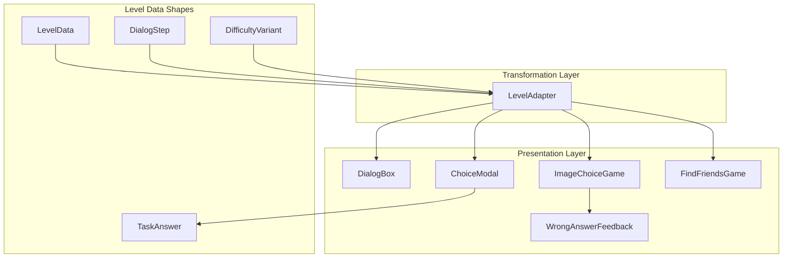
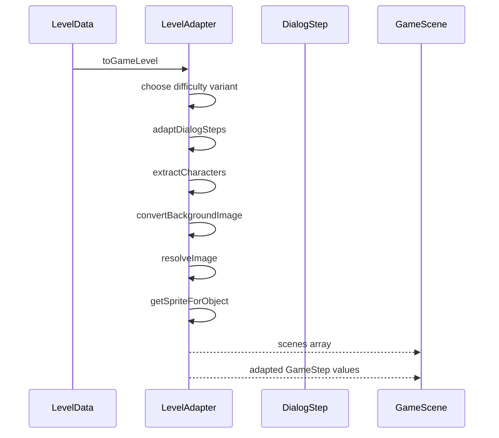
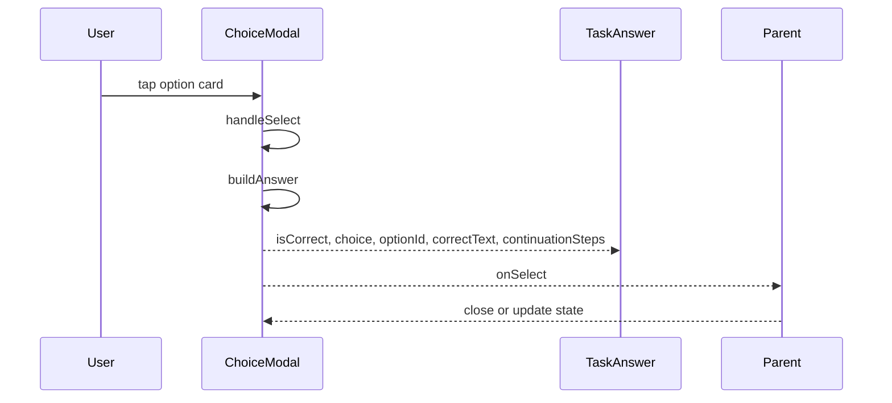
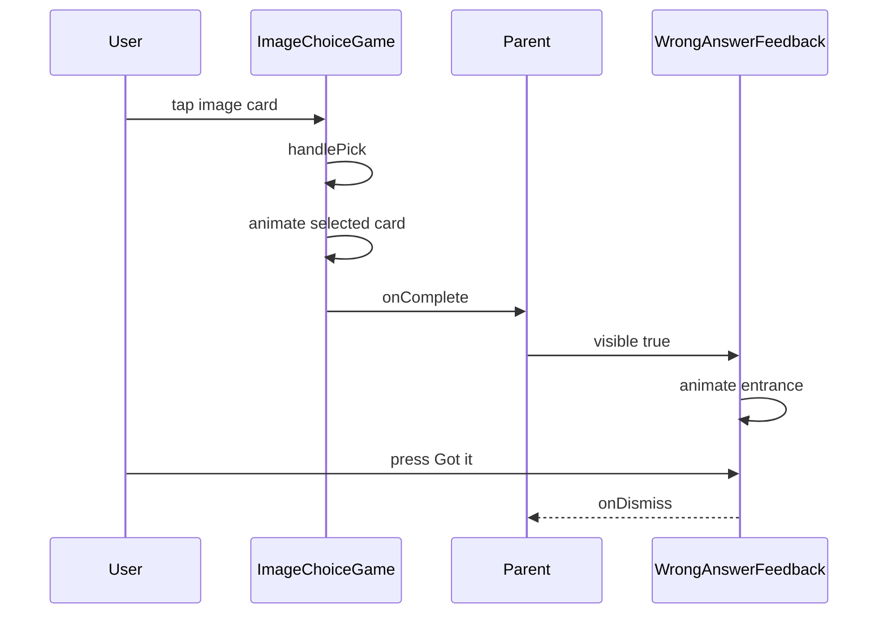
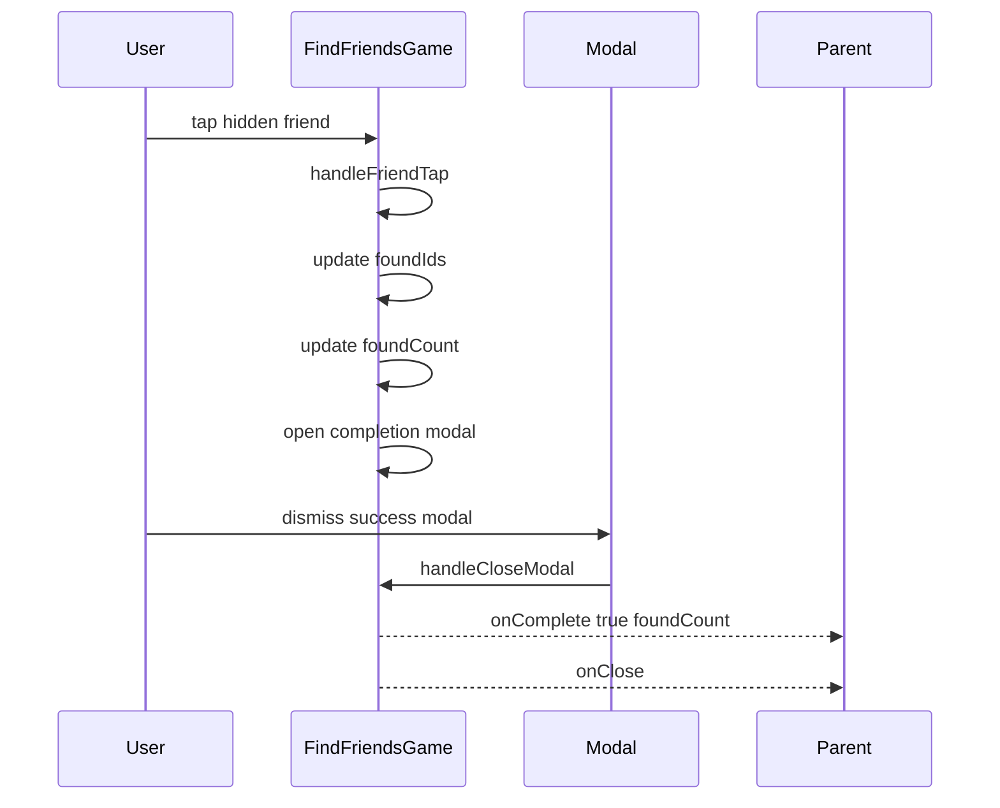

# Gameplay Runtime and Presentation - Dialogue widgets, task presentation, and embedded minigames

## Overview

This section covers the runtime UI surfaces that appear while a level is being played: the dialogue box, the choice-based task modal, the image-choice task surface, the find-friends minigame, and the wrong-answer feedback modal. These components are the visible layer of the level experience, showing narration, speaker text, selectable answers, image cards, and completion feedback inside the active scene.

`app/adapters/LevelAdapter.ts` sits in front of those surfaces and turns database-shaped level content into UI-ready game data. It normalizes scene assets, maps speakers to character IDs, expands object-finding tasks into positioned items with sprites, and resolves image-choice assets so the presentation widgets can render consistent task payloads.

## Architecture Overview

## Component Structure

### Presentation Layer

#### `DialogBox`

*`app/components/DialogBox.tsx`*

`DialogBox` renders the level dialogue card that the player taps to continue. It is styled as a rounded lilac card with a blue header, speaker label, and body text. The component accepts `canAdvance` and `onTap`, so the parent can control whether the player can progress.

DialogBox accepts type: 'narrate' | 'dialog' | 'task', but the rendered branch only returns JSX when type === 'dialog'. The commented task block is not active, so narrate and task steps do not render through this widget in the current code path.

**Props**

| Property | Type | Description |
| --- | --- | --- |
| `type` | `'narrate' \ | 'dialog' \ | 'task'` | Step category passed in from the level experience. |
| `speaker` | `string \ | null` | Speaker label shown in the header when present. |
| `text` | `string \ | null` | Dialogue body text. |
| `instruction` | `string \ | null` | Accepted by the props interface. |
| `onTap` | `() => void` | Tap handler for advancing the dialogue card. |
| `canAdvance` | `boolean` | Enables or disables tapping the card. Defaults to `true`. |
| `characterEmoji` | `string` | Accepted by the props interface. Defaults to `📖`. |

**Runtime behavior**

- Wraps the card in `TouchableOpacity`.
- Uses `activeOpacity={canAdvance ? 0.7 : 1}`.
- Disables the touch target when `canAdvance` is false.
- Shows the tap hint only when advancing is allowed.
- Uses `speaker` in the header for dialog steps.

**State**

`DialogBox` is stateless.

**Styles in use**

- `container`
- `contentContainer`
- `headerRow`
- `speakerName`
- `tapHint`
- `dialogCard`
- `dialogText`

---

#### `WrongAnswerFeedback`

*`app/components/Feedback.tsx`*

`WrongAnswerFeedback` is the wrong-answer feedback modal. It overlays the screen with a dark tint, shows a cat illustration at the top, and presents the chosen answer beside the correct answer. The UI uses a modal, animated entrance, and a shake loop on the cat area to create a playful correction surface.

**Props**

| Property | Type | Description |
| --- | --- | --- |
| `visible` | `boolean` | Controls whether the modal is shown. |
| `chosenText` | `string` | The answer the player picked. |
| `correctText` | `string` | The correct answer shown in the modal. |
| `onDismiss` | `() => void` | Called when the player taps `Got it!`. |

**Internal functions**

| Function | Description |
| --- | --- |
| `NervousLines` | Renders the three vertical SVG lines next to the cat. |
| `SadFace` | Renders the sad SVG face used in the wrong-answer row. |
| `HappyFace` | Renders the happy SVG face used in the correct-answer row. |
| `WrongAnswerFeedback` | Renders the modal and coordinates the animation lifecycle. |

**State and animation refs**

| Value | Type | Description |
| --- | --- | --- |
| `scaleAnim` | `Animated.Value` | Drives the entrance scale animation. |
| `opacityAnim` | `Animated.Value` | Drives the entrance fade animation. |
| `shakeAnim` | `Animated.Value` | Drives the cat shake motion after the modal appears. |

**Runtime behavior**

- Uses `Modal` with `transparent` and `statusBarTranslucent`.
- Animates in with `Animated.spring` and `Animated.timing`.
- Starts a looping shake sequence after the entrance animation completes.
- Resets animation values when `visible` becomes false.
- Displays `chosenText` and `correctText` in separate rows.
- Calls `onDismiss` from the `Got it!` button and `onRequestClose`.

**Dependencies**

- `AppColors`, `AppFonts` from `@/constants/theme`
- `react-native-svg`
- `../../assets/images/chapters/Cat.png`

---

#### `ChoiceModal`

*`app/components/minigames/ChoiceModal.tsx`*

`ChoiceModal` is the generic choice-task modal used for text-based answers. It presents an instruction, a list of options, and optional close control. When the player selects an option, the component builds a `TaskAnswer` object and sends it to `onSelect`.

**Props**

| Property | Type | Description |
| --- | --- | --- |
| `visible` | `boolean` | Controls whether the modal is shown. |
| `title` | `string` | Modal header text. Defaults to `Make a Choice`. |
| `instruction` | `string` | Instruction text shown above the options. |
| `options` | `ChoiceOption[]` | Answer options rendered as tappable cards. |
| `onSelect` | `(answer: TaskAnswer) => void` | Called when the player chooses an option. |
| `onClose` | `() => void` | Optional close handler for the header button. |
| `timeLimit` | `number` | Optional countdown duration in seconds. |
| `allowRetry` | `boolean` | Accepted by the props interface. Defaults to `true`. |
| `maxRetries` | `number` | Accepted by the props interface. Defaults to `3`. |
| `showCharacterHint` | `boolean` | Controls whether the dashed divider is shown. Defaults to `true`. |

**Option model**

| Property | Type | Description |
| --- | --- | --- |
| `id` | `string \ | number` | Stable option identifier. |
| `text` | `string` | Text shown on the option card. |
| `correct` | `boolean` | Marks the correct answer. |
| `feedback` | `string` | Accepted by the option interface. |
| `continuationSteps` | `Array<{ type: 'narrate' \ | 'dialog'; text?: string; speaker?: string; }>` | Follow-up dialogue steps attached to the option. |

**Internal functions**

| Function | Description |
| --- | --- |
| `buildAnswer` | Maps a `ChoiceOption` into a `TaskAnswer` object. |
| `handleSelect` | Prevents duplicate selection and sends the built answer to `onSelect`. |

**State and refs**

| Value | Type | Description |
| --- | --- | --- |
| `selectedId` | `string \ | number \ | null` | Stores the chosen option and blocks repeat taps. |
| `timeLeft` | `number` | Countdown state derived from `timeLimit`. |
| `isTimedOut` | `boolean` | Flag set when the timer reaches zero. |
| `scaleAnim` | `Animated.Value` | Modal entrance scale animation. |
| `opacityAnim` | `Animated.Value` | Modal entrance fade animation. |
| `timerRef` | `number \ | null` | Interval handle used to clear the countdown. |

**Runtime behavior**

- Animates the modal in on `visible`.
- Starts a one-second interval when `timeLimit` is provided and greater than zero.
- Clears the interval on hide and on unmount.
- Resets `selectedId` and `isTimedOut` when the modal closes.
- Sends `TaskAnswer` immediately when a card is tapped.
- Renders a close button only when `onClose` is present.
- Uses `showCharacterHint` to control the dashed divider in the body.

**TaskAnswer output**

| Property | Type | Description |
| --- | --- | --- |
| `isCorrect` | `boolean` | Mirrors the selected option’s `correct` flag. |
| `choice` | `string` | Selected option text. |
| `optionId` | `string \ | number` | Selected option identifier. |
| `continuationSteps` | `Array<{ type: 'narrate' \ | 'dialog'; text?: string; speaker?: string; }>` | Follow-up dialogue from the selected option. |
| `correctText` | `string` | Text of the first option marked correct in the list. |

---

#### `ImageChoiceGame`

*`app/components/minigames/imageChoice.tsx`*

`ImageChoiceGame` renders an image-based choice task. It supports either SVG component inputs or image source inputs, animates the selected card, and reports both the selected and correct labels through `onComplete`.

**Props**

| Property | Type | Description |
| --- | --- | --- |
| `visible` | `boolean` | Controls whether the modal is shown. Defaults to `true`. |
| `instruction` | `string` | Instruction text shown above the image cards. Defaults to `Choose the right one!`. |
| `options` | `ImageChoiceOption[]` | Image answer options rendered as cards. |
| `gameType` | `'slide_choice' \ | string` | Accepted by the props interface. |
| `onComplete` | `(correct: boolean, selectedId: string, chosenText: string, correctText: string) => void` | Called after the feedback pause. |

**Option model**

| Property | Type | Description |
| --- | --- | --- |
| `id` | `string` | Stable option identifier. |
| `label` | `string` | Label shown under the image card. |
| `image` | `ImageSourcePropType \ | string` | Image source or SVG component reference. |
| `correct` | `boolean` | Marks the correct card. |
| `feedback` | `string` | Accepted by the option interface. |

**Internal functions and state**

| Value | Type | Description |
| --- | --- | --- |
| `selectedId` | `string \ | null` | Tracks the chosen option. |
| `phase` | `'picking' \ | 'feedback'` | Controls whether taps are accepted and whether result overlays appear. |
| `scales` | `Animated.Value[]` | Per-card scale animations. |
| `scaleAnim` | `Animated.Value` | Modal entrance scale animation. |
| `opacityAnim` | `Animated.Value` | Modal entrance fade animation. |
| `handlePick` | Function | Selects a card, animates the selected scale, and schedules `onComplete`. |
| `renderCardContent` | Function | Renders an SVG component when `image` is a function, otherwise renders `Image`. |

**Runtime behavior**

- Animates the modal in when `visible` becomes true.
- Resets selection and phase when `visible` becomes false.
- Blocks additional selection once feedback phase begins.
- Uses a short timeout before calling `onComplete`.
- Overlays a green or red result mark on the selected card.
- Updates the label bar color to match the selected state.

**Dependencies**

- `AppColors`, `AppFonts` from `@/constants/theme`
- `ImageSourcePropType`
- `react-native`

---

#### `FindFriendsGame`

*`app/components/minigames/FindFriendsGame.tsx`*

`FindFriendsGame` is the embedded friend-finding minigame. The player taps hidden friend sprites inside bush decorations, sees a running counter, and receives a completion modal when all friends are found.

**Props**

| Property | Type | Description |
| --- | --- | --- |
| `friends` | `Friend[]` | Friend targets to hide in the scene. Defaults to `[]`. |
| `onComplete` | `(success: boolean, foundCount: number) => void` | Called when the completion modal closes. |
| `onClose` | `() => void` | Optional close handler for the game surface. |
| `instruction` | `string` | HUD instruction shown at the bottom. Defaults to `Find all your friends!`. |
| `isEmbedded` | `boolean` | Accepted by the props interface. Defaults to `false`. |
| `paused` | `boolean` | Shows the pause overlay when true. Defaults to `false`. |

**Friend model**

| Property | Type | Description |
| --- | --- | --- |
| `id` | `string` | Stable friend identifier. |
| `name` | `string` | Label shown above the sprite. |
| `image` | `ImageSourcePropType` | Friend sprite image. |
| `found` | `boolean` | Marks whether the friend is already collected. |

**Internal functions and state**

| Value | Type | Description |
| --- | --- | --- |
| `PixelBlock` | Function | Draws a single ground pixel block. |
| `PixelScene` | Function | Builds the layered ground scene using `B = 12`. |
| `foundIds` | `Set<string>` | Tracks discovered friend IDs. |
| `foundCount` | `number` | Counts discovered friends. |
| `message` | `string` | Temporary toast text after a friend is found. |
| `gameCompleted` | `boolean` | Prevents reopening the completion modal repeatedly. |
| `showModal` | `boolean` | Controls the completion modal visibility. |
| `areaSize` | `{ width: number; height: number }` | Stores the measured game area. |
| `scaleAnims` | `Map<string, Animated.Value>` | Per-friend animation map. |

**Runtime behavior**

- Measures the game area with `onLayout`.
- Builds a pixel ground layer after the area size is known.
- Hides already found friends by deriving `found` from `foundIds`.
- Animates the tapped friend sprite with a scale pulse and collapse.
- Updates `foundCount` and shows a temporary toast message.
- Opens the completion modal when `foundCount === friends.length`.
- Calls `onComplete(true, foundCount)` when the completion modal is dismissed.
- Renders the pause overlay when `paused` is true.
- Hides the top-right close button while the completion modal is open.

**Dependencies**

- `AppColors`, `AppFonts` from `@/constants/theme`
- `Bush` from `../decorations/bush`
- `Dimensions`, `Image`, `Modal`, `Animated` from `react-native`

---

### Transformation Layer

#### `LevelAdapter`

*`app/adapters/LevelAdapter.ts`*

`LevelAdapter` converts `LevelData` into a `GameLevel` that the presentation surfaces can render. It chooses the correct difficulty variant when available, adapts the dialogue list into `GameStep[]`, maps background images and character sprites, and enriches task payloads for object-finding and image-choice tasks.

**Public methods**

| Method | Description |
| --- | --- |
| `toGameLevel` | Converts `LevelData` into a UI-ready `GameLevel` for the requested difficulty. |

**Level output model**

| Property | Type | Description |
| --- | --- | --- |
| `id` | `string` | Generated as `level_${dbLevel.order}`. |
| `title` | `string` | Copied from `dbLevel.title`. |
| `order` | `number` | Copied from `dbLevel.order`. |
| `currentDifficulty` | `'easy' \ | 'medium' \ | 'hard'` | The requested difficulty. |
| `scenes` | `GameScene[]` | Scene array containing the adapted background, characters, and steps. |
| `reward` | `{ stars: number }` | Copied from `dbLevel.reward` or defaulted to `{ stars: 3 }`. |
| `maxRetries` | `number` | Copied from `dbLevel.maxRetries` or defaulted to `3`. |

**Scene model**

| Property | Type | Description |
| --- | --- | --- |
| `id` | `string` | Generated as `${dbLevel._id}_scene_main`. |
| `name` | `string \ | undefined` | Accepted by the interface. |
| `background` | `React.FC<any> \ | ImageSourcePropType \ | null` | Resolved background asset. |
| `characters` | `GameCharacter[]` | Adapted scene characters. |
| `steps` | `GameStep[]` | Adapted dialogue and task steps. |

**Step adaptation rules**

| Input shape | Output shape | Effect |
| --- | --- | --- |
| `step.type`, `step.text`, `step.sceneKey`, `step.gameType`, `step.speaker`, `step.instruction`, `step.taskType`, `step.content`, `step.correctFeedback`, `step.wrongFeedback` | `GameStep` | Copies the core dialogue and task fields into a UI-safe structure. |
| `step.speaker` | `speakerId` | Uses `getCharacterId` to map speaker names to lookup IDs. |
| `taskType === 'tap_object'` and `content.objectsInScene` | `content.objectsToFind` | Expands each object name into `{ id, name, image, x, y, found }` and assigns random positions. |
| `taskType === 'image_choice'` and `content.options` | `content.options` | Resolves each option image through `resolveImage`. |
| `step.continuationSteps` | Additional `GameStep[]` | Recursively adapts follow-up dialogue steps through `adaptContinuationSteps`. |

**Asset resolution helpers**

| Function | Responsibility |
| --- | --- |
| `convertBackgroundImage` | Maps `slide1`, `slide2`, and `slide3` to SVG assets or returns `{ uri: url }`. |
| `resolveImage` | Resolves image keys through `IMAGE_MAP` or returns `{ uri: key }`. |
| `loadSprite` | Maps character sprite paths to local `require` assets or falls back to `{ uri: path }`. |
| `getSpriteForObject` | Maps object names such as `noura`, `omar`, `nina`, `mom`, `friend`, and `stranger` to local images. |
| `getCharacterId` | Maps speaker labels such as `Mom`, `Me`, and `Ms. Johnson` to normalized character IDs. |
| `adaptDialogSteps` | Converts `DialogStep[]` into `GameStep[]`. |
| `adaptContinuationSteps` | Recursively adapts nested continuation steps. |
| `sanitizeId` | Converts the input ID to a string. |
| `extractCharacters` | Converts raw character names into `GameCharacter[]`. |

**Runtime behavior of ****`toGameLevel`**

- Reads the requested difficulty variant from `dbLevel.difficultyVariants?.[difficulty]`.
- Uses stored variant dialogue when it exists and contains entries.
- Falls back to the base dialogue when no stored variant is available.
- Logs the chosen path with `console.log`.
- Returns a single main scene using the adapted background, characters, and step list.
- Uses local fallback values for `reward` and `maxRetries` when those fields are missing.

**Dependencies**

- `ImageSourcePropType` from `react-native`
- `DialogStep`, `DifficultyVariant`, `LevelData` from `../types/level.types`
- `../../assets/svgs/game/chapters/slide1.svg`
- `../../assets/svgs/game/chapters/slide2.svg`
- `../../assets/svgs/game/chapters/slide3.svg`
- `../../assets/images/chapters/Nina pp.png`
- `../../assets/images/chapters/Mom PP.png`
- `../../assets/images/chapters/Friend.png`
- `../../assets/images/chapters/Man pp.png`
- `../../assets/images/chapters/friend1.png`
- `../../assets/images/chapters/friend2.png`

### Data Models

#### `GameLevel`

*`app/adapters/LevelAdapter.ts`*

| Property | Type | Description |
| --- | --- | --- |
| `id` | `string` | Clean level identifier generated by the adapter. |
| `title` | `string` | Level title. |
| `order` | `number` | Display order. |
| `currentDifficulty` | `'easy' \ | 'medium' \ | 'hard'` | Active difficulty. |
| `scenes` | `GameScene[]` | Scene array for the level. |
| `reward` | `{ stars: number }` | Reward payload. |
| `maxRetries` | `number` | Retry limit. |

#### `GameScene`

*`app/adapters/LevelAdapter.ts`*

| Property | Type | Description |
| --- | --- | --- |
| `id` | `string` | Scene identifier. |
| `name` | `string \ | undefined` | Scene label such as Kitchen or Bedroom. |
| `background` | `React.FC<any> \ | ImageSourcePropType \ | null` | Background asset or SVG component. |
| `characters` | `GameCharacter[]` | Scene characters. |
| `steps` | `GameStep[]` | Scene steps rendered in order. |

#### `GameCharacter`

*`app/adapters/LevelAdapter.ts`*

| Property | Type | Description |
| --- | --- | --- |
| `id` | `string` | Character identifier. |
| `name` | `string` | Display name. |
| `displayName` | `string` | Normalized display name. |
| `sprite` | `ImageSourcePropType \ | undefined` | Character image asset. |
| `position` | `CharacterPosition` | On-screen placement. |
| `voiceId` | `string \ | undefined` | Voice lookup key. |
| `scale` | `number \ | undefined` | Sprite scaling factor. |
| `side` | `'left' \ | 'right'` | Facing side. |

`CharacterPosition` is the union `'left' | 'center-left' | 'center-right' | 'right' | 'center'`.

#### `GameStep`

*`app/adapters/LevelAdapter.ts`*

| Property | Type | Description |
| --- | --- | --- |
| `id` | `string` | Step identifier. |
| `type` | `'narrate' \ | 'dialog' \ | 'task'` | Step type. |
| `sceneKey` | `string \ | undefined` | Links the step back to scene configuration. |
| `text` | `string \ | undefined` | Step text. |
| `speaker` | `string \ | undefined` | Speaker label. |
| `speakerId` | `string \ | undefined` | Normalized speaker lookup ID. |
| `instruction` | `string \ | undefined` | Task instruction text. |
| `taskType` | `'choice' \ | 'tap_object' \ | 'drag_drop' \ | 'speak' \ | 'image_choice' \ | undefined` | Task category. |
| `gameType` | `string \ | undefined` | Embedded game type hint such as `FindFriendsGame`. |
| `content` | `any` | Task-specific content payload. |
| `correctFeedback` | `string \ | undefined` | Success feedback text. |
| `wrongFeedback` | `string \ | undefined` | Failure feedback text. |
| `metadata` | `{ requiresAudio?: boolean; timeLimit?: number; hints?: string[]; } \ | undefined` | Optional step metadata. |

#### `TaskAnswer`

*`app/interfaces/TaskAnswer.ts`*

| Property | Type | Description |
| --- | --- | --- |
| `isCorrect` | `boolean` | Whether the selected option is correct. |
| `choice` | `string \ | undefined` | Chosen label or answer text. |
| `optionId` | `string \ | number \ | undefined` | Chosen option ID. |
| `continuationSteps` | `Array<{ type: 'narrate' \ | 'dialog'; text?: string; speaker?: string; }> \ | undefined` | Follow-up dialogue to continue after the answer. |
| `correctText` | `string` | The correct answer text. |

#### `DialogBoxProps`

*`app/components/DialogBox.tsx`*

| Property | Type | Description |
| --- | --- | --- |
| `type` | `'narrate' \ | 'dialog' \ | 'task'` | Controls the dialogue card mode. |
| `speaker` | `string \ | null` | Speaker name. |
| `text` | `string \ | null` | Body text. |
| `instruction` | `string \ | null` | Accepted by the props interface. |
| `onTap` | `() => void \ | undefined` | Tap handler. |
| `canAdvance` | `boolean \ | undefined` | Whether the player can tap to continue. |
| `characterEmoji` | `string` | Emoji fallback. |

#### `WrongAnswerFeedbackProps`

*`app/components/Feedback.tsx`*

| Property | Type | Description |
| --- | --- | --- |
| `visible` | `boolean` | Controls modal visibility. |
| `chosenText` | `string` | Player-selected text. |
| `correctText` | `string` | Correct answer text. |
| `onDismiss` | `() => void` | Dismiss handler. |

#### `ChoiceOption`

*`app/components/minigames/ChoiceModal.tsx`*

| Property | Type | Description |
| --- | --- | --- |
| `id` | `string \ | number` | Option identifier. |
| `text` | `string` | Display text. |
| `correct` | `boolean` | Correctness flag. |
| `feedback` | `string \ | undefined` | Accepted by the option interface. |
| `continuationSteps` | `Array<{ type: 'narrate' \ | 'dialog'; text?: string; speaker?: string; }> \ | undefined` | Optional follow-up dialogue. |

#### `ChoiceModalProps`

*`app/components/minigames/ChoiceModal.tsx`*

| Property | Type | Description |
| --- | --- | --- |
| `visible` | `boolean` | Controls modal visibility. |
| `title` | `string \ | undefined` | Header text. |
| `instruction` | `string \ | undefined` | Instruction text. |
| `options` | `ChoiceOption[]` | Choice list. |
| `onSelect` | `(answer: TaskAnswer) => void` | Selection callback. |
| `onClose` | `() => void \ | undefined` | Optional close callback. |
| `timeLimit` | `number \ | undefined` | Optional timer value. |
| `allowRetry` | `boolean \ | undefined` | Accepted by the props interface. |
| `maxRetries` | `number \ | undefined` | Accepted by the props interface. |
| `showCharacterHint` | `boolean \ | undefined` | Controls the divider display. |

#### `Friend`

*`app/components/minigames/FindFriendsGame.tsx`*

| Property | Type | Description |
| --- | --- | --- |
| `id` | `string` | Friend identifier. |
| `name` | `string` | Visible name. |
| `image` | `ImageSourcePropType` | Sprite source. |
| `found` | `boolean` | Discovery state. |

#### `FindFriendsGameProps`

*`app/components/minigames/FindFriendsGame.tsx`*

| Property | Type | Description |
| --- | --- | --- |
| `friends` | `Friend[] \ | undefined` | Embedded friend list. |
| `onComplete` | `(success: boolean, foundCount: number) => void` | Completion callback. |
| `onClose` | `() => void \ | undefined` | Optional close callback. |
| `instruction` | `string \ | undefined` | HUD instruction. |
| `isEmbedded` | `boolean \ | undefined` | Accepted by the props interface. |
| `paused` | `boolean \ | undefined` | Pause state flag. |

#### `ImageChoiceOption`

*`app/components/minigames/imageChoice.tsx`*

| Property | Type | Description |
| --- | --- | --- |
| `id` | `string` | Option identifier. |
| `label` | `string` | Label shown under the image. |
| `image` | `ImageSourcePropType \ | string` | Raster source or SVG component. |
| `correct` | `boolean` | Correctness flag. |
| `feedback` | `string \ | undefined` | Accepted by the option interface. |

#### `ImageChoiceGameProps`

*`app/components/minigames/imageChoice.tsx`*

| Property | Type | Description |
| --- | --- | --- |
| `visible` | `boolean \ | undefined` | Controls modal visibility. |
| `instruction` | `string \ | undefined` | Instruction text. |
| `options` | `ImageChoiceOption[]` | Image choice options. |
| `gameType` | `'slide_choice' \ | string \ | undefined` | Accepted by the props interface. |
| `onComplete` | `(correct: boolean, selectedId: string, chosenText: string, correctText: string) => void` | Completion callback. |

## Feature Flows

### 1. Level Data Adaptation to UI Ready Game Level

**What happens**

- `toGameLevel` reads the requested difficulty.
- Stored variant dialogue is used when present.
- Base dialogue is used when no stored variant is available.
- The resulting `GameLevel` contains one scene with adapted characters and steps.
- The generated scene is what the presentation widgets consume inside the level experience.

### 2. Choice Selection and Task Answer Emission

**What happens**

- The first tap locks selection through `selectedId`.
- `buildAnswer` packages the selected option into `TaskAnswer`.
- `onSelect` receives the answer immediately.
- If `timeLimit` exists, the countdown starts while the modal is visible.

### 3. Image Choice Selection and Feedback Delay

**What happens**

- The component accepts either SVG component images or raster image sources.
- A selected card is animated with a short scale pulse.
- The result is delayed briefly before `onComplete` fires.
- The wrong-answer modal can display `chosenText` and `correctText` after the selection flow.

### 4. Find Friends Completion Flow

**What happens**

- Each friend is wrapped in its own tappable animated target.
- The game shows a toast when a friend is found.
- Completion is detected when all friends are found.
- The success modal confirms the count and continues the level flow.

## State Management

### Local UI state by surface

| Surface | State values | Effect |
| --- | --- | --- |
| `ChoiceModal` | `selectedId`, `timeLeft`, `isTimedOut`, `scaleAnim`, `opacityAnim`, `timerRef` | Manages single-choice locking, countdown, and modal entrance animation. |
| `ImageChoiceGame` | `selectedId`, `phase`, `scales`, `scaleAnim`, `opacityAnim` | Manages per-card animation, feedback phase, and modal entrance animation. |
| `FindFriendsGame` | `foundIds`, `foundCount`, `message`, `gameCompleted`, `showModal`, `areaSize`, `scaleAnims` | Tracks hidden friend discovery, toast text, layout measurement, and completion modal state. |
| `WrongAnswerFeedback` | `scaleAnim`, `opacityAnim`, `shakeAnim` | Drives modal entrance and cat shake behavior. |
| `DialogBox` | None | Driven entirely by props. |

### State transitions

- `ChoiceModal`- `visible = true` starts the entrance animation and timer setup.
- `selectedId` is set on first tap and blocks repeat taps.
- `visible = false` resets selection and clears the timer.
- `ImageChoiceGame`- `visible = true` starts the entrance animation.
- First pick moves `phase` from `picking` to `feedback`.
- `visible = false` resets `selectedId` and `phase`.
- `FindFriendsGame`- Tapping a friend adds the ID to `foundIds` and increments `foundCount`.
- When all friends are found, `showModal` becomes true.
- Dismissing the modal calls `onComplete(true, foundCount)`.

## Integration Points

- `LevelData`, `DialogStep`, and `DifficultyVariant` feed `LevelAdapter.toGameLevel`.
- `TaskAnswer` is the emitted payload from `ChoiceModal`.
- `AppColors` and `AppFonts` are shared across the dialogue and minigame surfaces.
- `react-native-svg` powers the feedback doodles in `Feedback`.
- `Bush` is the environmental wrapper used by `FindFriendsGame`.
- `../../assets/svgs/game/chapters/slide1.svg`, `slide2.svg`, and `slide3.svg` are resolved by `LevelAdapter`.
- `../../assets/images/chapters/Cat.png` is used by the wrong-answer modal.
- Local chapter character assets are used by `LevelAdapter` and the object-finding enrichment path.

## Dependencies

### Runtime packages

- `react-native`
- `react-native-svg`
- `react`

### Internal modules

- `@/constants/theme`
- `@/app/interfaces/TaskAnswer`
- `../types/level.types`
- `../decorations/bush`

### Asset files

- `../../assets/svgs/game/chapters/slide1.svg`
- `../../assets/svgs/game/chapters/slide2.svg`
- `../../assets/svgs/game/chapters/slide3.svg`
- `../../assets/images/chapters/Cat.png`
- `../../assets/images/chapters/Nina pp.png`
- `../../assets/images/chapters/Mom PP.png`
- `../../assets/images/chapters/Friend.png`
- `../../assets/images/chapters/Man pp.png`
- `../../assets/images/chapters/friend1.png`
- `../../assets/images/chapters/friend2.png`

## Error Handling

The visible error-handling pattern in this section is defensive rendering and fallback data shaping.

- `LevelAdapter`- Uses stored difficulty variants when available.
- Falls back to base dialogue when no variant is present.
- Falls back to `{ stars: 3 }` and `3` retries when reward data is missing.
- Uses fallback sprite URIs when a specific asset key is not mapped.
- Logs a warning when `getSpriteForObject` cannot resolve a sprite.
- `ChoiceModal`- Clears the interval when the modal hides or unmounts.
- Prevents repeat selection by returning early when `selectedId` is already set.
- `FindFriendsGame`- Ignores taps on missing or already found friends.
- Prevents duplicate completion handling through `gameCompleted`.
- `WrongAnswerFeedback`- Resets animation values when hidden.

## Key Classes Reference

| Class | Responsibility |
| --- | --- |
| `LevelAdapter.ts` | Converts level data into UI-ready scenes and task payloads. |
| `DialogBox.tsx` | Renders the dialogue card used for dialog steps. |
| `Feedback.tsx` | Renders the wrong-answer feedback modal. |
| `ChoiceModal.tsx` | Renders the text-choice task modal and emits `TaskAnswer`. |
| `FindFriendsGame.tsx` | Renders the embedded friend-finding minigame. |
| `imageChoice.tsx` | Renders the image-choice task surface. |
| `TaskAnswer.ts` | Defines the answer payload returned by choice tasks. |
