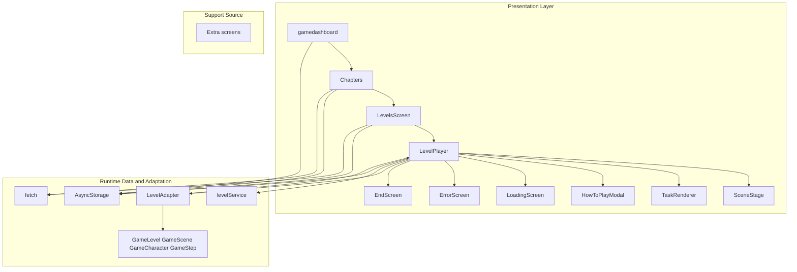
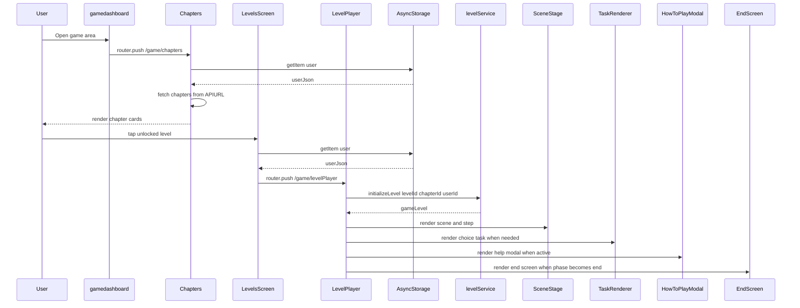
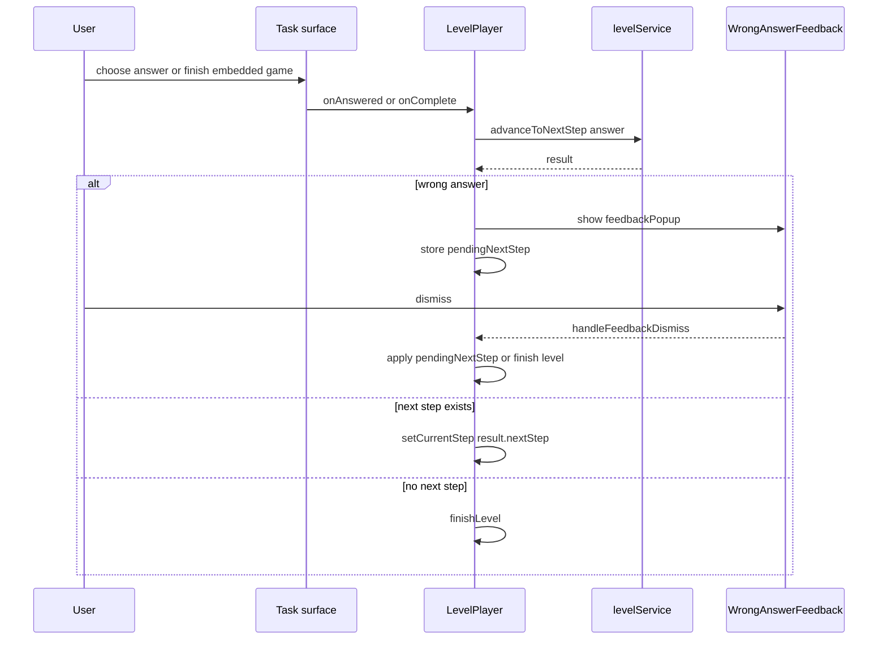

# Gameplay Runtime and Presentation

## Overview

This section covers the runtime path that takes a player from the game dashboard into chapter selection, then into a specific level, and finally through the active step-by-step gameplay loop. The visible screens coordinate user identity loading, chapter and level availability checks, navigation, and task presentation in a single flow that stays entirely on the client side.

The level player is the central orchestration point. It hydrates the current player from `AsyncStorage`, initializes level content through `levelService`, renders the active scene through `SceneStage`, and switches between task surfaces such as `TaskRenderer`, `ImageChoiceGame`, `FindFriendsGame`, `HowToPlayModal`, and the end or error branches imported from `app/components/Extra screens.tsx`.

## Architecture Overview

## Runtime Surface Summary

| File | Primary runtime role |
| --- | --- |
| `app/game/main.tsx` | Game dashboard entry screen and chapter navigation trigger |
| `app/game/chapters.tsx` | Horizontal chapter browser with lock gating and chapter start routing |
| `app/game/[chapterId].tsx` | Level grid for a chapter, including lock state and route to the level player |
| `app/game/levelPlayer.tsx` | Active gameplay orchestration, scene rendering, task handling, help modal, and end state |
| `app/components/howtoplay.tsx` | Support modal source for task instructions and highlighted hints |
| `app/components/Extra screens.tsx` | Support source for loading, error, and end-state views used by `LevelPlayer` |
| `app/components/SceneStage.tsx` | Scene presentation surface for background, character, narration, and embedded task content |
| `app/components/TaskRenderer.tsx` | Choice-task bridge that normalizes task data into a modal interaction |
| `app/adapters/LevelAdapter.ts` | Converts level data into runtime game shapes consumed by the player |

## Game Dashboard

*`app/game/main.tsx`*

The dashboard is a presentation entry point that loads the current user profile from `AsyncStorage`, renders a hero card, and exposes the main game navigation affordances. The visible navigation with a router call is the `Chapter` button, which pushes to `/game/chapters`.

### Local Components

| Identifier | Role |
| --- | --- |
| `PixelCloud` | Decorative cloud block used inside the hero scene |
| `HeroSection` | Main card that renders the sky scene, title, arrows, and action bar |
| `gamedashboard` | Screen component that loads the user record and renders `NavBar` plus `HeroSection` |

### `HeroSection` Props

| Property | Type | Description |
| --- | --- | --- |
| `userName` | `string` | Display name shown in the hero section state |
| `onOpenCalendar` | `() => void` | Passed into the component interface; the visible call site provides an empty handler |

### Runtime Notes

- `gamedashboard` reads `userJson` from `AsyncStorage.getItem("user")`.
- The parsed user object populates `userName` and `userId`.
- The `Chapter` button is the only action with an explicit `router.push("/game/chapters")` call.
- The visible layout also renders `Customize` and `Start` buttons, but the source shown here does not attach navigation handlers to them.

## Chapter List Screen

*`app/game/chapters.tsx`*

This screen loads the signed-in user, requests chapters using the local `APIURL`, derives unlock state from the user level, and presents chapters in a horizontal scroller. Locked chapters remain visible but are disabled and overlaid with a lock icon.

### Chapter Data Model

| Property | Type | Description |
| --- | --- | --- |
| `id` | `string` | Chapter identifier used for navigation |
| `title` | `string` | Chapter title shown in the card and used for background selection |
| `description` | `string` | Optional chapter description |
| `unlocked` | `boolean` | Derived visibility and start state |
| `levelCount` | `number` | Number of levels displayed for the chapter |

### Chapter Background Selection

`getChapterBackground` lowers the chapter title with `titleLower` and selects one of the visible assets:

- `the park` → `ParkBg`
- `home` → `HomeBg`
- `school safety` → `SchoolBg`
- default → `null`

### Runtime Flow

- Reads `userJson` from `AsyncStorage`.
- Parses `user.id`, `user.name`, and `user.level`.
- Calls `fetch(`${APIURL}?userId=${userId}`)`.
- Normalizes the response into chapter cards.
- Marks a chapter as unlocked when `chapter.unlockedOn <= userLevel`.
- Splits the rendered list into unlocked and locked chapters.
- Uses `scrollTo` and `handleScroll` to keep the current index aligned with the visible card.

### Chapter Screen Behaviors

| Behavior | Source-backed detail |
| --- | --- |
| Horizontal browsing | `ScrollView` with `onScroll` and `decelerationRate="fast"` |
| Lock handling | Locked chapters render a `Lock` overlay and a disabled start button |
| Navigation | Unlocked cards push to `/game/[chapterId]` with `chapterId` and `chapterTitle` |
| Empty state | `No chapters available yet.` when the normalized array is empty |

## Level Grid Screen

*`app/game/[chapterId].tsx`*

This screen loads all levels for a chapter, renders a card grid, and opens the level player only when a level is unlocked. It also overlays a background SVG and shows a chapter title banner at the top.

### Level Data Model

| Property | Type | Description |
| --- | --- | --- |
| `id` | `string` | Level identifier used for routing |
| `title` | `string` | Level title |
| `order` | `number` | Visible level number |
| `unlocked` | `boolean` | Controls pressability and locked styling |
| `passed` | `boolean` | Controls star row visibility and passed styling |
| `starsEarned` | `number` | Number of stars shown on passed levels |
| `attempts` | `number` | Attempt count included in the visible type |
| `reward` | `{ stars: number; xp: number }` | Optional reward payload visible in the type |

### Supporting Visuals

| Identifier | Role |
| --- | --- |
| `LockIcon` | Pixel-style lock badge used on locked levels |
| `StarRow` | Renders three star glyphs and fills them based on `count` |

### Runtime Flow

- Loads the user from `AsyncStorage.getItem("user")`.
- Requests levels from `fetch(`${APIURL}?userId=${userId}&chapterId=${chapterId}`)`.
- Reads `data.levels` and normalizes it into the `levels` state.
- Renders a loading indicator until the request completes.
- Shows locked cards as disabled and overlays them with `LockIcon`.
- Routes to `/game/levelPlayer` with `levelId`, `chapterId`, `levelTitle`, and `chapterTitle` only when the level is unlocked.

### Screen States

| State | Visible behavior |
| --- | --- |
| Loading | `ActivityIndicator` in the center |
| Populated | Grid of level cards with stars and lock overlays |
| Locked card | Disabled press handling and muted styling |

## Level Player Orchestration

*`app/game/levelPlayer.tsx`*

`LevelPlayer` is the gameplay hub. It resolves the user identity, initializes level data, picks the first scene, advances steps, opens and closes the help modal, and switches between gameplay, feedback, and end-state screens.

### Runtime State

| State | Type | Role |
| --- | --- | --- |
| `userName` | `string` | Loaded from the stored user record |
| `loading` | `boolean` | Controls initial load and retry branches |
| `error` | `string \ | null` | Drives the error screen |
| `currentStep` | `GameStep \ | null` | Active narrative or task step |
| `stars` | `number` | Current star count for the run |
| `phase` | `'playing' \ | 'end'` | Switches between gameplay and end screen |
| `earnedStarsDisplay` | `boolean[]` | Animated end-screen star reveal state |
| `savingProgress` | `boolean` | Passed through to `EndScreen` |
| `currentStepIndex` | `number` | Derived from progress after load and step changes |
| `levelTitle` | `string` | Display title for `EndScreen` |
| `currentScene` | `GameScene \ | null` | Scene data passed into `SceneStage` |
| `feedbackPopup` | `{ chosenText: string; correctText: string } \ | null` | Wrong-answer feedback payload |
| `pendingNextStep` | `GameStep \ | null` | Deferred continuation after feedback dismissal |
| `showHowToPlay` | `boolean` | Controls the help modal |

### Initialization Flow

1. Reads the stored user from `AsyncStorage`.
2. Extracts `user.id` through `getCurrentUserId`.
3. Validates `levelId` and `chapterId`.
4. Calls `levelService.initializeLevel(levelId as string, chapterId as string, userId)`.
5. Reads `gameLevel.scenes[0]` into `currentScene`.
6. Copies `gameLevel.title` into `levelTitle`.
7. Initializes `stars` from `gameLevel.reward?.stars || 3`.
8. Pulls the first runtime step through `levelService.getCurrentStep()`.
9. Reads `levelService.getProgress()` and aligns `currentStepIndex`.

### Gameplay Orchestration

| Branch | Visible behavior |
| --- | --- |
| Loading | Renders `LoadingScreen` |
| Error | Renders `ErrorScreen` with `onBack={() => router.back()}` |
| No step | Returns `LoadingScreen` again until a step is available |
| Playing | Renders `SceneStage`, feedback, task surfaces, and help affordances |
| End | Renders `EndScreen` on top of the gameplay content |

### In-scene Game Building

`buildInSceneGame` switches on `gameType`:

| `gameType` | Returned surface |
| --- | --- |
| `slide_choice` | `ImageChoiceGame` with `visible={!showHowToPlay}` and an `onComplete` callback that forwards `selectedId`, `chosenText`, and `correctText` |
| `find_friends` | `FindFriendsGame` with `friends`, `instruction`, `onComplete`, and `isEmbedded` |
| `choice` | `null`, because `TaskRenderer` owns the modal for this task type |
| default | `null` and a console warning |

### How To Play Content Assembly

`getHowToPlayContent` uses `step.gameType ?? step.taskType`.

| Game type | Title | Instructions | Highlight phrases | Characters | Steps |
| --- | --- | --- | --- | --- | --- |
| `find_friends` | `How to Play` | `Search for your friends and uncover their secret hideouts! Spot one? Tap them quick! Find them all!` | `Tap them quick!`, `Find them all!` | `You` plus two hidden `Friend` entries | `Search the scene`, `Tap to catch!`, `Find them all!` |
| `slide_choice` | `Make a Choice` | `Look at the options and tap the one you think is right!` | `tap` | none | `Look carefully`, `Tap your answer` |
| default | `How to Play` | `Complete the task to continue!` | none | none | empty array |

### Step Advancement

| Method | Role |
| --- | --- |
| `advance` | Advances non-task steps through `levelService.advanceToNextStep()` |
| `advanceStep` | Sends `TaskAnswer` data into `levelService.advanceToNextStep(answer)` and handles wrong-answer buffering |
| `handleFeedbackDismiss` | Clears feedback and either applies `pendingNextStep` or ends the level |
| `handleTaskAnswered` | Bridges `TaskRenderer` answer events into `advanceStep` |
| `handleInSceneGameComplete` | Bridges embedded game completion into `advanceStep` |
| `finishLevel` | Switches to the end phase and stages the star reveal animation |
| `handleRetry` | Reinitializes the level, resets the phase, and reloads the current step |

### Wrong Answer Handling

The comment above the help effect says the modal should auto-show whenever a new task step arrives, but the implementation only opens it automatically when currentStep?.type === 'task' && currentStep?.gameType === 'slide_choice'. Other task types rely on the floating ? button.

- If the answer is incorrect and includes `choice` and `correctText`, `feedbackPopup` is set.
- The next step from `levelService` is stored in `pendingNextStep`.
- `handleFeedbackDismiss` either advances to `pendingNextStep` or calls `finishLevel` when no next step exists.

### Level Player Sequence

### Answer Resolution Sequence

## Support Views Imported by Level Player

### Support Source Table

| File | Imported symbols | Runtime role |
| --- | --- | --- |
| `app/components/Extra screens.tsx` | `EndScreen`, `ErrorScreen`, `LoadingScreen` | Support source for the level player loading, error, and completion branches |
| `app/components/howtoplay.tsx` | `HowToPlayModal` | Task help overlay rendered from `LevelPlayer` content assembly |

## How To Play Modal

*`app/components/howtoplay.tsx`*

This support source supplies the modal used by `LevelPlayer` for task instructions. It accepts a visibility flag, a close callback, instruction text, highlighted phrases, optional character bubbles, and a cat image source.

### Helper Shapes

#### `StepItem`

| Property | Type | Description |
| --- | --- | --- |
| `icon` | `string` | Icon shown for the step |
| `label` | `string` | Step label text |

#### `CharacterItem`

| Property | Type | Description |
| --- | --- | --- |
| `emoji` | `string` | Character marker |
| `label` | `string` | Character label |
| `hidden` | `boolean` | Optional flag that hides the emoji behind a question mark |

#### `HowToPlayModalProps`

| Property | Type | Description |
| --- | --- | --- |
| `isVisible` | `boolean` | Controls modal visibility |
| `onClose` | `() => void` | Close action used by the `✕` button and `Modal` request handler |
| `title` | `string` | Optional modal title, defaults to `How to Play` |
| `instructions` | `string` | Instruction body text |
| `highlightPhrases` | `string[]` | Phrases that are visually highlighted in the instructions |
| `steps` | `StepItem[]` | Step list supplied by the caller |
| `characters` | `CharacterItem[]` | Optional character bubbles shown above the instructions |
| `catImageSource` | `any` | Optional cat image passed from `LevelPlayer` |

### Highlighted Text Helper

`HighlightedText` escapes the supplied phrases, builds a regular expression, and splits the instruction string into text fragments. Matching phrases are rendered with the `highlight` style while everything else uses `instructionText`.

### Modal Behavior

- Uses `Animated.Value` refs for scale and opacity.
- Opens with `Animated.parallel` when `isVisible` becomes true.
- Resets animation values when `isVisible` becomes false.
- Renders `Modal` with `transparent`, `animationType="none"`, and `statusBarTranslucent`.
- The close button calls `onClose` directly.

## Scene Stage Runtime Surface

*`app/components/SceneStage.tsx`*

`SceneStage` is the presentation layer that receives the current step, scene background, and active characters from the level player. It renders the stage backdrop, optional embedded game content, and the current dialog or narration surface.

### Scene Stage Props

| Property | Type | Description |
| --- | --- | --- |
| `characters` | `GameCharacter[]` | Runtime characters for the current scene |
| `currentStep` | `any` | Active step payload from the level player |
| `onAdvance` | `() => void` | Advance callback for non-task taps |
| `backgroundImage` | `any` | Scene background asset or component |
| `sceneKey` | `string` | Decoration key passed to `LevelDecorations` |
| `gameMode` | `boolean` | Hides the dialog path when true |
| `inSceneGame` | `React.ReactNode` | Embedded gameplay surface displayed in the stage |

### Runtime Behavior

- Derives `isTask` from `currentStep?.type === 'task'`.
- Locates `speakingCharacter` when the current step is `dialog`.
- Tracks `side` in local state and updates it from `speakingCharacter.side`.
- Renders `inSceneGame` in the bottom panel when supplied.
- Renders narration for `narrate` steps with a tap hint.
- Renders the dialog box together with the matching character sprite for `dialog` steps.
- Disables advancing when `gameMode` is true, `inSceneGame` is present, or the current step is a task.

## Task Renderer Support Surface

*`app/components/TaskRenderer.tsx`*

`TaskRenderer` is the bridge between a `choice` task and the `ChoiceModal` surface. It converts the task payload into a normalized option array and forwards the selected answer back to `LevelPlayer`.

### Task Renderer Props

| Property | Type | Description |
| --- | --- | --- |
| `step` | `GameStep` | Current task step |
| `onAnswered` | `(answer: TaskAnswer) => void` | Callback used when the user selects an answer |

### Runtime Behavior

- Watches `step.taskType` and `step.content`.
- When `step.taskType === 'choice'` and `step.content?.options` exists, it maps each entry into a `ChoiceOption`.
- Preserves `id`, `text`, `correct`, `feedback`, and `continuationSteps`.
- Opens `ChoiceModal` with `visible={showChoiceModal}`.
- Sends `timeLimit={step.metadata?.timeLimit}` and `showCharacterHint={true}` to the modal.
- Closes the modal and forwards the answer through `handleChoiceSelect`.
- Returns `null` for all other task types because the in-scene path is owned by `LevelPlayer`.

## Embedded Task Game Surfaces

### Find Friends Game

*`app/components/minigames/FindFriendsGame.tsx`*

This embedded surface is used by `LevelPlayer` for `find_friends` gameplay. It tracks found friends, reveals a completion modal when all targets are found, and can run in embedded or paused mode.

#### `Friend`

| Property | Type | Description |
| --- | --- | --- |
| `id` | `string` | Friend identifier |
| `name` | `string` | Display name |
| `image` | `ImageSourcePropType` | Character image asset |
| `found` | `boolean` | Found-state flag |
| `x` | `number` | Horizontal position percentage |
| `y` | `number` | Vertical position percentage |

#### `FindFriendsGameProps`

| Property | Type | Description |
| --- | --- | --- |
| `friends` | `Friend[]` | Friend list supplied by the caller |
| `onComplete` | `(success: boolean, foundCount: number) => void` | Completion callback |
| `onClose` | `() => void` | Optional close callback |
| `instruction` | `string` | HUD instruction text |
| `isEmbedded` | `boolean` | Marks embedded use inside the stage |
| `paused` | `boolean` | Displays the pause overlay when true |

#### Runtime Behavior

- Creates per-friend scale animations in `scaleAnims`.
- Derives runtime `friends` from `initialFriends` and `foundIds`.
- Updates `foundCount` and `message` when a friend is tapped.
- Opens a modal when all friends are found.
- Uses `onComplete(true, foundCount)` when the completion modal closes.
- Displays a close button only when `onClose` exists and the success modal is hidden.

### Image Choice Game

*`app/components/minigames/imageChoice.tsx`*

#### `ImageChoiceOption`

| Property | Type | Description |
| --- | --- | --- |
| `id` | `string` | Option identifier |
| `label` | `string` | Visible label under the card |
| `image` | `ImageSourcePropType \ | string` | Image asset or SVG component source |
| `correct` | `boolean` | Correctness flag |
| `feedback` | `string` | Optional feedback text |

#### `ImageChoiceGameProps`

| Property | Type | Description |
| --- | --- | --- |
| `visible` | `boolean` | Controls modal visibility |
| `instruction` | `string` | Instruction text |
| `options` | `ImageChoiceOption[]` | Normalized option list |
| `gameType` | `'slide_choice' \ | string` | Task marker used by the caller |
| `onComplete` | `(correct: boolean, selectedId: string, chosenText: string, correctText: string) => void` | Completion callback |

#### Runtime Behavior

- Animates the modal in and out with `scaleAnim` and `opacityAnim`.
- Tracks `selectedId` and `phase` in local state.
- Determines the correct option with `options.find(o => o.correct)!`.
- Switches from `picking` to `feedback` after a selection.
- Calls `onComplete` after a delay that depends on correctness.
- Renders SVG content when `opt.image` is a function, otherwise uses `Image`.

## Level Adapter

*`app/adapters/LevelAdapter.ts`*

`LevelAdapter` converts persisted level data into the runtime shapes used by the gameplay screens. It prepares scenes, characters, steps, and asset references so that `LevelPlayer` can render the active experience directly.

### Runtime Models

#### `GameLevel`

| Property | Type | Description |
| --- | --- | --- |
| `id` | `string` | Clean runtime level id |
| `title` | `string` | Level title |
| `order` | `number` | Level order |
| `currentDifficulty` | `'easy' \ | 'medium' \ | 'hard'` | Runtime difficulty |
| `scenes` | `GameScene[]` | Scene array used by the player |
| `reward` | `{ stars: number }` | Star reward payload |
| `maxRetries` | `number` | Retry limit |

#### `GameScene`

| Property | Type | Description |
| --- | --- | --- |
| `id` | `string` | Scene identifier |
| `name` | `string` | Optional scene name |
| `background` | `React.FC<any> \ | ImageSourcePropType \ | null` | Background asset or component |
| `characters` | `GameCharacter[]` | Runtime character list |
| `steps` | `GameStep[]` | Runtime step list |

#### `GameCharacter`

| Property | Type | Description |
| --- | --- | --- |
| `id` | `string` | Character id |
| `name` | `string` | Display name |
| `displayName` | `string` | Cased display label |
| `sprite` | `ImageSourcePropType` | Optional sprite asset |
| `position` | `CharacterPosition` | Placement anchor |
| `voiceId` | `string` | Optional voice id |
| `scale` | `number` | Optional sprite scale |
| `side` | `'left' \ | 'right'` | Dialog side preference |

#### `GameStep`

| Property | Type | Description |
| --- | --- | --- |
| `id` | `string` | Step id |
| `type` | `'narrate' \ | 'dialog' \ | 'task'` | Step type |
| `sceneKey` | `string` | Optional scene decoration key |
| `text` | `string` | Spoken or narrated text |
| `speaker` | `string` | Speaker label |
| `speakerId` | `string` | Lookup id for the speaker |
| `instruction` | `string` | Task instruction text |
| `taskType` | `'choice' \ | 'tap_object' \ | 'drag_drop' \ | 'speak' \ | 'image_choice'` | Task category |
| `gameType` | `string` | Optional embedded game marker |
| `content` | `any` | Task content payload |
| `correctFeedback` | `string` | Positive feedback text |
| `wrongFeedback` | `string` | Wrong-answer feedback text |
| `metadata` | `{ requiresAudio?: boolean; timeLimit?: number; hints?: string[]; }` | Optional metadata block |

### Public Methods

| Method | Description |
| --- | --- |
| `toGameLevel` | Converts a `LevelData` record into the runtime `GameLevel` shape |

### Internal Transformation Helpers

| Method | Description |
| --- | --- |
| `adaptDialogSteps` | Converts dialog records into runtime `GameStep` entries |
| `extractCharacters` | Maps scene character names into `GameCharacter` objects |
| `convertBackgroundImage` | Converts a stored background reference into a runtime background asset |
| `resolveImage` | Resolves image-choice option assets |
| `loadSprite` | Maps stored sprite paths to local assets |
| `getSpriteForObject` | Resolves object sprites for `tap_object` tasks |
| `sanitizeId` | Normalizes an id string for runtime use |
| `getCharacterId` | Resolves speaker names into character ids |
| `adaptContinuationSteps` | Recursively converts nested continuation steps |

### Runtime Flow

- Reads `dbLevel.difficultyVariants?.[difficulty]`.
- Uses stored variant dialog when available.
- Falls back to base dialog when no variant exists.
- Enriches `tap_object` tasks by converting `objectsInScene` into `objectsToFind`.
- Enriches `image_choice` tasks by resolving option images through `resolveImage`.
- Adds `speakerId` when `speaker` is present.
- Converts `continuationSteps` recursively.

## State Management

### User Profile Rehydration

When difficulty === 'easy' and no stored variant exists, the visible code only logs a fallback message and still adapts dbLevel.dialog through adaptDialogSteps. The class does not perform a separate simplification step inside the shown implementation.

- `app/game/main.tsx`, `app/game/chapters.tsx`, `app/game/[chapterId].tsx`, and `app/game/levelPlayer.tsx` all read `AsyncStorage.getItem("user")`.
- The stored record feeds `userName`, `userId`, and `userLevel`-based gating.

### Gameplay State

| Screen | State pattern |
| --- | --- |
| `gamedashboard` | Simple profile state with `userName` and `userId` |
| `Chapters` | User identity, chapter list, loading flag, and scroll index |
| `LevelsScreen` | User identity, level list, and loading flag |
| `LevelPlayer` | Multi-state orchestration with task, feedback, scene, modal, and end-phase state |
| `HowToPlayModal` | Animated modal state driven by `isVisible` |
| `FindFriendsGame` | Local found-tracking, completion modal, toast, pause, and layout state |
| `ImageChoiceGame` | Local selection and feedback phase state |

### Ref-Based Coordination

- `LevelPlayer` uses `isAdvancingRef` to guard against duplicate step advancement.
- `HowToPlayModal`, `ImageChoiceGame`, and `FindFriendsGame` use animation refs for local presentation transitions.

## Error Handling

- `LevelPlayer` sets a missing-chapter error when `chapterId` is absent.
- `LevelPlayer` sets an invalid-access error when either `levelId` or `chapterId` is missing.
- The load effect catches initialization failures and stores either `err.message` or `Failed to load level`.
- `ErrorScreen` receives the message and a `router.back()` handler.
- `getCurrentUserId` falls back to `anonymous` when the stored user record cannot be read.
- `LevelPlayer` warns when `nextStep` is missing or null in the non-task advancement path.
- `Chapters` and `LevelsScreen` log fetch failures through `console.error`.

## Caching Strategy

- The visible persisted cache key is `user` in `AsyncStorage`.
- `LevelPlayer` reuses the stored user record to derive the active `userId` and `userName`.
- `Chapters` also derives `userLevel` from the same cached record to decide chapter unlock state.
- `LevelsScreen` and `LevelPlayer` read the cached user record on mount and use it to initialize the runtime state.
- `levelService.getProgress()` is read after initialization and after advancement so `currentStepIndex` and `stars` stay aligned with the current run.
- `handleRetry` reinitializes the current level through `levelService.initializeLevel` and reloads the current step.

## Dependencies

- `@react-native-async-storage/async-storage`
- `expo-router`
- `react`
- `react-native`
- `react-native-svg`
- `AppColors`, `AppFonts`, `AppFontSizes`, `ButtonStyles`, and `Spacing` from `@/constants/theme`
- `NavBar` from `../components/navbar`
- `LevelAdapter` from `app/adapters/LevelAdapter.ts`
- `levelService` from `../services/LevelService`
- `SceneStage` from `../components/SceneStage`
- `TaskRenderer` from `../components/TaskRenderer`
- `HowToPlayModal` from `../components/howtoplay`
- `FindFriendsGame` from `../components/minigames/FindFriendsGame`
- `ImageChoiceGame` from `../components/minigames/imageChoice`
- `EndScreen`, `ErrorScreen`, and `LoadingScreen` from `app/components/Extra screens.tsx`
- `BackgroundSVG` from `@/assets/svgs/game/Background.svg`
- `catImage` from `../../assets/images/chapters/Cat.png`

## Testing Considerations

- Missing `chapterId` in `LevelPlayer` should route into the error branch.
- Missing `levelId` or `chapterId` should prevent gameplay initialization.
- `Chapters` should derive chapter unlock state from `userLevel`.
- Locked chapter cards and locked level cards should remain disabled.
- `LevelPlayer` should render `LoadingScreen` while the level is initializing.
- `LevelPlayer` should display `HowToPlayModal` for the supported task types after the help state opens.
- Wrong answers should show `WrongAnswerFeedback` and defer advancement through `pendingNextStep`.
- Dismissal of wrong-answer feedback should either resume at the stored next step or end the level.
- `handleRetry` should reinitialize the active level and restore the gameplay loop.
- `FindFriendsGame` should open its completion modal only after all friends are found.
- `ImageChoiceGame` should switch from picking to feedback and call `onComplete` with the selected and correct labels.
- `LevelAdapter.toGameLevel` should preserve scene background resolution, character mapping, and step enrichment for `tap_object` and `image_choice` tasks.

## Key Classes Reference

| Class | Responsibility |
| --- | --- |
| `main.tsx` | Game dashboard entry screen and chapter navigation |
| `chapters.tsx` | Chapter list browser and unlock gating |
| `[chapterId].tsx` | Level grid and level launch routing |
| `levelPlayer.tsx` | Active gameplay orchestration and support view switching |
| `howtoplay.tsx` | Task help modal source |
| `Extra screens.tsx` | Loading, error, and end-state support source |
| `SceneStage.tsx` | Scene presentation and dialog rendering |
| `TaskRenderer.tsx` | Choice task normalization and modal bridge |
| `LevelAdapter.ts` | Level data transformation into runtime shapes |
| `FindFriendsGame.tsx` | Embedded hidden-object task surface |
| `imageChoice.tsx` | Embedded image-choice task surface |
