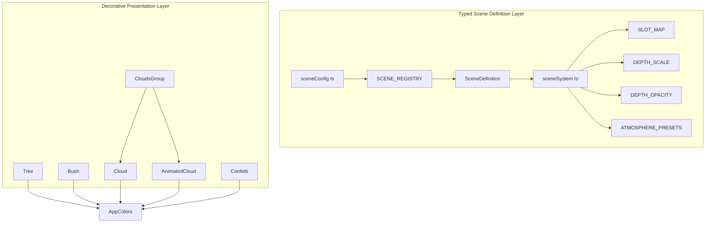
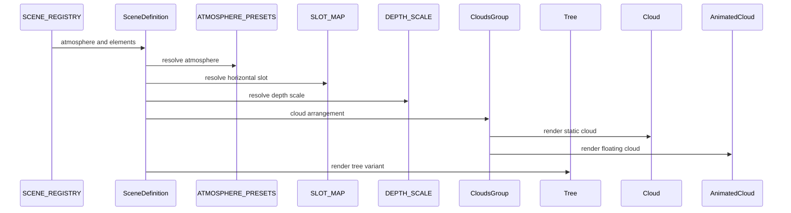
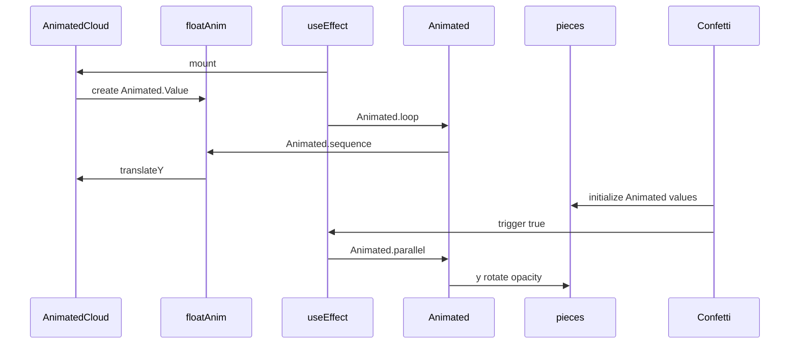

# Gameplay Runtime and Presentation - Scene Composition, Decorative Assets, and Visual Placement System

## Overview

This part of the app defines how park scenes are assembled and how the decorative layer is rendered on screen. The runtime starts with typed scene definitions in `app/services/sceneSystem.ts` and concrete scene registry entries in `app/services/sceneConfig.ts`, then uses those contracts to place characters, trees, props, clouds, and celebration effects with consistent slots, depth, and atmosphere.

The presentation layer is built from small visual primitives: SVG trees and bushes, pixel clouds in static and animated forms, and a confetti overlay. Shared visual tokens in `constants/theme.ts` supply the palette and theme values that keep the decorative assets aligned with the rest of the app’s style.

## Architecture Overview

## Typed Scene Definition Layer

### `app/services/sceneSystem.ts`

*`app/services/sceneSystem.ts`*

This module defines the scene vocabulary used across the runtime. It separates placement into named slots, gives each element a depth tier, and binds each scene to an atmosphere preset that controls sky tint, clouds, ground color, and ambient overlay.

#### Placement model

The placement system is built from constrained type aliases and lookup maps rather than raw style objects. That keeps scene layout data declarative and reusable across multiple scenes.

| Type or constant | Values |
| --- | --- |
| `LayerType` | `sky`, `background`, `midground`, `ground`, `foreground`, `ui` |
| `CharacterSize` | `small`, `medium`, `large`, `hero`, `xlarge` |
| `HorizontalSlot` | `far-left`, `left`, `center-left`, `center`, `center-right`, `right`, `far-right` |
| `DepthLevel` | `near`, `mid`, `far` |

#### Visual placement maps

| Constant | Purpose | Values |
| --- | --- | --- |
| `CHARACTER_SIZE_MAP` | Converts named sizes to numeric render sizes | `small: 120`, `medium: 200`, `large: 300`, `hero: 420`, `xlarge: 620` |
| `SLOT_MAP` | Converts named horizontal slots to `DimensionValue` positions | `far-left: '-5%'`, `left: '10%'`, `center-left: '25%'`, `center: '35%'`, `center-right: '55%'`, `right: '70%'`, `far-right: '82%'` |
| `DEPTH_SCALE` | Applies size scaling by depth | `near: 1`, `mid: 0.75`, `far: 0.55` |
| `DEPTH_OPACITY` | Applies opacity by depth | `near: 1`, `mid: 0.85`, `far: 0.65` |

The combination of `SLOT_MAP`, `DEPTH_SCALE`, and `DEPTH_OPACITY` creates the scene’s placement model: horizontal position comes from named slots, while depth changes both apparent size and visibility.

#### Element contracts

| Interface | Property | Type | Description |
| --- | --- | --- | --- |
| `CharacterElement` | `kind` | `'character'` | Identifies a character sprite entry |
| `CharacterElement` | `image` | `any` | Sprite asset reference |
| `CharacterElement` | `slot` | `HorizontalSlot` | Named horizontal placement |
| `CharacterElement` | `size` | `CharacterSize` | Named size token |
| `CharacterElement` | `depth` | `DepthLevel` | Optional depth tier, defaults to `near` |
| `CharacterElement` | `flipped` | `boolean` | Optional sprite mirror flag |
| `CharacterElement` | `zOffset` | `number` | Optional z-order fine tuning |
| `TreeElement` | `kind` | `'tree'` | Identifies a tree entry |
| `TreeElement` | `variant` | `'oak' \ | 'pine'` | Tree shape selector |
| `TreeElement` | `slot` | `HorizontalSlot` | Named horizontal placement |
| `TreeElement` | `size` | `CharacterSize` | Named size token used for the tree renderer |
| `TreeElement` | `depth` | `DepthLevel` | Optional depth tier |
| `PropElement` | `kind` | `'prop'` | Identifies a prop entry |
| `PropElement` | `image` | `any` | Prop asset reference |
| `PropElement` | `slot` | `HorizontalSlot` | Named horizontal placement |
| `PropElement` | `size` | `CharacterSize` | Named size token |
| `PropElement` | `depth` | `DepthLevel` | Optional depth tier |

`SceneElement` combines `CharacterElement`, `TreeElement`, and `PropElement` into one ordered scene payload.

#### Atmosphere model

| Type or constant | Values or fields |
| --- | --- |
| `AtmosphereType` | `day`, `golden-hour`, `overcast`, `night`, `indoor` |
| `ATMOSPHERE_PRESETS` | `skyTint`, `groundColor`, `showClouds`, `cloudOpacity`, `ambientOverlay` |

| Atmosphere | `skyTint` | `groundColor` | `showClouds` | `cloudOpacity` | `ambientOverlay` |
| --- | --- | --- | --- | --- | --- |
| `day` | `transparent` | `#3B7A57` | `true` | `1` | `undefined` |
| `golden-hour` | `#FF8C0022` | `#5C4A1E` | `true` | `0.7` | `rgba(255,140,0,0.08)` |
| `overcast` | `#88888822` | `#4A5568` | `true` | `0.5` | `rgba(100,100,120,0.12)` |
| `night` | `#00003388` | `#1a1a2e` | `false` | `0` | `rgba(0,0,50,0.3)` |
| `indoor` | `transparent` | `#8B6F47` | `false` | `0` | `undefined` |

#### Scene definition contract

| Interface | Property | Type | Description |
| --- | --- | --- | --- |
| `SceneDefinition` | `atmosphere` | `AtmosphereType` | Scene-wide lighting and sky preset |
| `SceneDefinition` | `elements` | `SceneElement[]` | Ordered back-to-front element list |
| `SceneDefinition` | `gameComponent` | `string` | Optional game takeover hook |
| `SceneDefinition` | `gameProps` | `object` | Optional payload for the takeover component |

The `elements` array is intentionally ordered back-to-front so the consumer can render layered objects in the same sequence they are declared.

### `app/services/sceneConfig.ts`

*`app/services/sceneConfig.ts`*

`SCENE_REGISTRY` is the concrete registry of named scenes. Each entry supplies the scene atmosphere and an ordered set of elements that combine trees, characters, and props.

| Scene key | Atmosphere | Element composition |
| --- | --- | --- |
| `park_arrival` | `day` | `tree` `oak` at `far-left`, `tree` `pine` at `right`, `tree` `oak` at `far-right`, `character` `Mom.png` at `left`, `character` `Cat.png` at `center-left`, `character` `maingirl.png` at `center-right` |
| `park_play` | `day` | `tree` `pine` at `center`, `character` `maingirl.png` at `left`, `character` `Cat.png` at `center-left`, `character` `friend1.png` at `center-right`, `character` `friend2.png` at `right`, `character` `friend3.png` at `far-right` |
| `park_volleyball` | `day` | `tree` `pine` at `left`, `tree` `pine` at `far-right`, `character` `maingirl.png` at `center`, `character` `friend3.png` at `right`, `prop` `Ball.png` at `center-right` |
| `park_stranger` | `day` | `tree` `pine` at `left`, `character` `maingirl.png` at `center`, `character` `Man.png` at `far-right`, `prop` `Ball.png` at `center-right` |
| `park_slide` | `day` | `character` `friend2.png` at `far-right`, `character` `maingirl.png` at `center`, `tree` `oak` at `center-right`, `tree` `oak` at `far-left` |

The scene registry uses the `SceneDefinition` contract directly. The visible entries rely on `atmosphere` and `elements`, while the interface also allows `gameComponent` and `gameProps` for scenes that hand visual control to a game component.

## Decorative Renderers

### `app/components/decorations/Tree.tsx`

*`app/components/decorations/Tree.tsx`*

`Tree` renders a positioned SVG tree and supports three visual variants: `oak`, `pine`, and `cherry`. It logs `Rendering Tree:` with `size`, `x`, `y`, `variant`, and `opacity`, then selects a variant from the local `trees` map.

#### Props

| Property | Type | Description |
| --- | --- | --- |
| `size` | `number` | Render size used for the SVG viewport and geometry scaling |
| `color` | `string` | Accepted in the prop contract |
| `x` | `number` | Absolute left position |
| `y` | `number` | Absolute top position |
| `variant` | `'oak' \ | 'pine' \ | 'cherry'` | Tree shape selector |
| `opacity` | `number` | Overall tree opacity |

#### Variant structure

| Variant | Geometry |
| --- | --- |
| `oak` | `Rect` trunk, three stacked `Rect` canopy layers, and small shadow `Rect` accents |
| `pine` | `Rect` trunk, three triangular `Path` canopy layers, and small shadow `Rect` accents |
| `cherry` | `Rect` trunk, three `Circle` canopy layers, and small blossom `Circle` accents |

The visible render paths use AppColors.dark, AppColors.blue, AppColors.lilac, AppColors.lilacLight, and AppColors.lilacMid for fills. The color prop is part of TreeProps, but the visible SVG branches use the shared theme palette.

`Tree` wraps the SVG in an absolutely positioned `View` with `zIndex: 12`, which keeps trees above the ground layer and behind characters.

### `app/components/decorations/bush.tsx`

*`app/components/decorations/bush.tsx`*

`Bush` renders a pixel-style shrub with an 8 by 8 grid of `Rect` cells. It uses `AppColors.blue` for the bush body and `AppColors.lilac` for the flower petals.

#### Props

| Property | Type | Description |
| --- | --- | --- |
| `size` | `number` | Overall SVG size, default `80` |
| `style` | `any` | Style object passed to the `Svg` root |

#### Structure

| Part | Behavior |
| --- | --- |
| `block` | Calculated as `size / 8` to define the pixel cell size |
| `bushShape` | 8 by 8 numeric mask that defines the rounded body |
| `pixel` | Helper that creates a `Rect` for each filled cell |
| `flower` | Helper that creates a cross-shaped flower with a center and four petals |

`Bush` uses three flower placements at `(3, 3)`, `(5, 4)`, and `(4, 5)` to break up the body and keep the bush visually playful.

### `app/components/decorations/cloud.tsx`

*`app/components/decorations/cloud.tsx`*

`Cloud` is the non-animated pixel cloud renderer. It shares the same size vocabulary as `AnimatedCloud` and uses the same positional conversion approach for `x` and `y`.

#### Props

| Property | Type | Description |
| --- | --- | --- |
| `size` | `'small' \ | 'medium' \ | 'large'` | Cloud density and footprint selector |
| `x` | `number \ | string` | Left position, accepted as a raw number or percentage string |
| `y` | `number \ | string` | Top position, accepted as a raw number or percentage string |
| `opacity` | `number` | Overall cloud opacity |

#### Rendering model

| Part | Behavior |
| --- | --- |
| `getPosition` | Converts numeric inputs directly and parses percent strings against `screenWidth` |
| `pixelSize` | Uses `8`, `10`, or `12` based on `size` |
| `cloudWidth` | Uses `80`, `120`, or `160` based on `size` |
| `cloudHeight` | Uses `50`, `70`, or `90` based on `size` |
| `cloudPattern` | 2D pixel mask with `1` for white pixels and `0` for transparent cells |

`Cloud` renders in an absolutely positioned `View` with `zIndex: 8` and `pointerEvents="none"` so it stays visually present but does not intercept touches.

### `app/components/decorations/AnimatedCloud.tsx`

*`app/components/decorations/AnimatedCloud.tsx`*

`AnimatedCloud` uses the same pixel-cloud geometry as `Cloud`, but adds a floating loop driven by `Animated.Value`. The component starts an `Animated.loop` inside `useEffect`, cycling up and down using `Easing.inOut(Easing.sin)`.

#### Props

| Property | Type | Description |
| --- | --- | --- |
| `size` | `'small' \ | 'medium' \ | 'large'` | Cloud density and footprint selector |
| `x` | `number \ | string` | Left position, accepted as a raw number or percentage string |
| `y` | `number \ | string` | Top position, accepted as a raw number or percentage string |
| `opacity` | `number` | Overall cloud opacity |
| `floatRange` | `number` | Vertical travel distance in pixels |
| `floatSpeed` | `number` | Duration of each half of the float cycle |

#### Animation flow

| Step | Behavior |
| --- | --- |
| `floatAnim` | Initialized with `useRef(new Animated.Value(0)).current` |
| `useEffect` | Starts the repeating animation sequence on mount |
| `Animated.sequence` | Moves from `0` to `1`, then back to `0` |
| `translateY` | Interpolates to `0` and `-floatRange` |
| `useNativeDriver` | Enabled for each timing step |

`AnimatedCloud` uses `pointerEvents="none"` and an absolute container with `zIndex: 8`, keeping it aligned with the static cloud renderer while adding motion.

### `app/components/decorations/Confetti.tsx`

*`app/components/decorations/Confetti.tsx`*

`Confetti` is a trigger-driven celebration overlay. It creates a fixed number of pieces, assigns each piece its own animated position and opacity state, and launches multiple animations in parallel when `trigger` becomes true.

#### Props

| Property | Type | Description |
| --- | --- | --- |
| `trigger` | `boolean` | Starts the confetti animation when true |

#### Runtime data

| Value | Type | Purpose |
| --- | --- | --- |
| `CONFETTI_COUNT` | `number` | Number of confetti pieces, set to `25` |
| `COLORS` | `string[]` | Alternates `AppColors.blue` and `AppColors.lilac` |
| `pieces` | array | Persistent ref-backed piece state |

Each piece stores animated values for `x`, `y`, `rotate`, `opacity`, and `scale`. On trigger, the component resets `y` to `-20`, sets `opacity` to `1`, then runs `Animated.parallel` so each piece falls, spins, and fades out together.

#### Piece animation sequence

| Animated value | Start | End |
| --- | --- | --- |
| `y` | `-20` | `height + 50` |
| `rotate` | `0` | `1` |
| `opacity` | `1` | `0` |

The overlay uses `pointerEvents="none"` and `StyleSheet.absoluteFill` so it covers the play area without blocking interactions.

### `app/components/decorations/cloudGroup.tsx`

*`app/components/decorations/cloudGroup.tsx`*

This file is documented here as isolated source evidence. `CloudsGroup` chooses a cloud arrangement from `sceneIndex`, then renders either `Cloud` or `AnimatedCloud` depending on the `animated` prop.

#### Props

| Property | Type | Description |
| --- | --- | --- |
| `sceneIndex` | `number` | Selects the cloud arrangement preset |
| `animated` | `boolean` | Switches between `AnimatedCloud` and `Cloud` |

#### Scene arrangements

| `sceneIndex` | Cloud list |
| --- | --- |
| `0` | `large` at `-20, 20` with `0.8`, `medium` at `120, 50` with `0.7`, `small` at `250, 30` with `0.9`, `medium` at `320, 60` with `0.6` |
| `1` | `medium` at `40, 30` with `0.7`, `large` at `200, 10` with `0.8`, `small` at `320, 40` with `0.9` |
| default | `medium` at `80, 40` with `0.8`, `small` at `240, 60` with `0.7`, `large` at `300, 20` with `0.6` |

The container is absolutely positioned with `top: 0`, `left: 700`, `right: 0`, `bottom: 0`, and `zIndex: 8`, which makes the group a right-side cloud band inside the scene.

## Theme Tokens

### `constants/theme.ts`

*`constants/theme.ts`*

This module provides the shared palette and presentation tokens used by the decorative components and the rest of the app UI. `AppColors` is the palette most directly consumed by the scene renderers.

#### Export summary

| Export | Purpose | Notable members |
| --- | --- | --- |
| `AppColors` | Shared color palette | `lilac`, `blue`, `lilacLight`, `lilacMid`, `white`, `dark`, `gameBg`, `impressionsBg` |
| `Colors` | Light and dark theme mapping | `light`, `dark` |
| `AppFonts` | Named font families | `title`, `header`, `subhead`, `body`, `bodySmall`, `button2`, `button` |
| `AppFontSizes` | Numeric size scale | `super`, `title`, `header`, `subhead`, `body`, `bodySmall`, `button`, `button2` |
| `ButtonStyles` | Button shape and spacing presets | `icon`, `level`, `primary`, `action`, `bigAction`, `hugeAction` |
| `CardStyles` | Card surface presets | `default`, `shadowVersion` |
| `Spacing` | Common spacing scale | `xs`, `sm`, `md`, `lg`, `xl`, `xxl` |
| `Fonts` | Platform font families | `ios`, `default`, `web` |

#### `AppColors`

| Token | Value |
| --- | --- |
| `lilac` | `#E7E1FF` |
| `blue` | `#003E8F` |
| `lilacLight` | `#E8DFFF` |
| `lilacMid` | `#B8A5D8` |
| `white` | `#FFFFFF` |
| `dark` | `#0D1F3C` |
| `gameBg` | `#E4D9F7` |
| `impressionsBg` | `#EDE6F9` |

#### `Colors`

| Mode | Tokens |
| --- | --- |
| `light` | `text: #11181C`, `background: #fff`, `tint: tintColorLight`, `icon: #687076`, `tabIconDefault: #687076`, `tabIconSelected: tintColorLight`, `primary: AppColors.blue`, `secondary: AppColors.lilac` |
| `dark` | `text: #ECEDEE`, `background: #151718`, `tint: tintColorDark`, `icon: #9BA1A6`, `tabIconDefault: #9BA1A6`, `tabIconSelected: tintColorDark`, `primary: AppColors.blue`, `secondary: AppColors.lilac` |

The decorative components in this section draw their colors directly from `AppColors`, which keeps tree bark, cloud fill, confetti, and bush shading aligned with the same theme palette.

## Feature Flows

### Scene composition flow

This flow reflects the source-backed composition model: a scene key resolves to a `SceneDefinition`, the layout maps convert slot and depth tokens into render values, and the decorative components turn those values into absolute scene placement.

### Decorative animation flow

`AnimatedCloud` runs continuously after mount, while `Confetti` runs only when its `trigger` prop is set. Both use React Native animation primitives and persist their animated values with `useRef`.

## State Management

| Surface | Carrier | Behavior |
| --- | --- | --- |
| Scene registry | `SCENE_REGISTRY` | Static `Record<string, SceneDefinition>` keyed by scene id |
| Scene payload | `SceneDefinition` | Bundles `atmosphere` and ordered `elements` |
| Slot placement | `SLOT_MAP` | Converts named slots into horizontal positions |
| Depth tuning | `DEPTH_SCALE` and `DEPTH_OPACITY` | Converts `near`, `mid`, `far` into size and opacity behavior |
| Cloud motion | `floatAnim` | `Animated.Value` stored in a ref for the floating loop |
| Confetti motion | `pieces` | Ref-backed array of animated piece state |
| Cloud grouping | `sceneIndex` and `animated` | Selects a scene preset and swaps between static and animated clouds |
| Tree fallback | `selectedVariant` | Falls back to `oak` when the requested variant key is missing |

The scene runtime keeps most of its state in constants, props, and refs rather than in external stores. That makes the visual layer deterministic from the scene key and decoration props.

## Error Handling

`Tree` and `CloudsGroup` both include source-backed fallback behavior for unknown selectors.

- `Tree` resolves `trees[variant] || trees.oak`, which means an unknown `variant` falls back to the `oak` tree.
- `CloudsGroup` uses a `default` branch in `getCloudsForScene`, which returns a fallback cloud arrangement for any `sceneIndex` other than `0` or `1`.
- `getPosition` in both cloud components accepts numbers directly and parses strings, returning `0` only when the input is neither a number nor a string.

These fallbacks keep the scene visible even when a caller passes an unrecognized variant or scene index.

## Dependencies

### Runtime and rendering dependencies

- `react`
- `react-native`
- `react-native-svg`
- `@/constants/theme`
- `Dimensions`
- `Animated`
- `Easing`
- `StyleSheet`
- `View`
- `Platform`

### Asset references used by `sceneConfig.ts`

- `../../assets/images/chapters/Mom.png`
- `../../assets/images/chapters/Cat.png`
- `../../assets/images/maingirl.png`
- `../../assets/images/chapters/friend1.png`
- `../../assets/images/chapters/friend2.png`
- `../../assets/images/chapters/friend3.png`
- `../../assets/images/chapters/Man.png`
- `../../assets/images/chapters/Ball.png`

The scene registry binds these assets directly into `SceneDefinition` entries, so the visual runtime can resolve sprite and prop imagery without extra lookup layers.

## Testing Considerations

- Verify every scene key in `SCENE_REGISTRY` resolves to a valid `SceneDefinition`.
- Verify each `HorizontalSlot` maps to the expected `DimensionValue` in `SLOT_MAP`.
- Verify `DEPTH_SCALE` and `DEPTH_OPACITY` apply consistent `near`, `mid`, and `far` behavior.
- Verify `Tree` selects `oak`, `pine`, and `cherry` correctly and falls back to `oak`.
- Verify `Cloud` and `AnimatedCloud` resolve percentage positions into numeric coordinates.
- Verify `Confetti` launches only when `trigger` is true and resets each piece before animation.
- Verify `CloudsGroup` selects the correct cloud arrangement for `sceneIndex` values `0`, `1`, and the fallback branch.
- Verify `AppColors` values remain consistent for the decorative assets that depend on them.

## Key Classes Reference

| Class | Responsibility |
| --- | --- |
| `sceneSystem.ts` | Defines scene slots, depth behavior, atmosphere presets, and scene element contracts |
| `sceneConfig.ts` | Declares the concrete `SCENE_REGISTRY` scene layouts and asset bindings |
| `Tree.tsx` | Renders SVG tree variants with absolute placement and theme colors |
| `bush.tsx` | Renders a pixel shrub with flower accents using SVG rectangles |
| `cloud.tsx` | Renders a static pixel cloud with size-based dimensions |
| `AnimatedCloud.tsx` | Renders a floating cloud with looping vertical animation |
| `Confetti.tsx` | Renders trigger-driven celebration particles with animated motion |
| `cloudGroup.tsx` | Selects scene-based cloud arrangements and switches between static and animated clouds |
| `theme.ts` | Supplies the shared palette and presentation tokens used by the decorative layer |
