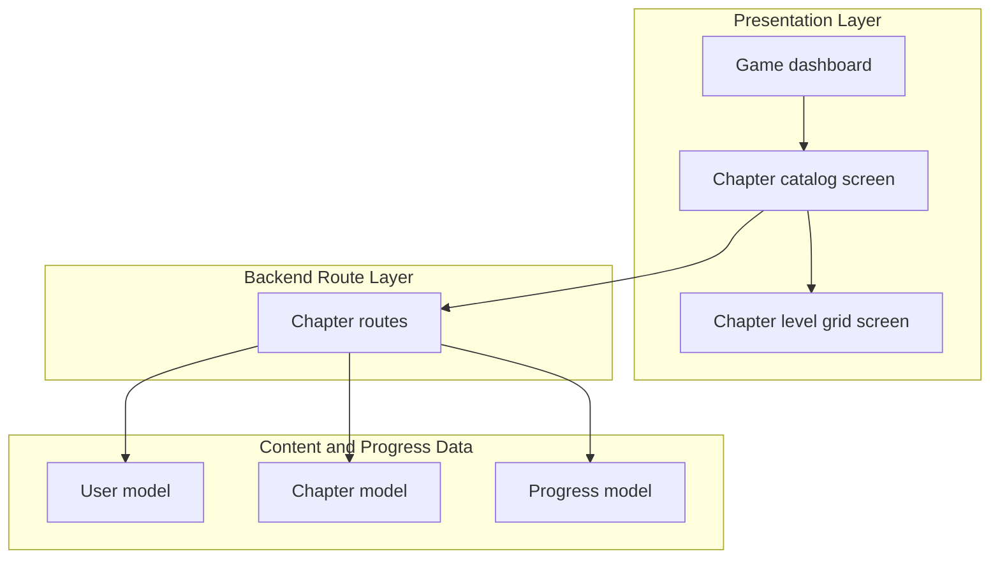
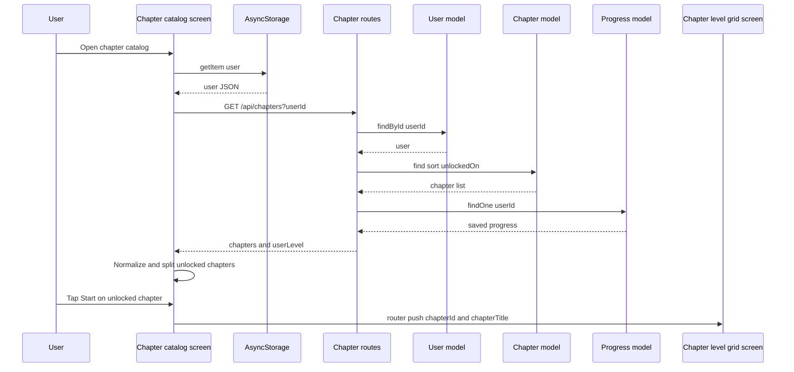

# Learning Content and Progression

## Overview

This feature is the chapter browsing and chapter-entry path for the game. It lets a player open the chapter catalog, see which chapters are unlocked, review how many levels each chapter contains, and start only the chapters their progression permits. The same flow also carries the player into the chapter-level grid screen, where individual levels are shown as locked, unlocked, or passed.

The backend chapter route enriches the catalog with saved progression from `Progress`, so the chapter list can carry both unlock state and per-chapter progress state in one response. The frontend then uses the player profile saved in `AsyncStorage` to render locked and unlocked cards, reorder them for browsing, and route into the selected chapter.

## Architecture Overview



## Presentation Layer

### Chapter Catalog Screen

*`app/game/chapters.tsx`*

This screen loads the user profile from `AsyncStorage`, requests the chapter catalog from the backend, and renders chapter cards in a horizontal carousel. It computes lock state from the current user level, shows chapter art by title, and only allows navigation into unlocked chapters.

#### Screen state and refs

| Name | Type | Purpose |  |
| --- | --- | --- | --- |
| `scrollViewRef` | `useRef<ScrollView>(null)` | Drives left and right carousel navigation. |  |
| `currentIndex` | `number` | Tracks the current visible chapter card for arrow buttons. |  |
| `userName` | `string` | Loaded from the stored `user` profile. |  |
| `userId` | `string \ | null` | Used as the query key for chapter loading. |
| `userLevel` | `number` | Local unlock threshold derived from `user.level`. |  |
| `chapters` | `Chapter[]` | Normalized chapter list used by the carousel. |  |
| `loading` | `boolean` | Controls the loading spinner versus the chapter list. |  |


#### Layout constants

| Constant | Value | Role |
| --- | --- | --- |
| `APIURL` | `http://localhost:5000/api/chapters` | Chapter catalog endpoint used by the screen. |
| `cardWidth` | `width * 0.30` | Card width used in rendering and scroll math. |
| `cardMarginHorizontal` | `30` | Horizontal spacing between cards. |


#### Local routines

| Routine | Description |
| --- | --- |
| `getChapterBackground` | Maps chapter titles to `ParkBg`, `HomeBg`, `SchoolBg`, or `null`. |
| `loadUserName` | Reads `user` from `AsyncStorage` and seeds `userName`, `userId`, and `userLevel`. |
| `fetchChapters` | Requests the catalog and converts the backend payload into local `Chapter` objects. |
| `handleScroll` | Updates `currentIndex` from the horizontal scroll offset. |
| `scrollTo` | Scrolls the carousel one card left or right. |


#### Chapter type

| Property | Type |
| --- | --- |
| `id` | `string` |
| `title` | `string` |
| `description?` | `string` |
| `unlocked?` | `boolean` |
| `levelCount?` | `number` |


#### Chapter card behavior

| UI part | Behavior |
| --- | --- |
| Top bar | Shows the chapter’s level count. |
| Background image | Selected by lowercased title through `getChapterBackground`. |
| Lock overlay | Rendered when `chapter.unlocked` is false. |
| Start button | Enabled only when `chapter.unlocked` is true. |
| Disabled button | Uses the locked button style and cannot navigate. |


#### Chapter ordering and filtering

- The screen splits the fetched list into `unlockedChapters` and `lockedChapters`.
- It concatenates those arrays into `allChapters`.
- The list therefore shows all unlocked chapters first, then all locked chapters.
- The button press handler only calls `router.push` when the chapter is unlocked.

#### Title to background mapping

| `titleLower` | Background |
| --- | --- |
| `the park` | `ParkBg` |
| `home` | `HomeBg` |
| `school safety` | `SchoolBg` |
| default | `null` |


#### Unlock rules on the client

| Rule source | Condition | Effect |  |
| --- | --- | --- | --- |
| Stored user profile | `typeof user.level === "number" ? user.level : Number(user.level) | 1` | Seeds the local unlock threshold. |
| Catalog record | `chapter.unlockedOn <= userLevel` | Sets the local `unlocked` flag. |  |
| UI guard | `chapter.unlocked` | Enables the Start button and routes to the chapter. |  |


The screen consumes the chapter list as either a raw array or an object with a `chapters` property. That lets it accept the backend response shape returned by `backend/routes/chapters.js`.

### Chapter Level Grid Screen

*`app/game/[chapterId].tsx`*

This screen opens after a chapter card is tapped. It reads `chapterId` and `chapterTitle` from the route, loads level data for that chapter, and displays a grid of level cards with lock and pass states.

#### Screen state

| Name | Type | Purpose |  |
| --- | --- | --- | --- |
| `userId` | `string \ | null` | Loaded from `AsyncStorage` and passed to the levels request. |
| `levels` | `Level[]` | Grid data for the selected chapter. |  |
| `loading` | `boolean` | Controls the loading spinner while levels are fetched. |  |


#### Local helpers

| Helper | Description |
| --- | --- |
| `LockIcon` | Renders the pixel-art lock used on locked level cards. |
| `StarRow` | Renders three stars and fills the first `count`. |


#### Level type

| Property | Type |
| --- | --- |
| `id` | `string` |
| `title` | `string` |
| `order` | `number` |
| `unlocked` | `boolean` |
| `passed` | `boolean` |
| `starsEarned` | `number` |
| `attempts` | `number` |
| `reward?` | `{ stars: number; xp: number }` |


#### Level card behavior

| UI state | Behavior |
| --- | --- |
| Loading | Shows `ActivityIndicator`. |
| Unlocked | Card is tappable and routes to `"/game/levelPlayer"`. |
| Passed | Card uses the passed styling and shows `StarRow`. |
| Locked | Card is dimmed, shows `LockIcon`, and is not tappable. |


#### Navigation from the chapter grid

- Tapping an unlocked level calls `router.push`.
- The route includes `levelId`, `chapterId`, `levelTitle`, and `chapterTitle`.
- Locked level cards render with `disabled={!level.unlocked}` and `activeOpacity={1}`.

## Backend Route Layer

### Chapter Routes

*`backend/routes/chapters.js`*

This route module serves chapter browsing data and admin chapter maintenance endpoints. It connects the user record, chapter catalog, and saved progress into one chapter listing response.

#### Imported model dependencies

| Import | Role in this file |
| --- | --- |
| `Chapter` from `../models/content agent/Chapter.js` | Chapter catalog source and admin create and delete target. |
| `Progress` from `../models/content agent/Progress.js` | Saved chapter progress source. |
| `User` from `../models/User.js` | Unlock threshold source for the requesting user. |


#### Route handlers

| Route | Description |
| --- | --- |
| `GET /` | Loads the user, chapter catalog, and saved progress, then returns merged chapter status. |
| `GET /admin` | Returns all chapter documents sorted by `unlockedOn`. |
| `POST /` | Creates a chapter from `title`, `order`, and `isActive`. |
| `DELETE /:id` | Deletes a chapter by id. |


#### Progress merge behavior

| Step | Code path | Result |
| --- | --- | --- |
| Load user | `User.findById(userId)` | Provides `user.level` for unlock checks. |
| Load chapters | `Chapter.find().sort({ unlockedOn: 1 })` | Gives the catalog in unlock order. |
| Load progress | `Progress.findOne({ userId })` | Pulls saved chapter progress for the user. |
| Build lookup | `new Map(progress?.chapterProgress.map((cp) => [cp.chapterId.toString(), cp]) ?? [])` | Enables per-chapter status lookup by chapter id. |
| Enrich each chapter | `chapters.map` | Adds `unlocked`, `status`, `starsEarned`, and `totalStarsPossible`. |


#### Chapter status fields returned by `GET /`

| Field | Source |
| --- | --- |
| `id` | `chapter._id` |
| `title` | `chapter.title` |
| `description` | `chapter.description` |
| `unlockedOn` | `chapter.unlockedOn` |
| `levelCount` | `chapter.levels?.length ?? 0` |
| `unlocked` | `chapter.unlockedOn <= user.level` |
| `status` | `cp?.status ?? "locked"` |
| `starsEarned` | `cp?.starsEarned ?? 0` |
| `totalStarsPossible` | `cp?.totalStarsPossible ?? 0` |


The route keeps unlock permission and saved progress separate. `unlocked` is permission-based through the user level, while `status`, `starsEarned`, and `totalStarsPossible` come from `Progress`.

#### Admin chapter creation behavior

| Input field | Behavior |
| --- | --- |
| `title` | Required. Missing `title` returns `400` with `title required`. |
| `order` | Defaults to `1` when not provided. |
| `isActive` | Defaults to `true` when not provided. |


#### Admin delete behavior

| Step | Behavior |
| --- | --- |
| Parse `id` | Reads `req.params.id`. |
| Validate id | Calls `mongoose.isValidObjectId(id)`. |
| Delete | Calls `Chapter.findByIdAndDelete(id)`. |
| Response | Returns `{ deleted: true }`. |


## API Integration

### Get Chapter Catalog

> **Note:** `backend/routes/chapters.js` uses `mongoose.isValidObjectId(id)` in `DELETE /:id`, but the file does not import `mongoose`. That guard cannot execute as written.

*`backend/routes/chapters.js`*

```api
{
    "title": "Get Chapter Catalog",
    "description": "Fetches the chapter catalog for a user, merges saved progress from Progress, and returns the computed unlock state.",
    "method": "GET",
    "baseUrl": "http://localhost:5000/api/chapters",
    "endpoint": "/",
    "headers": [],
    "queryParams": [
        {
            "key": "userId",
            "value": "user-123",
            "required": true
        }
    ],
    "pathParams": [],
    "bodyType": "none",
    "requestBody": "",
    "formData": [],
    "rawBody": "",
    "responses": {
        "200": {
            "description": "Success",
            "body": "{\n    \"chapters\": [\n        {\n            \"id\": \"66d8f8c2e9b1c2f001234567\",\n            \"title\": \"The Park\",\n            \"description\": \"Park safety lessons\",\n            \"unlockedOn\": 1,\n            \"levelCount\": 4,\n            \"unlocked\": false,\n            \"status\": \"locked\",\n            \"starsEarned\": 0,\n            \"totalStarsPossible\": 0\n        }\n    ],\n    \"userLevel\": 2\n}"
        },
        "404": {
            "description": "User not found",
            "body": "{\n    \"message\": \"User not found\"\n}"
        },
        "500": {
            "description": "Server error",
            "body": "{\n    \"message\": \"Server error\"\n}"
        }
    }
}
```

### Get Admin Chapter Catalog

*`backend/routes/chapters.js`*

```api
{
    "title": "Get Admin Chapter Catalog",
    "description": "Returns all chapter documents sorted by unlockedOn for admin use.",
    "method": "GET",
    "baseUrl": "http://localhost:5000/api/chapters",
    "endpoint": "/admin",
    "headers": [],
    "queryParams": [],
    "pathParams": [],
    "bodyType": "none",
    "requestBody": "",
    "formData": [],
    "rawBody": "",
    "responses": {
        "200": {
            "description": "Success",
            "body": "{\n    \"chapters\": [\n        {\n            \"_id\": \"66d8f8c2e9b1c2f001234567\",\n            \"title\": \"The Park\",\n            \"description\": \"Park safety lessons\",\n            \"unlockedOn\": 1,\n            \"levels\": []\n        }\n    ]\n}"
        },
        "500": {
            "description": "Server error",
            "body": "{\n    \"message\": \"Server error\"\n}"
        }
    }
}
```

### Create Chapter

*`backend/routes/chapters.js`*

```api
{
    "title": "Create Chapter",
    "description": "Creates a chapter with title, order, and active state for admin use.",
    "method": "POST",
    "baseUrl": "http://localhost:5000/api/chapters",
    "endpoint": "/",
    "headers": [
        {
            "key": "Content-Type",
            "value": "application/json",
            "required": true
        }
    ],
    "queryParams": [],
    "pathParams": [],
    "bodyType": "json",
    "requestBody": "{\n    \"title\": \"The Park\",\n    \"order\": 1,\n    \"isActive\": true\n}",
    "formData": [],
    "rawBody": "",
    "responses": {
        "201": {
            "description": "Created",
            "body": "{\n    \"chapter\": {\n        \"_id\": \"66d8f8c2e9b1c2f001234567\",\n        \"title\": \"The Park\",\n        \"order\": 1,\n        \"isActive\": true\n    }\n}"
        },
        "400": {
            "description": "Validation error",
            "body": "{\n    \"error\": \"title required\"\n}"
        },
        "500": {
            "description": "Server error",
            "body": "{\n    \"error\": \"Database error message\"\n}"
        }
    }
}
```

### Delete Chapter

*`backend/routes/chapters.js`*

```api
{
    "title": "Delete Chapter",
    "description": "Deletes a chapter by id for admin use.",
    "method": "DELETE",
    "baseUrl": "http://localhost:5000/api/chapters",
    "endpoint": "/:id",
    "headers": [],
    "queryParams": [],
    "pathParams": [
        {
            "key": "id",
            "value": "66d8f8c2e9b1c2f001234567",
            "required": true
        }
    ],
    "bodyType": "none",
    "requestBody": "",
    "formData": [],
    "rawBody": "",
    "responses": {
        "200": {
            "description": "Deleted",
            "body": "{\n    \"deleted\": true\n}"
        },
        "400": {
            "description": "Invalid id",
            "body": "{\n    \"error\": \"invalid id\"\n}"
        },
        "500": {
            "description": "Server error",
            "body": "{\n    \"error\": \"Database error message\"\n}"
        }
    }
}
```

## Feature Flows

### Browse chapters and open a chapter



## State Management

### Chapter catalog screen state

| State | Description |
| --- | --- |
| `loading` | Starts as `true` and controls the spinner. |
| `chapters` | Holds the mapped chapter records after fetch. |
| `currentIndex` | Tracks the visible card for arrow navigation. |
| `userId` | Drives the chapter fetch request. |
| `userLevel` | Drives the local unlock rule. |


### Chapter grid screen state

| State | Description |
| --- | --- |
| `loading` | Controls the chapter level loading spinner. |
| `levels` | Holds the level cards for the selected chapter. |
| `userId` | Drives the level request. |


### Server-side progression state

| State | Description |
| --- | --- |
| `chapterProgressMap` | In-memory map from `chapterId.toString()` to saved chapter progress during a request. |
| `unlocked` | Computed from the user level. |
| `status` | Computed from saved progress or defaults to `"locked"`. |


## Integration Points

> **Note:** `app/game/chapters.tsx` and `app/game/[chapterId].tsx` only clear `loading` after their fetch branches run. If `AsyncStorage` does not return a `user`, both screens remain on the spinner because the early return skips the code that clears loading.

- `app/game/main.tsx` routes into the chapter browser through the `Chapter` action and `router.push("/game/chapters")`.
- `app/game/chapters.tsx` uses `AsyncStorage` user data as the shared source for `userId` and `userLevel`.
- `backend/routes/chapters.js` combines `Chapter`, `Progress`, and `User` data into one catalog response.
- `app/game/[chapterId].tsx` uses the selected chapter params to render the chapter-level grid and route into `app/game/levelPlayer.tsx`.

## Error Handling

- `app/game/chapters.tsx` wraps both user loading and chapter fetching in `try` / `catch` blocks and logs failures with `console.error`.
- `app/game/[chapterId].tsx` logs user loading and level fetching failures with `console.error`.
- `backend/routes/chapters.js` returns `404` when `User.findById(userId)` returns nothing.
- `backend/routes/chapters.js` returns `400` when `title` is missing in `POST /`.
- `backend/routes/chapters.js` returns `400` when `id` fails validation in `DELETE /:id`.
- `backend/routes/chapters.js` returns `500` on caught server errors in all handlers.

## Caching Strategy

| Layer | Behavior |
| --- | --- |
| `AsyncStorage` | Persists the local `user` profile so both screens can reuse `id` and `level`. |
| Chapter catalog screen state | Keeps the fetched chapter list in memory for the current screen session. |
| Chapter grid screen state | Keeps the fetched level list in memory for the current screen session. |
| `chapterProgressMap` | Provides request-scoped lookup of saved progress by chapter id. |


## Dependencies

- `expo-router` for screen routing and dynamic chapter navigation.
- `@react-native-async-storage/async-storage` for loading the persisted `user` profile.
- `react-native` `ScrollView`, `ActivityIndicator`, `TouchableOpacity`, `ImageBackground`, and `Dimensions` for the catalog UI.
- `express` for the chapter route module.
- `Chapter` from `../models/content agent/Chapter.js`.
- `Progress` from `../models/content agent/Progress.js`.
- `User` from `../models/User.js`.
- `BackgroundSVG`, `ArrowRight`, `Arrow`, `Lock`, `ParkBg`, `HomeBg`, and `SchoolBg` for chapter and level visuals.

## Testing Considerations

- Verify that a stored `user` profile loads the correct `userId` and `userLevel`.
- Verify that chapter records with `unlockedOn <= userLevel` render with an enabled Start button.
- Verify that locked chapters show the lock overlay and do not route.
- Verify that `GET /api/chapters?userId=` returns a wrapped payload with `chapters` and `userLevel`.
- Verify that `Progress` values change `status`, `starsEarned`, and `totalStarsPossible` in the chapter response.
- Verify that `app/game/[chapterId].tsx` shows locked level cards with the padlock overlay and does not allow tap navigation.
- Verify that `GET /api/chapters` returns `404` when the user id does not resolve to a `User`.

## Key Classes Reference

| Class | Responsibility |
| --- | --- |
| `chapters.tsx` | Loads the chapter catalog, computes local lock state, and renders the horizontal chapter picker. |
| `[chapterId].tsx` | Shows the selected chapter’s level grid and routes into level play. |
| `chapters.js` | Serves chapter catalog data and merges saved progress into the response. |
