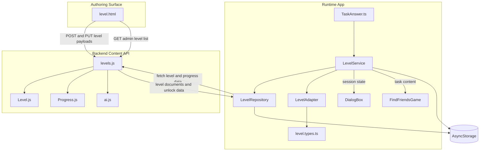
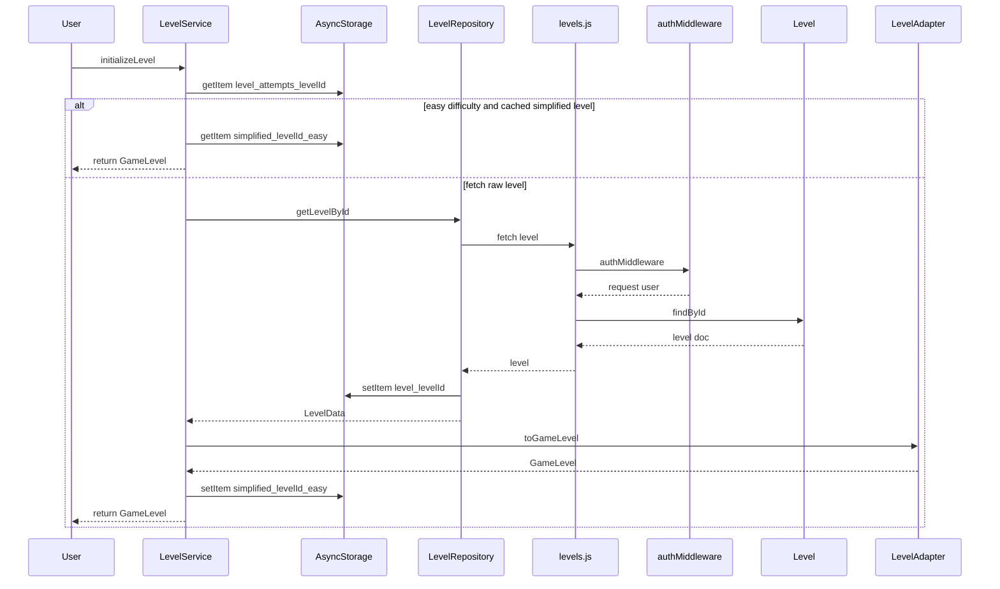
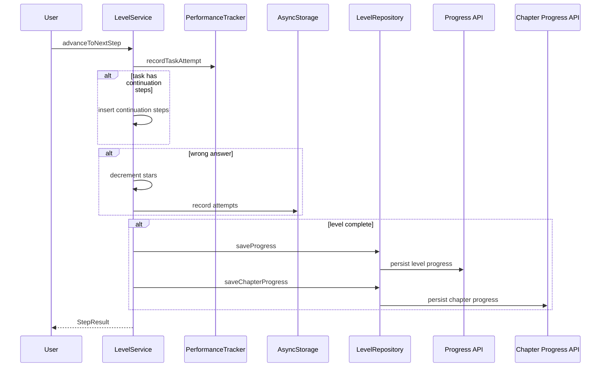
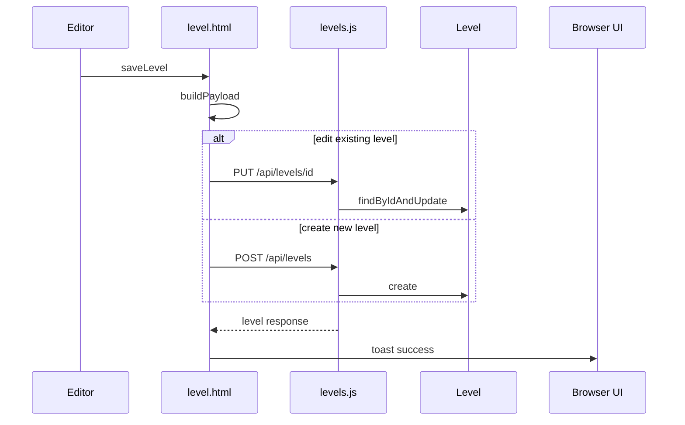

# Learning Content and Progression

## Overview

This feature is the content path that takes a level from authoring, through backend storage, into the mobile app, and then back out again as progress and chapter completion data. The authoring surface in `level.html` builds rich level payloads, `backend/routes/levels.js` stores and serves those documents through `backend/models/content agent/Level.js`, and the app reads them through `app/repositories/LevelRepository.ts`, transforms them through `app/adapters/LevelAdapter.ts`, and runs them inside `app/services/LevelService.ts`.

The runtime path is built around adaptive difficulty and layered caching. `LevelService` can reuse a simplified easy-mode level from `AsyncStorage`, `LevelRepository` maintains memory and persistent caches for levels and progress, and the backend can return an AI-generated easy variant when attempt thresholds are crossed. Progress completion also feeds back into chapter-level persistence through `ChapterProgressPayload`.

## Architecture Overview



## Runtime Content Types and Session State

### `app/types/level.types.ts`

> **Note:** The active `getLevelById` path in `app/repositories/LevelRepository.ts` always reaches the backend first because the cache lookup block is commented out. The method still repopulates cache after the fetch, but the shown code does not serve `getLevelById` from cache.

*`app/types/level.types.ts`*

This file defines the shared data shapes that the repository, adapter, and service all consume. `DialogStep` is the source shape for authored level steps, `LevelData` mirrors the backend level document consumed by the adapter, and `LevelProgress` and `ChapterProgressPayload` carry persistence data back to the backend.

#### `DialogStep`

| Property | Type | Description |
| --- | --- | --- |
| `type` | `'narrate' | 'dialog' | 'task'` | Step category used by the runtime renderer. |
| `text` | `string` | Step text. |
| `speaker` | `string` | Speaker label for dialog steps. |
| `sceneKey` | `string` | Scene lookup key for decorations and layout. |
| `taskType` | `'choice' | 'tap_object' | 'drag_drop' | 'speak' | 'image_choice'` | Task interaction type. |
| `gameType` | `string` | Optional game renderer key such as `FindFriendsGame`. |
| `instruction` | `string` | Task instruction shown to the player. |
| `content` | `any` | Task-specific content payload. |
| `correctFeedback` | `string` | Feedback shown on success. |
| `wrongFeedback` | `string` | Feedback shown on failure. |
| `continuationSteps` | `DialogStep[]` | Branch dialogue or follow-up tasks. |
| `_isContinuation` | `boolean` | Internal continuation flag. |
| `_parentTask` | `DialogStep` | Internal reference to the parent task step. |


#### `DifficultyVariant`

| Property | Type | Description |
| --- | --- | --- |
| `dialog` | `DialogStep[]` | Stored dialog variant for a given difficulty. |


#### `LevelData`

| Property | Type | Description |
| --- | --- | --- |
| `_id` | `string` | Backend document identifier. |
| `chapterId` | `string` | Chapter identifier. |
| `title` | `string` | Level title. |
| `order` | `number` | Chapter ordering value. |
| `scene` | `{ backgroundImage?: string; characters: string[]; narrative: string; }` | Scene configuration consumed by `LevelAdapter`. |
| `dialog` | `DialogStep[]` | Base dialog and task sequence. |
| `difficultyVariants` | `{ easy?: DifficultyVariant; medium?: DifficultyVariant; hard?: DifficultyVariant; }` | Optional stored difficulty variants. |
| `reward` | `{ stars: number }` | Reward metadata. |
| `maxRetries` | `number` | Maximum retries allowed for the level. |
| `isActive` | `boolean` | Active flag used by the backend route filters. |
| `createdAt` | `Date` | Creation timestamp. |
| `updatedAt` | `Date` | Last update timestamp. |


#### `LevelProgress`

| Property | Type | Description |
| --- | --- | --- |
| `userId` | `string` | Player identifier. |
| `levelId` | `string` | Level identifier. |
| `chapterId` | `string` | Chapter identifier. |
| `starsEarned` | `number` | Stars earned for the level. |
| `passed` | `boolean` | Whether the level was passed. |
| `attempts` | `number` | Attempt count. |
| `lastAttemptAt` | `Date` | Timestamp of the latest attempt. |
| `completedAt` | `Date` | Completion timestamp. |
| `lastStepIndex` | `number` | Last reached step index. |
| `metadata` | `{ timeSpent?: number; accuracy?: number; finalStars?: number; }` | Optional tracking metadata. |


#### `ChapterProgressPayload`

| Property | Type | Description |
| --- | --- | --- |
| `userId` | `string` | Player identifier. |
| `chapterId` | `string` | Chapter identifier. |
| `completedLevelId` | `string` | Recently completed level. |
| `starsEarned` | `number` | Stars earned on that completed level. |


### `app/interfaces/TaskAnswer.ts`

*`app/interfaces/TaskAnswer.ts`*

`TaskAnswer` is the answer shape that can carry branching content back into the level flow. `LevelService.advanceToNextStep` reads `isCorrect` and `continuationSteps` from the answer payload when a task step is resolved.

| Property | Type | Description |
| --- | --- | --- |
| `isCorrect` | `boolean` | Marks whether the answer was successful. |
| `choice` | `string` | Optional selected choice value. |
| `optionId` | `string | number` | Optional option identifier. |
| `continuationSteps` | `Array<{ type: 'narrate' | 'dialog'; text?: string; speaker?: string; }>` | Follow-up steps inserted after a correct answer. |
| `correctText` | `string` | Text used to confirm the correct answer. |


## Level Adapter

### `app/adapters/LevelAdapter.ts`

*`app/adapters/LevelAdapter.ts`*

`LevelAdapter` converts backend level documents into the game-facing `GameLevel` structure that the scene renderer consumes. It normalizes IDs, selects a difficulty variant, maps background assets, enriches task payloads, and resolves characters into the sprite and voice metadata the UI needs.

#### Properties

| Property | Type | Description |
| --- | --- | --- |
| `IMAGE_MAP` | `Record<string, any>` | Background and option image lookup for `slide1`, `slide2`, and `slide3`. |


#### `GameLevel`

| Property | Type | Description |
| --- | --- | --- |
| `id` | `string` | Clean runtime level identifier. |
| `title` | `string` | Level title. |
| `order` | `number` | Level ordering value. |
| `currentDifficulty` | `'easy' | 'medium' | 'hard'` | Difficulty selected for this runtime instance. |
| `scenes` | `GameScene[]` | Runtime scene array. |
| `reward` | `{ stars: number }` | Reward payload. |
| `maxRetries` | `number` | Retry limit. |


#### `GameScene`

| Property | Type | Description |
| --- | --- | --- |
| `id` | `string` | Runtime scene identifier. |
| `name` | `string` | Optional scene name such as Kitchen or Bedroom. |
| `background` | `React.FC<any> | ImageSourcePropType | null` | Background asset or SVG component. |
| `characters` | `GameCharacter[]` | Characters visible in the scene. |
| `steps` | `GameStep[]` | Runtime step sequence. |


#### `GameCharacter`

| Property | Type | Description |
| --- | --- | --- |
| `id` | `string` | Character identifier. |
| `name` | `string` | Display label. |
| `displayName` | `string` | Properly cased display label. |
| `sprite` | `ImageSourcePropType` | Local sprite asset. |
| `position` | `CharacterPosition` | Character placement in the scene. |
| `voiceId` | `string` | Text-to-speech voice key. |
| `scale` | `number` | Sprite scale. |
| `side` | `'left' | 'right'` | Scene side used for placement. |


`CharacterPosition` is the local union type used by the adapter: `'left'`, `'center-left'`, `'center-right'`, `'right'`, `'center'`.

#### `GameStep`

| Property | Type | Description |
| --- | --- | --- |
| `id` | `string` | Runtime step identifier. |
| `type` | `'narrate' | 'dialog' | 'task'` | Step category. |
| `sceneKey` | `string` | Scene decoration key used to reconnect a step to scene configuration. |
| `text` | `string` | Step text. |
| `speaker` | `string` | Speaker label. |
| `speakerId` | `string` | Character lookup key derived from `speaker`. |
| `instruction` | `string` | Task instruction. |
| `taskType` | `'choice' | 'tap_object' | 'drag_drop' | 'speak' | 'image_choice'` | Task interaction type. |
| `gameType` | `string` | Runtime mini-game key. |
| `content` | `any` | Runtime task content. |
| `correctFeedback` | `string` | Success feedback. |
| `wrongFeedback` | `string` | Failure feedback. |
| `metadata` | `{ requiresAudio?: boolean; timeLimit?: number; hints?: string[]; }` | Optional task metadata. |


#### Public Methods

| Method | Description |
| --- | --- |
| `toGameLevel` | Converts `LevelData` into a runtime `GameLevel`, chooses the requested difficulty, and builds the scene and step payloads. |


#### Transformation Responsibilities

- Selects `dbLevel.difficultyVariants?.[difficulty]` and uses stored dialog when it exists.
- Falls back to base `dbLevel.dialog` when there is no stored variant.
- Builds the runtime `GameLevel.id` from the level order.
- Creates one runtime scene with the adapted background, characters, and steps.
- Maps `scene.backgroundImage` through `convertBackgroundImage`, including the SVG asset map for `slide1`, `slide2`, and `slide3`.
- Resolves characters through `extractCharacters`, including `displayName`, `sprite`, `position`, `voiceId`, `scale`, and `side`.
- Enriches `tap_object` steps by creating `objectsToFind` entries with sprite lookup and randomized coordinates.
- Enriches `image_choice` steps by resolving each option image.
- Adds `speakerId` for speaker lookup.
- Recursively expands `continuationSteps` through `adaptContinuationSteps`.

## Level Service

### `app/services/LevelService.ts`

*`app/services/LevelService.ts`*

`LevelService` owns the active gameplay session, difficulty selection, attempt accounting, and level completion workflow. It coordinates repository fetches, adapter transformation, local easy-mode caching, and progress persistence.

#### Properties

| Property | Type | Description |
| --- | --- | --- |
| `attemptTracker` | `LevelAttemptTracker` | Persistent attempt counter used for simplify decisions. |
| `currentSession` | `GameSession | null` | Active gameplay session. |
| `performanceTracker` | `PerformanceTracker | null` | Task scoring and performance tracker. |
| `currentDifficulty` | `'easy' | 'medium' | 'hard'` | Difficulty selected for the active level. |
| `levelRetrialCount` | `number` | Retry counter stored on the service. |
| `wrongChoiceCount` | `number` | Wrong answer counter for the current attempt. |


#### `GameSession`

| Property | Type | Description |
| --- | --- | --- |
| `levelId` | `string` | Current level identifier. |
| `chapterId` | `string` | Current chapter identifier. |
| `level` | `GameLevel` | Adapted runtime level. |
| `currentSceneIndex` | `number` | Active scene index. |
| `currentStepIndex` | `number` | Active step index. |
| `starsEarned` | `number` | Stars remaining in the current session. |
| `attempts` | `number` | Stored attempt count. |
| `startTime` | `number` | Session start timestamp. |
| `completed` | `boolean` | Completion guard. |
| `answers` | `AnswerRecord[]` | Answer history for the session. |


#### `AnswerRecord`

| Property | Type | Description |
| --- | --- | --- |
| `stepId` | `string` | Step identifier. |
| `answer` | `any` | Raw answer payload. |
| `isCorrect` | `boolean` | Answer result. |
| `timestamp` | `number` | Time of answer. |
| `attempts` | `number` | Attempt count for that step. |


#### `StepResult`

| Property | Type | Description |
| --- | --- | --- |
| `success` | `boolean` | Operation result. |
| `feedback` | `string` | Optional feedback string. |
| `nextStep` | `GameStep | null` | Next runtime step. |
| `starsDeducted` | `number` | Star deduction applied to a wrong task answer. |


#### Public Methods

| Method | Description |
| --- | --- |
| `initializeLevel` | Loads a level, applies difficulty, reuses cached easy-mode content when available, creates the session, and returns the runtime `GameLevel`. |
| `advanceToNextStep` | Processes the current step, inserts continuation steps when present, applies wrong-answer penalties, and advances the session. |
| `getCurrentStep` | Returns the current runtime step or `null` when the session is exhausted. |
| `getProgress` | Returns step and completion progress for the active session. |
| `getPerformanceSummary` | Returns the current performance tracker summary when tracking is active. |
| `clearLevelCache` | Removes the simplified easy-mode cache entry for a level. |
| `destroy` | Clears the active session and the performance tracker reference. |
| `getStars` | Returns the current star count from the active session. |


#### Session Flow

- `initializeLevel` sets `currentDifficulty` to the requested value or `medium`.
- It reads accumulated attempts from `AsyncStorage` through `getAccumulatedAttempts`.
- For `easy`, it checks `getCachedSimplifiedLevel` before going to the adapter.
- When a cached easy version exists, the adapter is skipped and the cached `GameLevel` becomes the active session payload.
- Otherwise the method fetches `LevelData` through `levelRepository.getLevelById`, adapts it through `LevelAdapter.toGameLevel`, and then stores an easy-mode copy when the active difficulty is `easy`.
- The service creates `PerformanceTracker` with `userId` and `levelId`.
- The active `GameSession` is initialized with the adapted level, scene and step indices at zero, stars from the level reward, and the current attempt count.

#### Step Progression

- `advanceToNextStep` reads the current step from the active session.
- Task steps use `userAnswer?.isCorrect` to determine success.
- `recordTaskAttempt` on `PerformanceTracker` is called before step advancement.
- When `userAnswer?.continuationSteps` is present, those steps are inserted directly into the current scene immediately after the current task step.
- Wrong answers increment `wrongChoiceCount` and reduce `starsEarned` by one, with a lower bound of zero.
- Narrative and dialog steps simply advance the step index and return the next step.
- When no further step exists, the service completes the level and saves progress.

### `LevelAttemptTracker`

*`app/services/LevelService.ts`*

`LevelAttemptTracker` is the attempt history sidecar used by `LevelService` to decide when a level should be simplified.

#### Properties

| Property | Type | Description |
| --- | --- | --- |
| `attempts` | `Map<string, { count: number, wrongChoices: number }>` | Attempt counter keyed by level ID. |
| `instance` | `LevelAttemptTracker` | Singleton instance holder. |


#### Public Methods

| Method | Description |
| --- | --- |
| `recordAttempt` | Increments the attempt counter and stores the updated counts in `AsyncStorage`. |
| `shouldSimplify` | Reads persisted attempt data and returns `true` when the simplification threshold is met. |


#### Adaptive Difficulty Rule

- Persisted counts are stored under `level_attempts_${levelId}`.
- Simplification is triggered after at least two attempts with at least two wrong choices.
- The persisted counts are reused by `LevelService.initializeLevel` through `getAccumulatedAttempts`.

## Repository and Caching

### `app/repositories/LevelRepository.ts`

*`app/repositories/LevelRepository.ts`*

`LevelRepository` is the data access layer for levels, progress, checkpoints, and chapter preloading. It combines in-memory maps, `AsyncStorage`, timeout-protected fetches, and backend writes.

#### Properties

| Property | Type | Description |
| --- | --- | --- |
| `levelCache` | `Map<string, LevelData>` | In-memory level cache. |
| `chapterCache` | `Map<string, LevelData[]>` | In-memory chapter cache. |
| `progressCache` | `Map<string, LevelProgress>` | In-memory progress cache. |
| `CACHE_DURATION` | `readonly` | Cache lifetime used by freshness checks. |
| `cacheTimestamps` | `Map<string, number>` | Per-key cache timestamps. |
| `apiUrl` | `string` | Backend base URL from `EXPO_PUBLIC_API_URL` or `http://localhost:5000/api`. |
| `checkpointCache` | `Map<string, LevelCheckpoint>` | In-memory checkpoint cache. |


#### `LevelCheckpoint`

| Property | Type | Description |
| --- | --- | --- |
| `userId` | `string` | Player identifier. |
| `levelId` | `string` | Level identifier. |
| `sceneIndex` | `number` | Current scene index. |
| `stepIndex` | `number` | Current step index. |
| `starsEarned` | `number` | Stars earned at the checkpoint. |
| `answers` | `any[]` | Answer history. |
| `timestamp` | `Date` | Save time. |


#### Public Methods

| Method | Description |
| --- | --- |
| `getLevelById` | Loads a single level by ID, refreshes memory and persistent cache after the backend fetch, and returns `LevelData`. |
| `getLevelsByChapter` | Loads the chapter level list with chapter-level caching, persistent storage fallback, and backend fetch. |
| `saveProgress` | Posts level progress to the backend, stores a local copy, and invalidates cached entries for that level. |
| `getUserProgress` | Reads user progress from memory, then `AsyncStorage`, then the backend. |
| `preloadNextLevels` | Fetches the next two levels in a chapter in the background. |
| `saveCheckpoint` | Stores a checkpoint in memory, `AsyncStorage`, and the backend. |
| `saveChapterProgress` | Posts chapter-level completion payloads with auth headers. |
| `getCheckpoint` | Reads checkpoint data from memory or `AsyncStorage`. |


#### Cache Keys and Persistence Rules

| Purpose | Key Pattern | Lifetime or Rule |
| --- | --- | --- |
| Generic persistent storage wrapper | `level_${key}` | Stored with `_cachedAt` and `_version`. |
| Chapter level cache | `chapter_${chapterId}` | Valid for `CACHE_DURATION`. |
| User progress cache | `progress_${userId}_${levelId}` | Valid for `CACHE_DURATION`. |
| Checkpoint cache | `checkpoint_${userId}_${levelId}` | Valid for `CACHE_DURATION`. |
| Retry queue | `progress_retry_queue` | Enqueued when `saveProgress` fails. |
| Auth token lookup | `token` | Used by `getAuthHeaders`. |


#### Fetch and Write Behavior

- `getLevelsByChapter` checks the chapter memory cache first, then `AsyncStorage`, then `GET` requests the backend.
- `fetchFromAPI` wraps the level fetch in an `AbortController` with a 10 second timeout.
- `getLevelById` always fetches from the backend in the shown code path, then updates memory and persistent storage.
- `saveProgress` posts to the backend, stores the result locally, and invalidates the in-memory caches for that level ID.
- `getUserProgress` returns `null` on `404` or fetch failure.
- `saveCheckpoint` writes to memory and `AsyncStorage` before it tries the backend checkpoint save.
- `getCheckpoint` does not fetch the backend; it only returns memory or persistent data.
- `preloadNextLevels` walks the chapter list, finds the current level, and preloads the next two levels by calling `getLevelById`.

### `AsyncStorage`

> **Note:** `app/repositories/LevelRepository.ts` fetches chapter levels from `GET /levels?chapterId=&sort=order`, but `backend/routes/levels.js` defines `GET /` to require both `userId` and `chapterId` and to return unlock state. The repository call and the visible route contract do not match.

`AsyncStorage` is the persistence layer shared by the repository, the attempt tracker, and the level service. It holds auth state, attempt counts, easy-mode caches, and retry queues across app restarts.

| Consumer | Key Pattern | Purpose |
| --- | --- | --- |
| `LevelRepository.getAuthHeaders` | `token` | Builds the bearer token header when present. |
| `LevelRepository.getFromAsyncStorage` and `saveToAsyncStorage` | `level_${key}` | Wraps level, chapter, progress, checkpoint, and retry data with freshness metadata. |
| `LevelService.getCurrentUserId` | `user` | Returns the current user ID or `anonymous`. |
| `LevelAttemptTracker.recordAttempt` and `shouldSimplify` | `level_attempts_${levelId}` | Stores accumulated attempts and wrong-choice counts. |
| `LevelService.cacheSimplifiedLevel` and `getCachedSimplifiedLevel` | `simplified_${levelId}_easy` | Stores the easy-mode `GameLevel` for seven days. |
| `LevelService.clearLevelCache` | `simplified_${levelId}_easy` | Removes the cached easy-mode level. |
| `LevelRepository.queueForRetry` | `progress_retry_queue` | Stores failed progress writes for later retry. |


### `PerformanceTracker`

`PerformanceTracker` is injected through `app/services/LevelService.ts` as a telemetry dependency imported from `./PerformanceTracter`. The implementation is not shown, but the usage points are visible.

| Class | Usage |
| --- | --- |
| `LevelService` | Creates `new PerformanceTracker(userId, levelId)` in `initializeLevel`, calls `recordTaskAttempt` in `advanceToNextStep`, and returns `getCurrentPerformance()` through `getPerformanceSummary`. |


## Scene Rendering Components

### `app/components/DialogBox.tsx`

*`app/components/DialogBox.tsx`*

`DialogBox` renders the narrative and dialog card surface that displays authored step text during play. The visible implementation focuses on the `type === 'dialog'` branch and shows the current speaker and text with an optional tap prompt.

#### `DialogBoxProps`

| Property | Type | Description |
| --- | --- | --- |
| `type` | `'narrate' | 'dialog' | 'task'` | Step type passed in from the runtime. |
| `speaker` | `string | null` | Speaker label. |
| `text` | `string | null` | Body text. |
| `instruction` | `string | null` | Task instruction. |
| `onTap` | `() => void` | Tap callback. |
| `canAdvance` | `boolean` | Enables or disables tap advancement. |
| `characterEmoji` | `string` | Visual fallback icon. |


### `app/components/minigames/FindFriendsGame.tsx`

> **Note:** The shown implementation returns JSX only in the `type === 'dialog'` branch. The task branch is commented out in the visible code.

*`app/components/minigames/FindFriendsGame.tsx`*

`FindFriendsGame` is the task surface used for the friend-finding mini-game. It renders a pixel ground scene, places friend sprites behind bushes, tracks found items, and calls `onComplete` when all friends are discovered.

#### `Friend`

| Property | Type | Description |
| --- | --- | --- |
| `id` | `string` | Friend identifier. |
| `name` | `string` | Friend name. |
| `image` | `ImageSourcePropType` | Friend sprite image. |
| `found` | `boolean` | Found state. |
| `x` | `number` | Horizontal placement percentage. |
| `y` | `number` | Vertical placement percentage. |


#### `FindFriendsGameProps`

| Property | Type | Description |
| --- | --- | --- |
| `friends` | `Friend[]` | Friend list passed into the mini-game. |
| `onComplete` | `(success: boolean, foundCount: number) => void` | Completion callback. |
| `onClose` | `() => void` | Optional close callback. |
| `instruction` | `string` | Instruction text shown in the HUD. |
| `isEmbedded` | `boolean` | Embedded mode flag. |
| `paused` | `boolean` | Pause flag. |


#### Runtime Behavior

- The component builds a local `foundIds` set and `foundCount` counter.
- Each tap animates the tapped friend through an `Animated.sequence`.
- Completion opens a success modal once all friends are found.
- Closing the modal triggers `onComplete(true, foundCount)` and then `onClose` when present.
- The friend list is rendered from the `friends` prop, which aligns with `tap_object` content when the editor stores friend-based task data.

## Backend Content Models

### `backend/models/content agent/Level.js`

*`backend/models/content agent/Level.js`*

The model implementation is not shown, but the route file uses it as the source of truth for level documents, active filtering, and difficulty variant updates.

| Observed use | Role |
| --- | --- |
| `Level.find({ chapterId, isActive: true }).sort({ order: 1 })` | Chapter level listing. |
| `Level.findById(levelId)` | Single-level retrieval. |
| `Level.create(body)` | Level creation from the editor payload. |
| `Level.findByIdAndUpdate(id, req.body, { new: true, runValidators: true })` | Level editing. |
| `Level.findByIdAndDelete(id)` | Level deletion. |
| `difficultyVariants.easy.dialog` | Easy variant storage. |
| `difficultyVariants.medium.dialog` | Medium variant storage. |
| `difficultyVariants.hard.dialog` | Hard variant storage. |


### `backend/models/content agent/Progress.js`

*`backend/models/content agent/Progress.js`*

The model implementation is not shown, but the visible route reads it for unlock calculation and chapter-level progress extraction.

| Observed use | Role |
| --- | --- |
| `Progress.findOne({ userId })` | Loads the user's progress document. |
| `progress.levelProgress` | Progress array used to compute unlock status. |
| `passed`, `starsEarned`, `attempts` | Fields read into the unlock payload. |


## Backend Content Routes

### `backend/routes/levels.js`

*`backend/routes/levels.js`*

This route module exposes both player-facing level retrieval and admin editing endpoints. The visible code uses `authMiddleware` only on `GET /:id`; the other shown handlers are not wrapped by that middleware.

| Route | Behavior |
| --- | --- |
| `GET /` | Returns chapter level unlock state for a user and chapter. |
| `GET /admin` | Returns raw active level docs for a chapter. |
| `GET /:id` | Returns a single level, applies easy variants after repeated attempts, and requires `authMiddleware`. |
| `POST /` | Creates a level document from the editor payload. |
| `PUT /:id` | Updates a level document. |
| `DELETE /:id` | Deletes a level document. |
| `POST /admin/levels/:id/generate-variants` | Writes generated difficulty variants into the level document. |


#### `Get Levels`

```api
{
    "title": "Get Levels",
    "description": "Returns chapter level unlock state for a user and chapter",
    "method": "GET",
    "baseUrl": "http://localhost:5000/api/levels",
    "endpoint": "/",
    "headers": [],
    "queryParams": [
        {
            "key": "userId",
            "value": "user-123",
            "required": true
        },
        {
            "key": "chapterId",
            "value": "chapter-456",
            "required": true
        }
    ],
    "pathParams": [],
    "bodyType": "none",
    "requestBody": "",
    "formData": [],
    "rawBody": "",
    "responses": {
        "200": {
            "description": "Success",
            "body": "{\n    \"levels\": [\n        {\n            \"id\": \"level-1\",\n            \"title\": \"Stay Near Me\",\n            \"order\": 1,\n            \"reward\": {\n                \"stars\": 3\n            },\n            \"tags\": {\n                \"difficulty\": \"easy\",\n                \"environment\": \"park\",\n                \"emotionalTheme\": \"trust\",\n                \"skills\": [\n                    \"safety\"\n                ],\n                \"ageRange\": [\n                    \"5-7\"\n                ],\n                \"source\": \"manual\"\n            },\n            \"unlocked\": true,\n            \"passed\": true,\n            \"starsEarned\": 3,\n            \"attempts\": 1\n        }\n    ]\n}"
        },
        "400": {
            "description": "Missing query values",
            "body": "{\n    \"message\": \"userId and chapterId required\"\n}"
        }
    }
}
```

#### `Get Admin Levels`

```api
{
    "title": "Get Admin Levels",
    "description": "Returns raw active level documents for the selected chapter",
    "method": "GET",
    "baseUrl": "http://localhost:5000/api/levels",
    "endpoint": "/admin",
    "headers": [],
    "queryParams": [
        {
            "key": "chapterId",
            "value": "chapter-456",
            "required": true
        }
    ],
    "pathParams": [],
    "bodyType": "none",
    "requestBody": "",
    "formData": [],
    "rawBody": "",
    "responses": {
        "200": {
            "description": "Success",
            "body": "{\n    \"levels\": [\n        {\n            \"_id\": \"level-1\",\n            \"chapterId\": \"chapter-456\",\n            \"title\": \"Stay Near Me\",\n            \"order\": 1,\n            \"reward\": {\n                \"stars\": 3\n            },\n            \"tags\": {\n                \"difficulty\": \"easy\",\n                \"environment\": \"park\",\n                \"emotionalTheme\": \"trust\",\n                \"skills\": [\n                    \"safety\"\n                ],\n                \"ageRange\": [\n                    \"5-7\"\n                ],\n                \"source\": \"manual\"\n            },\n            \"scene\": {\n                \"backgroundImage\": \"slide1\",\n                \"characters\": [\n                    \"child\",\n                    \"mother\",\n                    \"stranger\"\n                ],\n                \"narrative\": \"A child walks into the park with their mother.\"\n            },\n            \"dialog\": [\n                {\n                    \"type\": \"narrate\",\n                    \"text\": \"We arrived at the park.\",\n                    \"sceneKey\": \"park_arrival\"\n                }\n            ],\n            \"difficultyVariants\": {\n                \"easy\": {\n                    \"dialog\": [\n                        {\n                            \"type\": \"narrate\",\n                            \"text\": \"We arrived at the park.\"\n                        }\n                    ]\n                }\n            },\n            \"maxRetries\": 3,\n            \"isActive\": true\n        }\n    ]\n}"
        }
    }
}
```

#### `Get Level`

```api
{
    "title": "Get Level",
    "description": "Returns one level and applies an easy variant after repeated attempts",
    "method": "GET",
    "baseUrl": "http://localhost:5000/api/levels",
    "endpoint": "/:id",
    "headers": [
        {
            "key": "Authorization",
            "value": "Bearer <token>",
            "required": true
        }
    ],
    "queryParams": [],
    "pathParams": [
        {
            "key": "id",
            "value": "level-123",
            "required": true
        }
    ],
    "bodyType": "none",
    "requestBody": "",
    "formData": [],
    "rawBody": "",
    "responses": {
        "200": {
            "description": "Success",
            "body": "{\n    \"level\": {\n        \"_id\": \"level-123\",\n        \"chapterId\": \"chapter-456\",\n        \"title\": \"Stay Near Me\",\n        \"order\": 1,\n        \"scene\": {\n            \"backgroundImage\": \"slide1\",\n            \"characters\": [\n                \"child\",\n                \"mother\",\n                \"stranger\"\n            ],\n            \"narrative\": \"A child walks into the park with their mother.\"\n        },\n        \"dialog\": [\n            {\n                \"type\": \"narrate\",\n                \"text\": \"We arrived at the park.\",\n                \"sceneKey\": \"park_arrival\"\n            }\n        ],\n        \"difficultyVariants\": {\n            \"easy\": {\n                \"dialog\": [\n                    {\n                        \"type\": \"narrate\",\n                        \"text\": \"We arrived at the park.\"\n                    }\n                ]\n            }\n        },\n        \"reward\": {\n            \"stars\": 3\n        },\n        \"maxRetries\": 3,\n        \"isActive\": true,\n        \"_variantApplied\": \"easy\"\n    }\n}"
        },
        "404": {
            "description": "Level not found",
            "body": "{\n    \"message\": \"Level not found\"\n}"
        }
    }
}
```

#### `Create Level`

```api
{
    "title": "Create Level",
    "description": "Creates a level document from the editor payload",
    "method": "POST",
    "baseUrl": "http://localhost:5000/api/levels",
    "endpoint": "/",
    "headers": [
        {
            "key": "Content-Type",
            "value": "application/json",
            "required": true
        }
    ],
    "queryParams": [],
    "pathParams": [],
    "bodyType": "application/json",
    "requestBody": "{\n    \"chapterId\": \"chapter-456\",\n    \"title\": \"Stay Near Me\",\n    \"order\": 1,\n    \"maxRetries\": 3,\n    \"reward\": {\n        \"stars\": 3\n    },\n    \"isActive\": true,\n    \"tags\": {\n        \"environment\": \"park\",\n        \"emotionalTheme\": \"trust\",\n        \"difficulty\": \"easy\",\n        \"difficultyScore\": 1,\n        \"skills\": [\n            \"safety\",\n            \"decision-making\"\n        ],\n        \"ageRange\": [\n            \"5-7\"\n        ],\n        \"source\": \"manual\"\n    },\n    \"scene\": {\n        \"backgroundImage\": \"slide1\",\n        \"narrative\": \"A child walks into the park with their mother.\",\n        \"narrativeVariants\": {\n            \"simple\": \"We arrived at the park.\",\n            \"complex\": \"The child enters the park with their mother and notices a stranger nearby.\"\n        },\n        \"characters\": [\n            \"child\",\n            \"mother\",\n            \"stranger\"\n        ]\n    },\n    \"dialog\": [\n        {\n            \"type\": \"narrate\",\n            \"sceneKey\": \"park_arrival\",\n            \"text\": \"We arrived at the park.\"\n        },\n        {\n            \"type\": \"dialog\",\n            \"sceneKey\": \"park_greeting\",\n            \"speaker\": \"Mom\",\n            \"text\": \"Stay close to me.\"\n        },\n        {\n            \"type\": \"task\",\n            \"sceneKey\": \"park_choice\",\n            \"taskType\": \"choice\",\n            \"gameType\": \"FindFriendsGame\",\n            \"instruction\": \"Choose the safe action.\",\n            \"content\": {\n                \"options\": [\n                    {\n                        \"text\": \"Stay close to Mom\",\n                        \"correct\": true,\n                        \"continuationSteps\": [\n                            {\n                                \"type\": \"dialog\",\n                                \"text\": \"Good choice.\",\n                                \"speaker\": \"Mom\"\n                            }\n                        ]\n                    },\n                    {\n                        \"text\": \"Run away\",\n                        \"correct\": false,\n                        \"continuationSteps\": []\n                    }\n                ]\n            },\n            \"correctFeedback\": \"Great job!\",\n            \"wrongFeedback\": \"Try again.\"\n        }\n    ]\n}",
    "formData": [],
    "rawBody": "{\n  \"chapterId\": \"chapter-456\",\n  \"title\": \"Stay Near Me\",\n  \"order\": 1,\n  \"maxRetries\": 3,\n  \"reward\": {\n    \"stars\": 3\n  },\n  \"isActive\": true,\n  \"tags\": {\n    \"environment\": \"park\",\n    \"emotionalTheme\": \"trust\",\n    \"difficulty\": \"easy\",\n    \"difficultyScore\": 1,\n    \"skills\": [\n      \"safety\",\n      \"decision-making\"\n    ],\n    \"ageRange\": [\n      \"5-7\"\n    ],\n    \"source\": \"manual\"\n  },\n  \"scene\": {\n    \"backgroundImage\": \"slide1\",\n    \"narrative\": \"A child walks into the park with their mother.\",\n    \"narrativeVariants\": {\n      \"simple\": \"We arrived at the park.\",\n      \"complex\": \"The child enters the park with their mother and notices a stranger nearby.\"\n    },\n    \"characters\": [\n      \"child\",\n      \"mother\",\n      \"stranger\"\n    ]\n  },\n  \"dialog\": [\n    {\n      \"type\": \"narrate\",\n      \"sceneKey\": \"park_arrival\",\n      \"text\": \"We arrived at the park.\"\n    },\n    {\n      \"type\": \"dialog\",\n      \"sceneKey\": \"park_greeting\",\n      \"speaker\": \"Mom\",\n      \"text\": \"Stay close to me.\"\n    },\n    {\n      \"type\": \"task\",\n      \"sceneKey\": \"park_choice\",\n      \"taskType\": \"choice\",\n      \"gameType\": \"FindFriendsGame\",\n      \"instruction\": \"Choose the safe action.\",\n      \"content\": {\n        \"options\": [\n          {\n            \"text\": \"Stay close to Mom\",\n            \"correct\": true,\n            \"continuationSteps\": [\n              {\n                \"type\": \"dialog\",\n                \"text\": \"Good choice.\",\n                \"speaker\": \"Mom\"\n              }\n            ]\n          },\n          {\n            \"text\": \"Run away\",\n            \"correct\": false,\n            \"continuationSteps\": []\n          }\n        ]\n      },\n      \"correctFeedback\": \"Great job!\",\n      \"wrongFeedback\": \"Try again.\"\n    }\n  ]\n}",
    "responses": {
        "201": {
            "description": "Created",
            "body": "{\n    \"level\": {\n        \"_id\": \"level-123\",\n        \"chapterId\": \"chapter-456\",\n        \"title\": \"Stay Near Me\",\n        \"order\": 1,\n        \"maxRetries\": 3,\n        \"reward\": {\n            \"stars\": 3\n        },\n        \"isActive\": true,\n        \"tags\": {\n            \"environment\": \"park\",\n            \"emotionalTheme\": \"trust\",\n            \"difficulty\": \"easy\",\n            \"difficultyScore\": 1,\n            \"skills\": [\n                \"safety\",\n                \"decision-making\"\n            ],\n            \"ageRange\": [\n                \"5-7\"\n            ],\n            \"source\": \"manual\"\n        },\n        \"scene\": {\n            \"backgroundImage\": \"slide1\",\n            \"narrative\": \"A child walks into the park with their mother.\",\n            \"narrativeVariants\": {\n                \"simple\": \"We arrived at the park.\",\n                \"complex\": \"The child enters the park with their mother and notices a stranger nearby.\"\n            },\n            \"characters\": [\n                \"child\",\n                \"mother\",\n                \"stranger\"\n            ]\n        },\n        \"dialog\": [\n            {\n                \"type\": \"narrate\",\n                \"sceneKey\": \"park_arrival\",\n                \"text\": \"We arrived at the park.\"\n            },\n            {\n                \"type\": \"dialog\",\n                \"sceneKey\": \"park_greeting\",\n                \"speaker\": \"Mom\",\n                \"text\": \"Stay close to me.\"\n            },\n            {\n                \"type\": \"task\",\n                \"sceneKey\": \"park_choice\",\n                \"taskType\": \"choice\",\n                \"gameType\": \"FindFriendsGame\",\n                \"instruction\": \"Choose the safe action.\",\n                \"content\": {\n                    \"options\": [\n                        {\n                            \"text\": \"Stay close to Mom\",\n                            \"correct\": true,\n                            \"continuationSteps\": [\n                                {\n                                    \"type\": \"dialog\",\n                                    \"text\": \"Good choice.\",\n                                    \"speaker\": \"Mom\"\n                                }\n                            ]\n                        },\n                        {\n                            \"text\": \"Run away\",\n                            \"correct\": false,\n                            \"continuationSteps\": []\n                        }\n                    ]\n                },\n                \"correctFeedback\": \"Great job!\",\n                \"wrongFeedback\": \"Try again.\"\n            }\n        ]\n    }\n}"
        },
        "400": {
            "description": "Validation error",
            "body": "{\n    \"error\": \"chapterId required\"\n}"
        }
    }
}
```

#### `Update Level`

```api
{
    "title": "Update Level",
    "description": "Updates a level document",
    "method": "PUT",
    "baseUrl": "http://localhost:5000/api/levels",
    "endpoint": "/:id",
    "headers": [
        {
            "key": "Content-Type",
            "value": "application/json",
            "required": true
        }
    ],
    "queryParams": [],
    "pathParams": [
        {
            "key": "id",
            "value": "level-123",
            "required": true
        }
    ],
    "bodyType": "application/json",
    "requestBody": "{\n    \"chapterId\": \"chapter-456\",\n    \"title\": \"Stay Near Me\",\n    \"order\": 2,\n    \"maxRetries\": 3,\n    \"reward\": {\n        \"stars\": 4\n    },\n    \"isActive\": true,\n    \"tags\": {\n        \"environment\": \"park\",\n        \"emotionalTheme\": \"trust\",\n        \"difficulty\": \"medium\",\n        \"difficultyScore\": 2,\n        \"skills\": [\n            \"safety\",\n            \"decision-making\"\n        ],\n        \"ageRange\": [\n            \"5-7\"\n        ],\n        \"source\": \"manual\"\n    },\n    \"scene\": {\n        \"backgroundImage\": \"slide2\",\n        \"narrative\": \"A child walks into the park with their mother.\",\n        \"narrativeVariants\": {\n            \"simple\": \"We arrived at the park.\",\n            \"complex\": \"The child enters the park with their mother and notices a stranger nearby.\"\n        },\n        \"characters\": [\n            \"child\",\n            \"mother\",\n            \"stranger\"\n        ]\n    },\n    \"dialog\": [\n        {\n            \"type\": \"narrate\",\n            \"sceneKey\": \"park_arrival\",\n            \"text\": \"We arrived at the park.\"\n        }\n    ]\n}",
    "formData": [],
    "rawBody": "{\n  \"chapterId\": \"chapter-456\",\n  \"title\": \"Stay Near Me\",\n  \"order\": 2,\n  \"maxRetries\": 3,\n  \"reward\": {\n    \"stars\": 4\n  },\n  \"isActive\": true,\n  \"tags\": {\n    \"environment\": \"park\",\n    \"emotionalTheme\": \"trust\",\n    \"difficulty\": \"medium\",\n    \"difficultyScore\": 2,\n    \"skills\": [\n      \"safety\",\n      \"decision-making\"\n    ],\n    \"ageRange\": [\n      \"5-7\"\n    ],\n    \"source\": \"manual\"\n  },\n  \"scene\": {\n    \"backgroundImage\": \"slide2\",\n    \"narrative\": \"A child walks into the park with their mother.\",\n    \"narrativeVariants\": {\n      \"simple\": \"We arrived at the park.\",\n      \"complex\": \"The child enters the park with their mother and notices a stranger nearby.\"\n    },\n    \"characters\": [\n      \"child\",\n      \"mother\",\n      \"stranger\"\n    ]\n  },\n  \"dialog\": [\n    {\n      \"type\": \"narrate\",\n      \"sceneKey\": \"park_arrival\",\n      \"text\": \"We arrived at the park.\"\n    }\n  ]\n}",
    "responses": {
        "200": {
            "description": "Updated",
            "body": "{\n    \"level\": {\n        \"_id\": \"level-123\",\n        \"chapterId\": \"chapter-456\",\n        \"title\": \"Stay Near Me\",\n        \"order\": 2,\n        \"maxRetries\": 3,\n        \"reward\": {\n            \"stars\": 4\n        },\n        \"isActive\": true,\n        \"tags\": {\n            \"environment\": \"park\",\n            \"emotionalTheme\": \"trust\",\n            \"difficulty\": \"medium\",\n            \"difficultyScore\": 2,\n            \"skills\": [\n                \"safety\",\n                \"decision-making\"\n            ],\n            \"ageRange\": [\n                \"5-7\"\n            ],\n            \"source\": \"manual\"\n        },\n        \"scene\": {\n            \"backgroundImage\": \"slide2\",\n            \"narrative\": \"A child walks into the park with their mother.\",\n            \"narrativeVariants\": {\n                \"simple\": \"We arrived at the park.\",\n                \"complex\": \"The child enters the park with their mother and notices a stranger nearby.\"\n            },\n            \"characters\": [\n                \"child\",\n                \"mother\",\n                \"stranger\"\n            ]\n        },\n        \"dialog\": [\n            {\n                \"type\": \"narrate\",\n                \"sceneKey\": \"park_arrival\",\n                \"text\": \"We arrived at the park.\"\n            }\n        ]\n    }\n}"
        },
        "400": {
            "description": "Invalid id",
            "body": "{\n    \"error\": \"invalid id\"\n}"
        },
        "404": {
            "description": "Not found",
            "body": "{\n    \"error\": \"not found\"\n}"
        }
    }
}
```

#### `Delete Level`

```api
{
    "title": "Delete Level",
    "description": "Deletes a level document",
    "method": "DELETE",
    "baseUrl": "http://localhost:5000/api/levels",
    "endpoint": "/:id",
    "headers": [],
    "queryParams": [],
    "pathParams": [
        {
            "key": "id",
            "value": "level-123",
            "required": true
        }
    ],
    "bodyType": "none",
    "requestBody": "",
    "formData": [],
    "rawBody": "",
    "responses": {
        "200": {
            "description": "Deleted",
            "body": "{\n    \"deleted\": true\n}"
        },
        "400": {
            "description": "Invalid id",
            "body": "{\n    \"error\": \"invalid id\"\n}"
        }
    }
}
```

#### `Generate Variants`

```api
{
    "title": "Generate Variants",
    "description": "Generates and stores difficulty variants for a level",
    "method": "POST",
    "baseUrl": "http://localhost:5000/api/levels",
    "endpoint": "/admin/levels/:id/generate-variants",
    "headers": [
        {
            "key": "Content-Type",
            "value": "application/json",
            "required": true
        }
    ],
    "queryParams": [],
    "pathParams": [
        {
            "key": "id",
            "value": "level-123",
            "required": true
        }
    ],
    "bodyType": "application/json",
    "requestBody": "[]",
    "formData": [],
    "rawBody": "{}",
    "responses": {
        "200": {
            "description": "Success",
            "body": "{\n    \"success\": true\n}"
        }
    }
}
```

## Admin and Editor Surface

### `level.html`

> **Note:** The visible `POST /admin/levels/:id/generate-variants` handler calls `generateVariantsForLevel(level)`, but that symbol is not imported in the shown file excerpt. The success path for this route is not confirmed by the provided code.

*`level.html`*

This file is the authoring surface for levels and chapters. It stores the backend base URL in `localStorage` under `pb_api`, pings the selected backend, loads chapters and levels for editing, and submits create or update payloads directly to the levels route.

#### Local State

| State | Type | Description |
| --- | --- | --- |
| `API` | `string` | Selected backend base URL. |
| `chapters` | `array` | Cached chapter list used by the chapter selectors. |
| `stepCounter` | `number` | Local step counter declared in the script. |
| `draggedElement` | `element` | Drag state used by step reordering. |


#### Core Editor Functions

| Function | Role |
| --- | --- |
| `saveApiUrl` | Stores the backend URL in `localStorage` and triggers a delayed backend ping. |
| `pingApi` | Checks backend reachability and updates the status indicator. |
| `fetchChapters` | Loads chapter options for the chapter selectors. |
| `loadLevels` | Loads the level list for the selected chapter or all levels. |
| `editLevel` | Loads a single level document into the builder. |
| `populateBuilder` | Writes level data into the form fields and recreates dialog steps. |
| `resetBuilder` | Clears the builder form for a new level. |
| `makeStepEl` | Builds an editable step card for narrate, dialog, or task content. |
| `collectSteps` | Serializes the current step tree back into the `dialog` array. |
| `buildPayload` | Assembles the final level document body for create or update. |
| `saveLevel` | Sends the payload to `POST /api/levels` or `PUT /api/levels/:id`. |


#### Authoring Data Path

- `buildPayload` collects `chapterId`, `title`, `order`, `maxRetries`, `reward.stars`, `tags`, `scene`, and `dialog`.
- `tags` includes `environment`, `emotionalTheme`, `difficulty`, `difficultyScore`, `skills`, `ageRange`, and `source`.
- `scene` includes `backgroundImage`, `narrative`, `narrativeVariants.simple`, `narrativeVariants.complex`, and `characters`.
- `collectSteps` serializes `narrate`, `dialog`, and `task` steps.
- `task` serialization supports `choice`, `tap_object`, `drag_drop`, `speak`, and `image_choice`.
- `tap_object` can switch into `find_friends` mode, which writes `friends`, `randomPositions`, and `objectsInScene`.
- `choice` and `image_choice` steps capture per-option continuation steps so authored branches survive round-trip editing.
- `saveLevel` uses `PUT` when `edit-level-id` has a value and `POST` when creating a new level.

#### UI States

| State | Visible Behavior |
| --- | --- |
| `Not connected` | `api-dot` is red and the label shows the backend is not connected. |
| `Connected` | `api-dot` becomes green and the editor loads chapter and level data. |
| `Cannot reach API` | The status label shows a connection failure. |
| `Loading` | The chapters or levels panels show a loading message. |
| Empty levels | The levels list shows the empty state when no levels exist. |
| Empty chapters | The chapters panel shows the empty state when no chapters exist. |
| Toast success | The toast shows success feedback after create, update, or delete operations. |
| Toast error | The toast shows error feedback when save or load operations fail. |


#### Editor to Backend Flow

> **Note:** `collectSteps` assigns `sceneKey =` inside the `task` branch without a local declaration in the visible code. That creates an implicit global during payload assembly.

- The editor fetches existing level documents from `GET /api/levels/admin`.
- It loads a single level for editing through `GET /api/levels/:id`.
- It creates and updates level documents through `POST /api/levels` and `PUT /api/levels/:id`.
- It deletes level documents through `DELETE /api/levels/:id`.
- The visible editor routes depend on the backend route module rather than a separate client repository.

## Feature Flows

### Level Load and Adaptation



`initializeLevel` first restores attempt counts, then decides whether easy-mode content can be reused. When it does not reuse a cached easy level, the service fetches `LevelData`, adapts it, and stores a simplified copy for future easy-mode loads.

### Task Resolution and Progress Save



`advanceToNextStep` is the branching point for runtime progression. It can insert continuation content into the current scene, reduce stars on a wrong answer, and finish the level when no further step remains.

### Authoring and Publishing a Level



The editor round-trips the full authored step tree, including branch steps and task-specific content, directly into the backend level document.

## State Management

### Runtime Session State in `LevelService`

- `currentSession` is the active runtime state holder.
- `currentDifficulty` controls transformation and easy-mode cache selection.
- `wrongChoiceCount` tracks the number of wrong answers in the current attempt.
- `levelRetrialCount` is stored on the service as an additional retry counter.
- `performanceTracker` is created when a level is initialized and cleared in `destroy`.
- `destroy` resets `currentSession` and `performanceTracker` to `null`.

### Repository Cache State in `LevelRepository`

- `levelCache`, `chapterCache`, `progressCache`, and `checkpointCache` are in-memory maps.
- `cacheTimestamps` is the freshness source for all cached entries.
- `CACHE_DURATION` drives the validation window for memory and `AsyncStorage` reads.
- `saveProgress` invalidates caches after a successful backend write.
- `saveCheckpoint` persists a checkpoint to memory, `AsyncStorage`, and the backend.
- `getUserProgress` and `getCheckpoint` both fall back to persistent storage after memory checks.

### Authoring State in `level.html`

- `API` remembers the backend base URL between editor sessions.
- `chapters` populates both the chapter selector and the chapter management panel.
- `draggedElement` tracks drag-and-drop state while the step list is reordered.
- `stepCounter` is present as the local step counter variable in the script.

## Caching Strategy

### Runtime and Repository Caches

| Cache | Owner | Key Pattern | Freshness |
| --- | --- | --- | --- |
| Simple level cache | `LevelService` | `simplified_${levelId}_easy` | Seven days. |
| Level memory cache | `LevelRepository` | `levelId` | `CACHE_DURATION`. |
| Chapter memory cache | `LevelRepository` | `chapter_${chapterId}` | `CACHE_DURATION`. |
| Progress memory cache | `LevelRepository` | `progress_${userId}_${levelId}` | `CACHE_DURATION`. |
| Checkpoint memory cache | `LevelRepository` | `checkpoint_${userId}_${levelId}` | `CACHE_DURATION`. |
| AsyncStorage wrapper | `LevelRepository` | `level_${key}` | Wrapper stores `_cachedAt` and `_version`. |
| Attempt tracker cache | `LevelAttemptTracker` | `level_attempts_${levelId}` | Persistent history. |
| Retry queue | `LevelRepository` | `progress_retry_queue` | Used after failed progress writes. |


### Invalidation Triggers

- `LevelService.clearLevelCache` removes the easy-mode cache entry for one level.
- `LevelRepository.saveProgress` invalidates the memory caches associated with that level ID.
- `LevelRepository.getFromAsyncStorage` rejects stale wrapped entries when `_cachedAt` is older than `CACHE_DURATION`.
- `LevelService.getCachedSimplifiedLevel` rejects stale easy-mode entries after seven days.
- `LevelRepository.queueForRetry` appends failed progress payloads and restarts the retry processor hook.

## Error Handling

### Repository and Service Behavior

- `getLevelById` wraps the backend fetch in a `try` and throws `Unable to load level: ${levelId}` after logging failures.
- `fetchFromAPI` aborts after 10 seconds and throws a not found or generic API error when the response is not successful.
- `getUserProgress` returns `null` on backend errors and when the backend returns `404`.
- `saveProgress` catches failures, logs them, and enqueues the payload for retry instead of throwing.
- `saveCheckpoint` logs checkpoint failures and does not surface them as hard errors.
- `saveChapterProgress` sends the payload with auth headers and does not inspect the response status in the visible code.
- `LevelService.completeLevel` has a duplicate-save guard through `currentSession.completed`.

### Backend Route Behavior

- `GET /` returns `400` when `userId` or `chapterId` is missing.
- `GET /:id` returns `404` when the level is not found.
- `POST /` returns `400` when `chapterId` or `title` is missing.
- `PUT /:id` and `DELETE /:id` return `400` when `mongoose.isValidObjectId(id)` fails.
- `PUT /:id` returns `404` when the target level does not exist.
- `backend/routes/levels.js` logs server-side errors and returns `500` when a handler fails.

## Dependencies

### App Runtime

- `AsyncStorage` from `@react-native-async-storage/async-storage`
- `ImageSourcePropType` from `react-native`
- `LevelData`, `DialogStep`, `DifficultyVariant`, `LevelProgress`, and `ChapterProgressPayload` from `app/types/level.types.ts`
- `LevelAdapter` from `app/adapters/LevelAdapter.ts`
- `levelRepository` from `app/repositories/LevelRepository.ts`
- `PerformanceTracker` from `./PerformanceTracter`

### Backend Runtime

- `express`
- `mongoose`
- `authMiddleware` from `../middleware/auth.js`
- `Level` from `../models/content agent/Level.js`
- `Progress` from `../models/content agent/Progress.js`
- `generateAndSaveEasyVariant`, `getEasyVariant`, and `getLevelAttemptCount` from `./ai.js`

### Assets and Local Runtime Data

- `../../assets/svgs/game/chapters/slide1.svg`
- `../../assets/svgs/game/chapters/slide2.svg`
- `../../assets/svgs/game/chapters/slide3.svg`
- `../../assets/images/chapters/Nina pp.png`
- `../../assets/images/chapters/Mom PP.png`
- `../../assets/images/chapters/Friend.png`
- `../../assets/images/chapters/Man pp.png`
- `../../assets/images/chapters/friend1.png`
- `../../assets/images/chapters/friend2.png`
- `pb_api`
- `token`
- `user`

## Testing Considerations

- Verify that `LevelAdapter.toGameLevel` selects stored difficulty variants when present and uses the fallback dialog otherwise.
- Verify that `tap_object` steps produce `objectsToFind` entries with sprites and randomized positions.
- Verify that `image_choice` options resolve image keys through the adapter map.
- Verify that `LevelService.initializeLevel` returns a cached easy-mode level without calling the adapter when `simplified_${levelId}_easy` is fresh.
- Verify that `advanceToNextStep` inserts `continuationSteps` into the current scene after a successful task answer.
- Verify that wrong task answers reduce stars and increment `wrongChoiceCount`.
- Verify that `saveProgress` writes to the backend and local storage, then invalidates in-memory caches.
- Verify that `getLevelsByChapter` and the backend `GET /` handler are aligned before using chapter-level retrieval in production flows.
- Verify that the editor payload round-trips branch steps, option continuations, and `find_friends` mode content without losing data.

## Key Classes Reference

| Class | Responsibility |
| --- | --- |
| `LevelAdapter.ts` | Converts `LevelData` into runtime `GameLevel`, scene, character, and step objects. |
| `LevelRepository.ts` | Fetches levels and progress, manages memory caches, and persists data through `AsyncStorage`. |
| `LevelService.ts` | Owns runtime session state, step advancement, adaptive caching, and progress completion. |
| `level.types.ts` | Defines shared level, step, progress, and chapter payload contracts. |
| `TaskAnswer.ts` | Defines the task answer payload used for step branching and correctness. |
| `levels.js` | Serves level retrieval, admin editing, unlock calculation, and variant generation routes. |
| `DialogBox.tsx` | Renders the dialog and narrative card surface for runtime step text. |
| `FindFriendsGame.tsx` | Renders the friend-finding mini-game used by task content. |
