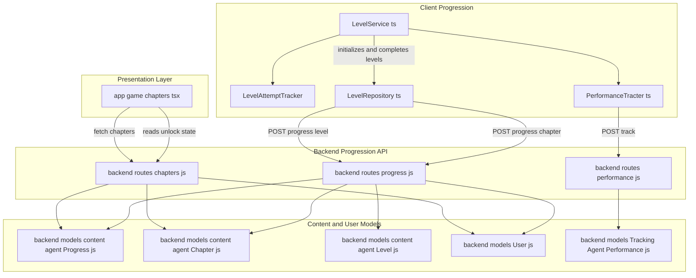
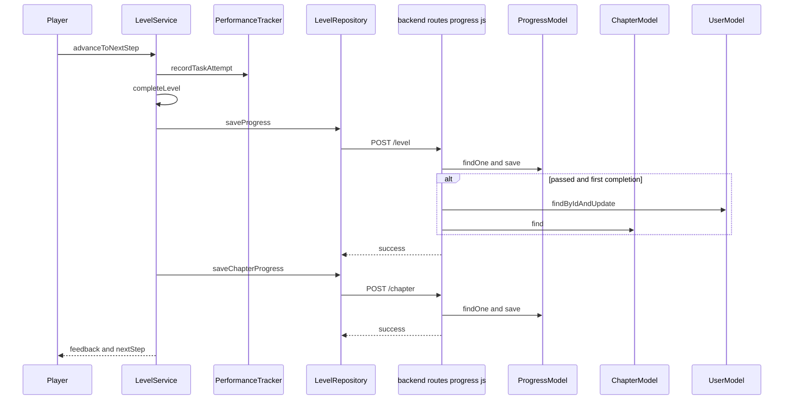
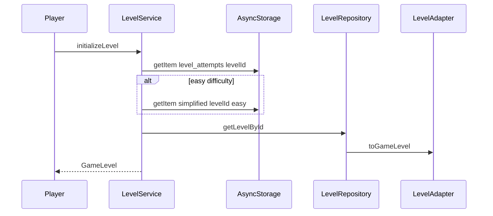
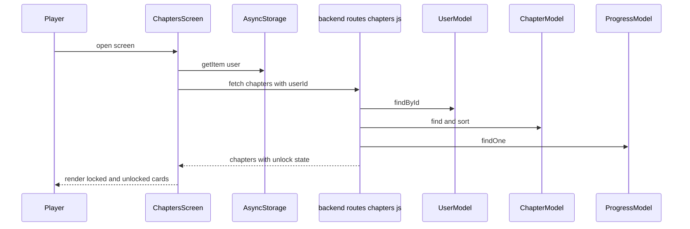
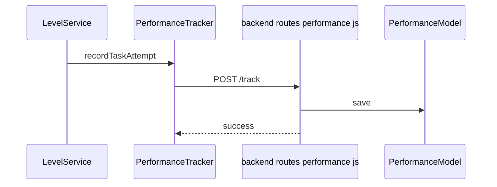

# Learning Content and Progression

## Overview

This feature is the persistence backbone for level completion, chapter completion, stars, token rewards, and chapter unlock state. On the client, `LevelService` finishes a level, saves the result, and immediately pushes chapter progress so the backend can decide whether the chapter is fully passed and whether tokens should be awarded.

On the backend, `backend/routes/progress.js` stores per-level and per-chapter progress, increments `User.level` on first completion, computes `totalStars`, awards chapter tokens once, and exposes progress for chapter and unlock rendering. `backend/routes/chapters.js` then reads that stored progress to return chapter cards with `locked`, `status`, and star totals already resolved for the UI.

## Architecture Overview



## Progress Records and Stored State

### Progress Document Shape

*`backend/models/content agent/Progress.js`*

This model file is not shown directly, but its persisted shape is visible through `backend/routes/progress.js` and `backend/routes/chapters.js`.

| Field | Type | Used for |
| --- | --- | --- |
| `userId` | string | Groups all progress for one player |
| `levelProgress` | array | Stores one entry per completed or attempted level |
| `chapterProgress` | array | Stores one entry per chapter |
| `totalStars` | number | Stores the sum of stars from passed levels |
| `unlockedChapters` | array | Returned by the level progress API and read by the UI path |


#### `levelProgress` entry fields

| Field | Type | Used for |
| --- | --- | --- |
| `levelId` | string | Identifies the completed level |
| `chapterId` | string | Links the level to its chapter |
| `attempts` | number | Stores attempt count sent from the client |
| `passed` | boolean | Marks whether the level is cleared |
| `starsEarned` | number | Stores the best star result for that level |
| `lastAttemptAt` | Date | Records the most recent attempt time |
| `completedAt` | Date | Records the completion time |
| `servedDifficulty` | string | Written as `'base'` in the shown route |
| `servedLanguage` | string | Written as `'base'` in the shown route |


#### `chapterProgress` entry fields

| Field | Type | Used for |
| --- | --- | --- |
| `chapterId` | string | Identifies the chapter |
| `status` | string | `active` or `passed` |
| `starsEarned` | number | Sum of stars from passed levels in the chapter |
| `startedAt` | Date | Set on the first chapter write |
| `completedAt` | Date | Set once when the chapter first becomes passed |


### Chapter Schema

*`backend/models/content agent/Chapter.js`*

| Property | Type | Description |
| --- | --- | --- |
| `title` | `String` | Chapter title |
| `description` | `String` | Chapter summary text |
| `coverImage` | `String` | Chapter image URL |
| `tags` | `TagsSchema` | Tagging metadata for routing and moderation |
| `taggingStatus` | `String` | `pending`, `approved`, or `flagged` |
| `failThreshold` | `FailThresholdSchema` | Retry and pass-rate thresholds |
| `unlockedOn` | `Number` | User level required to unlock the chapter |
| `isActive` | `Boolean` | Draft or soft-delete toggle |


#### `TagsSchema`

| Property | Type | Description |
| --- | --- | --- |
| `environment` | `String` | `park`, `house`, `school`, `forest`, `market`, `street`, `online` |
| `skills` | `[String]` | `language`, `social`, `motor`, `focus`, `memory`, `emotional`, `safety` |
| `difficulty` | `String` | `easy`, `medium`, `hard` |
| `difficultyScore` | `Number` | Numeric difficulty score from 1 to 3 |
| `ageRange` | `[String]` | `4-6`, `6-8`, `8-10` |
| `emotionalTheme` | `String` | `friendship`, `sharing`, `courage`, `trust`, `boundaries`, `empathy` |
| `source` | `String` | Defaults to `ai` |


#### `FailThresholdSchema`

| Property | Type | Description |
| --- | --- | --- |
| `maxRetriesPerLevel` | `Number` | Defaults to `3` |
| `minPassRate` | `Number` | Defaults to `0.6` |


### Level Schema Used for Chapter Completion

*`backend/models/content agent/Level.js`*

The level model file is not shown directly, but `backend/routes/progress.js` reads it with `Level.find({ chapterId })` to count how many levels belong to a chapter.

| Field | Type | Used for |
| --- | --- | --- |
| `chapterId` | document reference or id field used by `Level.find({ chapterId })` | Counts chapter levels during chapter completion |


### User Schema

*`backend/models/User.js`*

#### `petSchema`

| Property | Type | Description |
| --- | --- | --- |
| `color` | `String` | Pet color |
| `accessory` | `String` | Pet accessory such as `bow`, `hat`, or `scarf` |
| `name` | `String` | Pet name chosen by the user |


#### `avatarSchema`

| Property | Type | Description |
| --- | --- | --- |
| `hair` | `String` | Avatar hair style |
| `skin` | `String` | Avatar skin tone |
| `top` | `String` | Avatar top |
| `bottom` | `String` | Avatar bottom |
| `shoes` | `String` | Avatar shoes |
| `accessory` | `String` | Avatar accessory |
| `pet` | `petSchema` | Nested pet customization |


#### `TokenEntrySchema`

| Property | Type | Description |
| --- | --- | --- |
| `amount` | `Number` | Token amount added to the ledger |
| `reason` | `String` | Ledger reason such as `chapter_complete` or `bonus` |
| `chapterId` | `Schema.Types.ObjectId` | References `"Chapter"` |
| `earnedAt` | `Date` | Defaults to `Date.now` |


#### `userSchema`

| Property | Type | Description |
| --- | --- | --- |
| `name` | `String` | User display name |
| `username` | `String` | Unique username |
| `email` | `String` | Unique email |
| `password` | `String` | Hashed password |
| `parentId` | `Schema.Types.ObjectId` | References `"Parent"` |
| `avatar` | `avatarSchema` | Avatar customization data |
| `level` | `Number` | User level used to unlock chapters |
| `profile.dateOfBirth` | `Date` | User date of birth |
| `profile.ageRange` | `String` | `4-6`, `6-8`, or `8-10` |
| `profile.language` | `String` | Defaults to `"en"` |
| `profile.readingLevel` | `String` | `beginner`, `intermediate`, or `advanced` |
| `tokens` | `Number` | Token balance increased on chapter completion |
| `tokenLedger` | `[TokenEntrySchema]` | Token history |
| `friends` | `Schema.Types.ObjectId[]` | References `"User"` |
| `friendCode` | `String` | Unique generated code |
| `communityEnabled` | `Boolean` | Parent-controlled community access |
| `isActive` | `Boolean` | Active user toggle |
| `createdAt` | `Date` | Record creation time |


#### `ParentSchema`

| Property | Type | Description |
| --- | --- | --- |
| `name` | `String` | Parent name |
| `username` | `String` | Unique parent username |
| `email` | `String` | Unique parent email |
| `password` | `String` | Hashed password |
| `children` | `Schema.Types.ObjectId[]` | References `"User"` |
| `permissions` | `Map` | Per-child permission map |
| `notificationEmail` | `String` | Email used for reports |
| `isActive` | `Boolean` | Active parent toggle |


#### `permissions` value schema

| Property | Type | Description |
| --- | --- | --- |
| `communityAccess` | `Boolean` | Controls community access for a child |
| `diaryAiSuggestions` | `Boolean` | Controls diary AI suggestions |
| `insightReports` | `Boolean` | Controls insight reports |


## Client Level Progression Service

### Level Session Contracts

*`app/services/LevelService.ts`*

#### `GameSession`

| Property | Type | Description |
| --- | --- | --- |
| `levelId` | `string` | Current level id |
| `chapterId` | `string` | Current chapter id |
| `level` | `GameLevel` | Adapted level payload |
| `currentSceneIndex` | `number` | Current scene position |
| `currentStepIndex` | `number` | Current step position |
| `starsEarned` | `number` | Remaining stars tracked during the session |
| `attempts` | `number` | Accumulated failed attempts |
| `startTime` | `number` | Session start timestamp |
| `completed` | `boolean` | Completion guard |
| `answers` | `AnswerRecord[]` | Answer history |


#### `AnswerRecord`

| Property | Type | Description |
| --- | --- | --- |
| `stepId` | `string` | Step id being answered |
| `answer` | `any` | Raw answer payload |
| `isCorrect` | `boolean` | Whether the answer was correct |
| `timestamp` | `number` | Capture time |
| `attempts` | `number` | Attempts spent on the step |


#### `StepResult`

| Property | Type | Description |
| --- | --- | --- |
| `success` | `boolean` | Whether the step advanced successfully |
| `feedback` | `string` | Optional feedback text |
| `nextStep` | `GameStep \ | null` | Next step or completion signal |
| `starsDeducted` | `number` | Stars removed for a wrong answer |


### Level Attempt Tracker

*`app/services/LevelService.ts`*

This singleton keeps a per-level wrong-choice counter in memory and mirrors it to `AsyncStorage` under `level_attempts_${levelId}`.

| Property | Type | Description |
| --- | --- | --- |
| `instance` | `LevelAttemptTracker` | Singleton instance |
| `attempts` | `Map<string, { count: number, wrongChoices: number }>` | Per-level attempt counters |


| Method | Description |
| --- | --- |
| `recordAttempt` | Increments the per-level count, increments wrong choices when needed, and persists the updated counters to `AsyncStorage` |
| `shouldSimplify` | Reads `level_attempts_${levelId}` and returns `true` after at least 2 attempts with at least 2 wrong choices |


### Level Service

*`app/services/LevelService.ts`*

The service is instantiated once as `levelService` and manages the active session, stars, difficulty, performance tracking, and completion writes.

| Property | Type | Description |
| --- | --- | --- |
| `attemptTracker` | `LevelAttemptTracker` | Singleton attempt tracker |
| `currentSession` | `GameSession \ | null` | Active level session |
| `performanceTracker` | `PerformanceTracker \ | null` | Per-session telemetry tracker |
| `currentDifficulty` | `'easy' \ | 'medium' \ | 'hard'` | Selected difficulty |
| `levelRetrialCount` | `number` | Retry counter |
| `wrongChoiceCount` | `number` | Wrong answer counter for the current run |


| Method | Description |
| --- | --- |
| `initializeLevel` | Loads the raw level, adapts it with `LevelAdapter.toGameLevel`, restores the current attempt count, seeds the session, and caches simplified easy-mode content when needed |
| `advanceToNextStep` | Advances the session, records telemetry for task steps, deducts stars on wrong answers, and calls `completeLevel` when the level ends |
| `getCurrentStep` | Returns the current `GameStep` or `null` when the session is exhausted |
| `getProgress` | Returns step count, total steps, remaining stars, and percent complete |
| `getPerformanceSummary` | Returns the current telemetry summary from `PerformanceTracker` |
| `clearLevelCache` | Removes the simplified easy-mode cache for a level |
| `destroy` | Clears the active session and telemetry tracker |
| `getStars` | Returns the session’s current star total |


#### Level Service flow

`initializeLevel` first calls `getAccumulatedAttempts(levelId)`, then checks `getCachedSimplifiedLevel(levelId)` when difficulty is `easy`. If a cached simplified level exists, the service skips adaptation and creates `currentSession` immediately with `starsEarned` seeded from `cached.reward?.stars || 3`.

`advanceToNextStep` uses the current step type to decide whether to record telemetry, adjust stars, insert continuation steps, or finish the level. When the session runs out of steps, `completeLevel` writes level progress and then triggers chapter progress.

#### Level completion save path



#### Session initialization flow



## Client Data Flow and Persistence

### `app/repositories/LevelRepository.ts`

> **Note:** `completeLevel` saves progress only once because of the `currentSession.completed` guard. The same method also records the level attempt only when `wrongChoiceCount > 0`, so a clean pass does not add a failed-attempt record.

This repository is the client-side persistence gateway. It uses `AsyncStorage`, a 5 minute in-memory cache, a retry queue for failed saves, and direct calls to the progress routes.

| Property | Type | Description |
| --- | --- | --- |
| `levelCache` | `Map<string, LevelData>` | Cached level payloads |
| `chapterCache` | `Map<string, LevelData[]>` | Cached chapter level lists |
| `progressCache` | `Map<string, LevelProgress>` | Cached progress responses |
| `CACHE_DURATION` | `readonly` | Five minute cache window |
| `cacheTimestamps` | `Map<string, number>` | Last write times for cache entries |
| `apiUrl` | `string` | API base URL from `EXPO_PUBLIC_API_URL` or `http://localhost:5000/api` |
| `checkpointCache` | `Map<string, LevelCheckpoint>` | Cached checkpoints |


| Method | API Endpoint | Description | Caching |
| --- | --- | --- | --- |
| `getLevelById` | `GET /levels/:levelId` | Loads one level, checks memory cache, then `AsyncStorage`, then backend | Reads and populates cache |
| `getLevelsByChapter` | `GET /levels?chapterId=&sort=order` | Loads all levels in a chapter | Reads and populates cache |
| `saveProgress` | `POST /progress/level` | Saves a completed level, stores a local snapshot, and invalidates the in-memory level cache | Writes local snapshot and clears `levelId` cache |
| `getUserProgress` | `GET /progress/:userId/:levelId` | Loads a cached or remote progress record | Reads cache first |
| `preloadNextLevels` | none | Preloads the next two levels in the chapter | Uses level cache |
| `saveCheckpoint` | `POST /progress/checkpoint` | Stores a checkpoint locally and sends it to the API | Uses checkpoint cache |
| `saveChapterProgress` | `POST /progress/chapter` | Sends chapter completion updates after every level finish | No local cache write |
| `getCheckpoint` | none | Reads a checkpoint from cache or `AsyncStorage` | Uses checkpoint cache |


#### Caching and storage keys

| Key | Used by | Purpose |
| --- | --- | --- |
| `level_${levelId}` | `getLevelById` and `saveToAsyncStorage` | Level payload cache |
| `level_chapter_${chapterId}` | `getLevelsByChapter` and `saveToAsyncStorage` | Chapter level list cache |
| `level_progress_${userId}_${levelId}` | `saveProgress` and `getUserProgress` | Persisted progress snapshot |
| `level_progress_retry_queue` | `queueForRetry` | Retry queue for failed progress saves |
| `simplified_${levelId}_easy` | `cacheSimplifiedLevel` and `getCachedSimplifiedLevel` | Easy-mode simplified level cache |
| `level_attempts_${levelId}` | `LevelAttemptTracker` | Attempt count and wrong-choice persistence |


### Progress Routes

> **Note:** `LevelRepository.getUserProgress` calls `/progress/${userId}/${levelId}`, but `backend/routes/progress.js` only defines `GET '/:userId'`. In the provided code, that helper has no matching backend route. `saveCheckpointToAPI` also targets `/progress/checkpoint`, which is not defined in the visible progress route file.

*`backend/routes/progress.js`*

These routes handle the actual progress persistence for levels and chapters. The file also calculates unlocks from user level and chapter thresholds.

| Route | Responsibility |
| --- | --- |
| `POST /level` | Saves one level progress record, updates `totalStars`, increments `User.level` on first completion, and returns newly unlocked chapters |
| `POST /chapter` | Updates the chapter progress record, marks a chapter passed when all chapter levels are cleared, and awards tokens once |
| `GET /:userId` | Returns the stored progress document populated with level and chapter references |


#### Save Level Progress

```api
{
    "title": "Save Level Progress",
    "description": "Persists a completed level, updates stars, and evaluates unlocks",
    "method": "POST",
    "baseUrl": "http://localhost:5000/api/progress",
    "endpoint": "/level",
    "headers": [
        {
            "key": "Content-Type",
            "value": "application/json",
            "required": true
        }
    ],
    "queryParams": [],
    "pathParams": [],
    "bodyType": "json",
    "requestBody": "{\n    \"userId\": \"user_123\",\n    \"levelId\": \"level_1\",\n    \"chapterId\": \"chapter_park\",\n    \"starsEarned\": 3,\n    \"passed\": true,\n    \"attempts\": 2,\n    \"lastAttemptAt\": \"2026-05-12T10:15:00.000Z\",\n    \"completedAt\": \"2026-05-12T10:15:30.000Z\"\n}",
    "formData": [],
    "rawBody": "",
    "responses": {
        "200": {
            "description": "Level progress saved",
            "body": "{\n    \"success\": true,\n    \"progress\": {\n        \"userId\": \"user_123\",\n        \"levelProgress\": [\n            {\n                \"levelId\": \"level_1\",\n                \"chapterId\": \"chapter_park\",\n                \"attempts\": 2,\n                \"passed\": true,\n                \"starsEarned\": 3,\n                \"lastAttemptAt\": \"2026-05-12T10:15:00.000Z\",\n                \"completedAt\": \"2026-05-12T10:15:30.000Z\",\n                \"servedDifficulty\": \"base\",\n                \"servedLanguage\": \"base\"\n            }\n        ],\n        \"chapterProgress\": [\n            {\n                \"chapterId\": \"chapter_park\",\n                \"status\": \"active\",\n                \"starsEarned\": 0,\n                \"startedAt\": \"2026-05-12T10:10:00.000Z\"\n            }\n        ],\n        \"totalStars\": 3,\n        \"unlockedChapters\": [\n            \"chapter_school\"\n        ]\n    },\n    \"levelUp\": true,\n    \"newUnlocks\": [\n        \"chapter_school\"\n    ]\n}"
        },
        "400": {
            "description": "Missing required fields",
            "body": "{\n    \"message\": \"chapterId is required\",\n    \"levelId\": \"level_1\"\n}"
        }
    }
}
```

#### Save Chapter Progress

```api
{
    "title": "Save Chapter Progress",
    "description": "Upserts chapter progress, checks chapter completion, and awards tokens once",
    "method": "POST",
    "baseUrl": "http://localhost:5000/api/progress",
    "endpoint": "/chapter",
    "headers": [
        {
            "key": "Content-Type",
            "value": "application/json",
            "required": true
        }
    ],
    "queryParams": [],
    "pathParams": [],
    "bodyType": "json",
    "requestBody": "{\n    \"userId\": \"user_123\",\n    \"chapterId\": \"chapter_park\",\n    \"completedLevelId\": \"level_1\",\n    \"starsEarned\": 3\n}",
    "formData": [],
    "rawBody": "",
    "responses": {
        "200": {
            "description": "Chapter progress saved",
            "body": "{\n    \"success\": true,\n    \"progress\": {\n        \"userId\": \"user_123\",\n        \"levelProgress\": [\n            {\n                \"levelId\": \"level_1\",\n                \"chapterId\": \"chapter_park\",\n                \"attempts\": 2,\n                \"passed\": true,\n                \"starsEarned\": 3,\n                \"lastAttemptAt\": \"2026-05-12T10:15:00.000Z\",\n                \"completedAt\": \"2026-05-12T10:15:30.000Z\",\n                \"servedDifficulty\": \"base\",\n                \"servedLanguage\": \"base\"\n            }\n        ],\n        \"chapterProgress\": [\n            {\n                \"chapterId\": \"chapter_park\",\n                \"status\": \"passed\",\n                \"starsEarned\": 12,\n                \"startedAt\": \"2026-05-12T10:10:00.000Z\",\n                \"completedAt\": \"2026-05-12T10:20:00.000Z\"\n            }\n        ],\n        \"totalStars\": 12,\n        \"unlockedChapters\": []\n    },\n    \"allPassed\": true,\n    \"tokensAwarded\": 80\n}"
        },
        "400": {
            "description": "Missing required fields",
            "body": "{\n    \"message\": \"userId, chapterId, and completedLevelId are required\"\n}"
        }
    }
}
```

#### Get Progress for User

```api
{
    "title": "Get Progress for User",
    "description": "Returns the persisted progress document for one user",
    "method": "GET",
    "baseUrl": "http://localhost:5000/api/progress",
    "endpoint": "/:userId",
    "headers": [],
    "queryParams": [],
    "pathParams": [
        {
            "key": "userId",
            "value": "user_123",
            "required": true
        }
    ],
    "bodyType": "none",
    "requestBody": "",
    "formData": [],
    "rawBody": "",
    "responses": {
        "200": {
            "description": "Progress document returned",
            "body": "{\n    \"userId\": \"user_123\",\n    \"levelProgress\": [\n        {\n            \"levelId\": {\n                \"_id\": \"level_1\",\n                \"title\": \"First Steps\"\n            },\n            \"chapterId\": \"chapter_park\",\n            \"attempts\": 2,\n            \"passed\": true,\n            \"starsEarned\": 3,\n            \"lastAttemptAt\": \"2026-05-12T10:15:00.000Z\",\n            \"completedAt\": \"2026-05-12T10:15:30.000Z\"\n        }\n    ],\n    \"chapterProgress\": [\n        {\n            \"chapterId\": {\n                \"_id\": \"chapter_park\",\n                \"title\": \"The Park\"\n            },\n            \"status\": \"passed\",\n            \"starsEarned\": 12,\n            \"startedAt\": \"2026-05-12T10:10:00.000Z\",\n            \"completedAt\": \"2026-05-12T10:20:00.000Z\"\n        }\n    ],\n    \"totalStars\": 12,\n    \"unlockedChapters\": [\n        \"chapter_school\"\n    ]\n}"
        },
        "200_empty": {
            "description": "No progress stored yet",
            "body": "{\n    \"levelProgress\": [],\n    \"chapterProgress\": [],\n    \"totalStars\": 0,\n    \"unlockedChapters\": []\n}"
        }
    }
}
```

#### Progress route behavior

`POST /level` writes or updates a `levelProgress` entry. It then recomputes `totalStars` by summing only the passed levels, so stars from failed attempts do not contribute to the total. When the route sees `passed: true`, it increments `User.level` and calls `evaluateChapterUnlocks` to return chapters that now satisfy `chapter.unlockedOn <= user.level`.

`POST /chapter` reads every level in the chapter from `Level.find({ chapterId })`, compares that set to `progress.levelProgress`, and marks the chapter `passed` only when every level in that chapter has `passed: true`. On the first transition to `passed`, it writes `completedAt` and calls `awardTokens`.

#### Chapter reward logic

> **Note:** `router.post('/level')` computes `isFirstCompletion` after it writes the new `levelProgress` entry. If the user already had a progress row for that level, the freshly written `passed: true` value makes the `!progress.levelProgress[existingLevelIndex]?.passed` check false, so the `levelUp` branch does not run on that first successful replay. **Note:** `evaluateChapterUnlocks` checks `user.unlockedChapters`, but `backend/models/User.js` does not define that field and this route does not write it. In this code, unlock persistence is driven by `User.level` and `Chapter.unlockedOn`, not by a stored `unlockedChapters` array.

`awardTokens` gives a fixed base amount of `20` plus `5` tokens per star earned in that chapter. It updates both `User.tokens` and `User.tokenLedger`, and writes the ledger reason as `chapter_complete`.

### Chapter Unlock Display

*`backend/routes/chapters.js`*

This route reads both `Chapter` and `Progress` to build the chapter list that the UI renders. It joins chapter definitions with chapter progress so the response already contains `locked`, `status`, and star totals.

#### Get Chapters With Unlock State

```api
{
    "title": "Get Chapters With Unlock State",
    "description": "Returns chapters with unlock and progress information for one user",
    "method": "GET",
    "baseUrl": "http://localhost:5000/api/chapters",
    "endpoint": "/",
    "headers": [],
    "queryParams": [
        {
            "key": "userId",
            "value": "user_123",
            "required": true
        }
    ],
    "pathParams": [],
    "bodyType": "none",
    "requestBody": "",
    "formData": [],
    "rawBody": "",
    "responses": {
        "200": {
            "description": "Chapter list returned",
            "body": "{\n    \"chapters\": [\n        {\n            \"id\": \"chapter_park\",\n            \"title\": \"The Park\",\n            \"description\": \"Learn park safety and social skills\",\n            \"unlockedOn\": 1,\n            \"levelCount\": 4,\n            \"unlocked\": true,\n            \"status\": \"passed\",\n            \"starsEarned\": 12,\n            \"totalStarsPossible\": 12\n        }\n    ],\n    \"userLevel\": 2\n}"
        },
        "404": {
            "description": "User missing",
            "body": "{\n    \"message\": \"User not found\"\n}"
        }
    }
}
```

#### Chapter list resolution

`chapterroutes.get("/")` looks up the user, sorts chapters by `unlockedOn`, and builds a `chapterProgressMap` from `progress.chapterProgress`. The chapter card state is then derived from `chapter.unlockedOn <= user.level`, while progress status comes from the stored `Progress` document.

### Chapter List UI

*`app/game/chapters.tsx`*

This screen is the consumer of unlock persistence. It loads the current user from `AsyncStorage`, fetches chapters with `userId`, and renders the cards in locked or unlocked states. The `Start` button is enabled only when `chapter.unlocked` is true, and the component routes into `/game/[chapterId]` with `chapterId` and `chapterTitle`.

| State | Type | Purpose |
| --- | --- | --- |
| `currentIndex` | `number` | Scroll position for the chapter carousel |
| `userName` | `string` | Display name loaded from `AsyncStorage` |
| `userId` | `string \ | null` | Backend lookup key |
| `userLevel` | `number` | Used to derive `chapter.unlocked` |
| `chapters` | `Chapter[]` | Normalized chapter cards |
| `loading` | `boolean` | Controls the loading indicator |


The component accepts both array and wrapped response shapes. It normalizes each chapter with `String(chapter.id ?? chapter._id)`, `chapter.title || chapter.name || "Untitled Chapter"`, and `chapter.levels?.length ?? chapter.levelCount ?? 0`.

#### Chapter screen sequence



## Performance Tracking

### Performance Tracker

*`app/services/PerformanceTracter.ts`*

This service records answer timing and correctness for the current play session, then forwards each task attempt to the backend tracking route.

#### Constructor dependencies

| Type | Description |
| --- | --- |
| `string` | `userId` stored in the tracker |
| `string` | `levelId` stored in the tracker |


#### `PerformanceData`

| Property | Type | Description |
| --- | --- | --- |
| `userId` | `string` | Player id |
| `levelId` | `string` | Level id |
| `timestamp` | `Date` | Time of the task record |
| `sessionId` | `string` | Session identifier |
| `taskId` | `string` | Task identifier |
| `taskType` | `string` | Optional task type |
| `correct` | `boolean` | Whether the answer was correct |
| `timeTaken` | `number` | Time spent on the task |
| `tasksAttempted` | `number` | Running attempted count |
| `tasksCorrect` | `number` | Running correct count |
| `accuracy` | `number` | Current accuracy percentage |
| `averageResponseTime` | `number` | Average time across recorded tasks |
| `hesitationCount` | `number` | Optional hesitation metric |
| `abandonedTasks` | `number` | Optional abandoned task count |
| `previousAccuracy` | `number` | Previous accuracy snapshot |
| `trendDirection` | `'improving' \ | 'declining' \ | 'stable'` | Trend label |


| Method | Description |
| --- | --- |
| `recordTaskAttempt` | Builds a record from the current session, appends it to `sessionData`, and sends it to the backend |
| `getCurrentPerformance` | Returns a live summary using the most recent task records |
| `getSummary` | Returns a formatted summary string |
| `clear` | Resets the recorded session data |
| `getTaskCount` | Returns the number of recorded tasks |
| `getRecentTasks` | Returns the most recent tasks |
| `hasData` | Returns whether any task data exists |


`LevelService.advanceToNextStep` calls `recordTaskAttempt` before it advances the session so each task contributes to the live performance summary.

#### Performance tracking flow



#### Track Performance

```api
{
    "title": "Track Performance",
    "description": "Stores one task-level telemetry record",
    "method": "POST",
    "baseUrl": "http://localhost:5000/api/performance",
    "endpoint": "/track",
    "headers": [
        {
            "key": "Content-Type",
            "value": "application/json",
            "required": true
        }
    ],
    "queryParams": [],
    "pathParams": [],
    "bodyType": "json",
    "requestBody": "{\n    \"userId\": \"user_123\",\n    \"levelId\": \"level_1\",\n    \"sessionId\": \"user_123_level_1_1715500000000\",\n    \"taskId\": \"morning_q1\",\n    \"taskType\": \"choice\",\n    \"correct\": true,\n    \"timeTaken\": 4.2,\n    \"accuracy\": 75,\n    \"averageResponseTime\": 4.2,\n    \"timestamp\": \"2026-05-12T10:15:00.000Z\"\n}",
    "formData": [],
    "rawBody": "",
    "responses": {
        "200": {
            "description": "Performance record accepted",
            "body": "{\n    \"success\": true\n}"
        }
    }
}
```

### Performance Model

> **Note:** `performanceRouter.post('/track')` returns `res.status(200).json({ success: true })` before the later `res.status(200).json({ success: true, message: , id:  })` line, so the second response is unreachable in the provided route code.

*`backend/models/Tracking Agent/Performance.js`*

| Property | Type | Description |
| --- | --- | --- |
| `userId` | `String` | Indexed player id |
| `levelId` | `String` | Level id |
| `sessionId` | `String` | Session id |
| `taskId` | `String` | Task id |
| `taskType` | `String` | Optional task type |
| `correct` | `Boolean` | Correctness flag |
| `timeTaken` | `Number` | Time spent |
| `accuracy` | `Number` | Accuracy snapshot |
| `averageResponseTime` | `Number` | Average response time |
| `timestamp` | `Date` | Creation time |


## State Management

### Session and persistence split

- `currentSession` in `LevelService` holds in-memory progress for the active level only.
- `Progress` documents in the backend hold the durable record for level and chapter completion.
- `User.level` is the unlock gate used by `backend/routes/chapters.js`.
- `tokens` and `tokenLedger` on `User` are the durable reward sink for chapter completion.

### Singleton and per-session patterns

- `levelService` is exported as a singleton.
- `levelRepository` is exported as a singleton.
- `LevelAttemptTracker.getInstance()` keeps one shared attempt tracker across the app runtime.
- `PerformanceTracker` is created per level session inside `initializeLevel`.

### UI state in `app/game/chapters.tsx`

- `loading` shows the spinner while chapters are fetched.
- `chapters` becomes the rendered source of truth for card state.
- `userLevel` drives `chapter.unlocked`.
- `currentIndex` drives carousel navigation.

## Caching Strategy

### Level and progress caches

| Cache | Owner | Key pattern | Expiry or invalidation |
| --- | --- | --- | --- |
| Level payload cache | `LevelRepository` | `level_${levelId}` | 5 minute in-memory TTL and `_cachedAt` freshness check in `AsyncStorage` |
| Chapter level list cache | `LevelRepository` | `level_chapter_${chapterId}` | 5 minute in-memory TTL |
| Progress snapshot cache | `LevelRepository` | `level_progress_${userId}_${levelId}` | Written after successful `saveProgress` |
| Retry queue | `LevelRepository` | `level_progress_retry_queue` | Used when `saveProgress` fails |
| Simplified easy level cache | `LevelService` | `simplified_${levelId}_easy` | 7 day TTL; removed by `clearLevelCache` |
| Attempt persistence | `LevelAttemptTracker` | `level_attempts_${levelId}` | Updated on every wrong-choice completion |


### Invalidation triggers

- `saveProgress` calls `invalidateCache(progress.levelId)` after a successful write.
- `clearLevelCache(levelId)` removes `simplified_${levelId}_easy`.
- `clearExpiredCache()` removes expired in-memory entries.
- `cacheSimplifiedLevel` stores a timestamp so `getCachedSimplifiedLevel` can reject stale data after 7 days.

## Error Handling

- `getAccumulatedAttempts` returns `0` when `AsyncStorage` reads fail.
- `getCachedSimplifiedLevel` returns `null` on read or parse failure.
- `cacheSimplifiedLevel` and `clearLevelCache` log failures without throwing.
- `LevelRepository.saveProgress` queues failed saves through `queueForRetry` instead of throwing.
- `backend/routes/progress.js` returns `400` when `userId`, `levelId`, `chapterId`, or `completedLevelId` is missing.
- `backend/routes/progress.js` and `backend/routes/chapters.js` return `500` on server errors.
- `backend/routes/chapters.js` returns `404` when the requested user does not exist.
- `app/game/chapters.tsx` clears `loading` in a `finally` block even when the fetch fails.

## Dependencies

- `AsyncStorage` in `app/services/LevelService.ts` and `app/repositories/LevelRepository.ts`
- `LevelAdapter.toGameLevel` for adapting raw level content before progress starts
- `levelRepository` for all progress writes and chapter progress updates
- `PerformanceTracker` for task telemetry during play sessions
- `express` in `backend/routes/progress.js`, `backend/routes/chapters.js`, and `backend/routes/performance.js`
- `mongoose` in `backend/models/User.js`, `backend/models/content agent/Chapter.js`, `backend/models/Tracking Agent/Performance.js`
- `bcryptjs` and `crypto` in `backend/models/User.js`
- `User`, `Chapter`, `Level`, and `Progress` for progress, unlock, and reward persistence

## Testing Considerations

- Verify that `completeLevel` writes the level progress only once per session.
- Verify that wrong answers reduce `starsEarned` and are reflected in the saved `starsEarned` value.
- Verify that `progress.totalStars` only sums passed level entries.
- Verify that chapter completion writes `status: 'passed'` only when every level in the chapter has a passed progress entry.
- Verify that `awardTokens` runs only on the first transition to a passed chapter.
- Verify that chapter unlocks are derived from `User.level` and `Chapter.unlockedOn` in the chapter list route.
- Verify that `app/game/chapters.tsx` renders locked chapters when `chapter.unlocked` is false.
- Verify that `LevelRepository.saveProgress` falls back to retry queuing on failed network saves.
- Verify that `LevelAttemptTracker.shouldSimplify` returns `true` after two wrong-choice completions.

## Key Classes Reference

| Class | Location | Responsibility |
| --- | --- | --- |
| `LevelService` | `LevelService.ts` | Runs active level sessions, saves level completion, and triggers chapter progress writes |
| `LevelAttemptTracker` | `LevelService.ts` | Persists per-level wrong-choice attempt counts |
| `LevelRepository` | `LevelRepository.ts` | Handles progress writes, level caching, and local persistence |
| `Progress.js` | `Progress.js` | Stores level and chapter progress records |
| `Chapter.js` | `Chapter.js` | Stores chapter unlock thresholds and chapter metadata |
| `Level.js` | `Level.js` | Supplies chapter level membership for completion checks |
| `User.js` | `User.js` | Stores player level, tokens, and token ledger |
| `chapters.js` | `chapters.js` | Returns chapter cards with unlock and progress state |
| `progress.js` | `progress.js` | Saves level and chapter completion and computes rewards |
| `PerformanceTracter.ts` | `PerformanceTracter.ts` | Records per-task telemetry during play |
| `Performance.js` | `Performance.js` | Stores task-level performance records |
