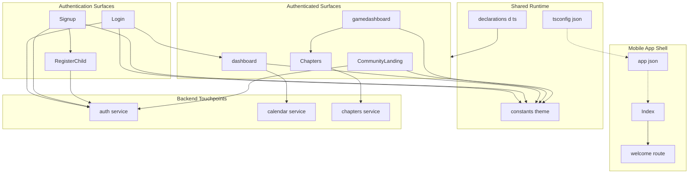
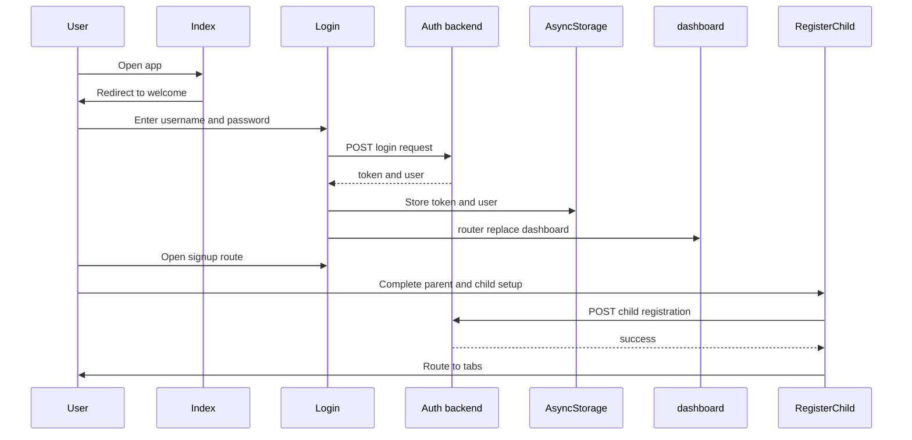
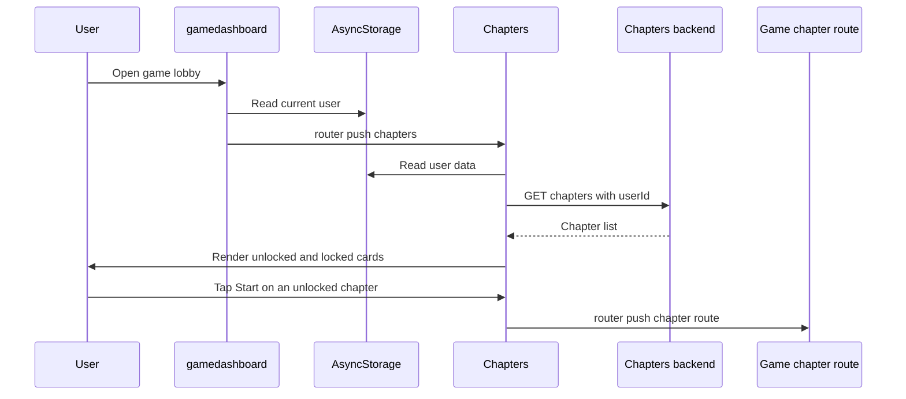

# System Overview and Runtime Boundaries

## Overview

This part of the app defines the runtime shape of the Expo client: which route files act as entrypoints, how the shell hands control to authentication and authenticated surfaces, and which shared config files keep the mobile runtime consistent across screens. The shell is route-driven through `expo-router`, with `app/index.tsx` acting as the startup gate and the route files under `app/` forming the visible user surfaces.

The same boundary also ties the client to backend-facing workflows. Authentication screens persist session state with `AsyncStorage`, the dashboard loads per-user calendar data, and the chapter browser uses stored user data to request chapters and decide which ones are unlocked. Shared design tokens in `constants/theme.ts`, SVG support in `declarations.d.ts`, and Expo manifest settings in `app.json` keep these surfaces aligned.

## Runtime Surface Map

| File | Surface role | Runtime behavior |
| --- | --- | --- |
| `app/index.tsx` | App startup gate | Immediately redirects to `/welcome`. |
| `app/login.tsx` | Authentication view | Posts login credentials, stores `token` and `user`, and routes to `/dashboard`. |
| `app/signup.tsx` | Account creation view | Posts signup data, stores `token` and `user`, then routes to `/register-child`. |
| `app/register-child.tsx` | Child registration view | Reads the parent user from `AsyncStorage`, posts child data, then routes to `/(tabs)`. |
| `app/dashboard.tsx` | Authenticated dashboard | Loads the current user, opens a calendar modal, and routes to the diary surface. |
| `app/game/main.tsx` | Game lobby | Loads the current user and routes to `/game/chapters` from the chapter button. |
| `app/game/chapters.tsx` | Chapter browsing surface | Loads the current user, fetches chapters by `userId`, renders locked and unlocked cards, and routes into a chapter play surface. |
| `app/community/main.tsx` | Community hub | Uses viewport size to lay out the hub and routes into avatar customization and friends list surfaces. |

## Architecture Overview

## Mobile App Shell

### `app/index.tsx`

This file is the startup handoff for the mobile app. It imports `Redirect` from `expo-router` and sends the initial route to `/welcome`, so the first runtime decision is made before any feature screen renders.

The file contains a single exported function, `Index`, and does not introduce its own UI state or local data flow.

### `app/dashboard.tsx`

`dashboard.tsx` is the authenticated home surface. It reads the stored `user` object from `AsyncStorage`, derives `userName` and `userId`, and opens a calendar modal only when the user taps the calendar card.

The screen also links into the diary surface through `router.push('/diary/Diary')` from `DiaryPreviewCard`. Its visible dashboard data is built from a `calendarDays` array with `date` and `status`, then normalized into `markedDates` for `RnCalendar`.

#### Dashboard data flow

| State or value | Source | Purpose |
| --- | --- | --- |
| `userName` | `AsyncStorage` `user` JSON | Personalizes the hero card. |
| `userId` | `AsyncStorage` `user` JSON | Identifies the calendar request target. |
| `calendarVisible` | Local `useState` | Opens and closes the calendar modal. |
| `calendarDays` | Backend response | Feeds the calendar markers. |
| `calendarLoading` | Local `useState` | Controls the loading spinner inside the modal. |

The calendar request uses `fetch(\`http://localhost:5000/api/calendar/${userId}\`)`, then reads `data.days || []`. The screen maps `status` values into marker colors:

- `missed` uses `#FF6B6B`
- `favorite` uses `#FFD700`
- all other statuses use `#7B61FF`

### `app/login.tsx`

`Login` is the sign-in surface. It collects `username` and `password`, validates that both are filled, and posts the payload to `http://localhost:5000/api/auth/login` with `Content-Type: application/json`.

On success, it writes `token` and `user` into `AsyncStorage`, passes the user into `useSessionStore` through `setUser`, and replaces the route with `/dashboard`. The screen keeps a `focusedField` value to style the active input and a `loading` flag to drive the submit button state.

#### Authentication boundary table

| File | Persisted data | Backend call | Next route |
| --- | --- | --- | --- |
| `app/login.tsx` | `token`, `user` | `POST http://localhost:5000/api/auth/login` | `/dashboard` |
| `app/signup.tsx` | `token`, `user` | `POST http://localhost:5000/api/auth/signup` | `/register-child` |
| `app/register-child.tsx` | none written on success in this file | `POST http://localhost:5000/api/auth/register-child` | `/(tabs)` |

### `app/signup.tsx`

`Signup` creates the parent account. It uses the same auth service base as `Login`, posts `name`, `username`, `email`, and `password`, and stores the returned `token` and `user` on success.

The route handoff is part of the runtime boundary: after account creation, the screen pushes `/register-child` so the parent can immediately create a child account in the same session flow. The screen also uses `focusedField` and `loading` state to control input emphasis and submit feedback.

### `app/register-child.tsx`

`RegisterChild` completes the account setup flow. It reads the stored parent user from `AsyncStorage`, extracts `user.id` into `parentId`, and refuses to submit if the parent record is missing.

The screen posts `name`, `username`, `email`, `password`, and `parentId` to `http://localhost:5000/api/auth/register-child`. When the backend returns success, it shows a success alert and routes to `/(tabs)`.

## Authenticated Home and Game Surfaces

### `app/game/main.tsx`

`gamedashboard` is the game lobby. It loads the current user from `AsyncStorage`, renders the pixel-art hero scene, and exposes the chapter browser through the `Chapter` button, which pushes `/game/chapters`.

The visible runtime boundary here is navigation rather than data loading. The screen keeps `userName` and `userId` in local state, but the chapter browsing handoff is the important user-facing transition.

### `app/game/chapters.tsx`

This file is the chapter browsing surface connected to the game lobby. It reads the stored `user` object from `AsyncStorage`, uses `user.id` and `user.level`, and then fetches chapters from `http://localhost:5000/api/chapters` with `userId` in the query string.

The response is normalized into a local `Chapter` type and rendered as a horizontally scrollable card stack. Unlocked chapters are shown as active cards with a `Start` button; locked chapters are dimmed, covered by a lock overlay, and disabled.

#### `Chapter` type

| Property | Type |
| --- | --- |
| `id` | `string` |
| `title` | `string` |
| `description` | `string` |
| `unlocked` | `boolean` |
| `levelCount` | `number` |

#### Chapter browsing states

| State | Trigger | UI response |
| --- | --- | --- |
| Loading | Initial fetch after `userId` is available | Shows `ActivityIndicator`. |
| Empty | The response yields no chapters | Shows `No chapters available yet.` |
| Unlocked | `chapter.unlocked` is true | Shows full card styling and active `Start` button. |
| Locked | `chapter.unlocked` is false | Shows lock overlay, reduced opacity, and disabled button. |
| Scrolling | User swipes or taps arrow buttons | Updates `currentIndex` and disables arrows at the ends. |

The route into the play surface uses `router.push({ pathname: '/game/[chapterId]', params: { chapterId: chapter.id, chapterTitle: chapter.title } })`, so the chapter browser is the last visible boundary before level execution.

### `app/community/main.tsx`

`CommunityLanding` is the social hub entrypoint. It uses `useWindowDimensions` to size the `Zarf` background and positions the main actions relative to the current viewport. The screen is wrapped in a `ScrollView`, which makes the hub usable across different heights.

The navigation boundary is explicit:

- `Customize` routes to `/community/components/avatar`
- `Join` routes to `/community/components/friendsList`
- `Friends List` also routes to `/community/components/friendsList`

This makes `app/community/main.tsx` a launchpad rather than a terminal screen.

## Shared Runtime Contracts

### `constants/theme.ts`

This file defines the shared design system used by the visible entrypoints. The app imports these tokens directly in `app/dashboard.tsx`, `app/login.tsx`, `app/signup.tsx`, `app/register-child.tsx`, `app/game/main.tsx`, `app/game/chapters.tsx`, and `app/community/main.tsx`.

| Export | Contents |
| --- | --- |
| `AppColors` | `lilac`, `blue`, `lilacLight`, `lilacMid`, `white`, `dark`, `gameBg`, `impressionsBg` |
| `AppFonts` | `title`, `header`, `subhead`, `body`, `bodySmall`, `button2`, `button` |
| `AppFontSizes` | `super`, `title`, `header`, `subhead`, `body`, `bodySmall`, `button`, `button2` |
| `ButtonStyles` | `icon`, `level`, `primary`, `action`, `bigAction`, `hugeAction` |
| `CardStyles` | `default`, `shadowVersion` |
| `Spacing` | `xs`, `sm`, `md`, `lg`, `xl`, `xxl` |
| `Colors` | `light`, `dark` |

`AppFonts` holds the font family tokens, including `Game Paused DEMO`, `PixelPurl`, and `yoster`. `Colors` remains a platform-selected theme map with light and dark palettes, while `AppColors` is the project-specific palette used across the current screens.

### `app.json`

`app.json` is the Expo manifest that defines the client shell identity and native runtime flags.

| Key or group | Value or role |
| --- | --- |
| `expo.name` | `parkette3` |
| `expo.slug` | `parkette3` |
| `expo.version` | `1.0.0` |
| `expo.orientation` | `portrait` |
| `expo.icon` | `./assets/images/icon.png` |
| `expo.scheme` | `parkette3` |
| `expo.userInterfaceStyle` | `automatic` |
| `expo.newArchEnabled` | `true` |
| `expo.ios.supportsTablet` | `true` |
| `expo.android.adaptiveIcon.backgroundColor` | `#E6F4FE` |
| `expo.android.adaptiveIcon.foregroundImage` | `./assets/images/android-icon-foreground.png` |
| `expo.android.adaptiveIcon.backgroundImage` | `./assets/images/android-icon-background.png` |
| `expo.android.adaptiveIcon.monochromeImage` | `./assets/images/android-icon-monochrome.png` |
| `expo.android.edgeToEdgeEnabled` | `true` |
| `expo.android.predictiveBackGestureEnabled` | `false` |
| `expo.web.output` | `static` |
| `expo.web.favicon` | `./assets/images/favicon.png` |
| `expo.plugins` | `expo-router`, `expo-splash-screen` |
| `expo.experiments.typedRoutes` | `true` |
| `expo.experiments.reactCompiler` | `true` |

The manifest directly supports the route-based shell by enabling `expo-router`, and it defines the splash experience through `expo-splash-screen`.

### `declarations.d.ts`

This file declares support for SVG imports:

- `declare module '*.svg'`
- imports `React`
- imports `SvgProps` from `react-native-svg`
- exports each SVG as `React.FC<SvgProps>`

That declaration is what makes the SVG assets used in the game and community surfaces importable as React components.

### `tsconfig.json`

`tsconfig.json` extends `expo/tsconfig.base`, keeps `strict` mode enabled, and defines the path alias `@/*` to `./*`. The same file also includes the Expo type outputs and several backend source files in the TypeScript include set:

- `backend/routes/ai.js`
- `backend/routes/performance.js`
- `backend/scripts/friendcode.js`

This makes the shared project boundary broader than the mobile app alone.

## Support Files

| File | Purpose |
| --- | --- |
| `backend/scripts/generateaidifficulty.ts` | Uses `Anthropic` and `Level` to generate `difficultyVariants.easy`, `difficultyVariants.medium`, and `difficultyVariants.hard` from active levels. |
| `backend/scripts/migratetokens.js` | Connects to MongoDB and removes `unlockedChapters` from `Progress` documents with `$unset`. |
| `scripts/reset-project.js` | CLI reset utility that moves or deletes `app`, `components`, `hooks`, `constants`, and `scripts`, then recreates `app/index.tsx` and `app/_layout.tsx`. |

## Feature Flows

### App Startup and Authentication Handoff

### Game Lobby to Chapter Browser

## State Management and Error Handling

The screens in this section use local React state instead of a shared view-model layer:

- `useState` stores form inputs, loading flags, modal visibility, and scroll position.
- `useEffect` hydrates user state from `AsyncStorage` and triggers data fetches after the required user identifier is available.
- `useMemo` in `app/dashboard.tsx` derives `markedDates` from the fetched calendar data.
- `useRef` in `app/game/chapters.tsx` keeps the horizontal scroll view controllable from the arrow buttons.

Error handling is implemented directly in the screens:

- `app/login.tsx`, `app/signup.tsx`, and `app/register-child.tsx` guard empty submissions with `Alert.alert`.
- The same screens catch network errors and show generic failure alerts.
- `app/register-child.tsx` checks for `parentId` before making the request and stops with an alert if it is missing.
- `app/dashboard.tsx` and `app/game/chapters.tsx` log fetch failures with `console.error` and always clear their loading states in `finally` blocks.

## Integration Points

- `expo-router` drives the route boundaries across `app/index.tsx`, `app/login.tsx`, `app/signup.tsx`, `app/register-child.tsx`, `app/dashboard.tsx`, `app/community/main.tsx`, `app/game/main.tsx`, and `app/game/chapters.tsx`.
- `AsyncStorage` is the shared persistence layer for `token`, `user`, and the parent lookup used by child registration.
- `useSessionStore` is updated in `app/login.tsx` and read by community surfaces to access the current user identity.
- `react-native-calendars` powers the dashboard calendar modal.
- The chapter browser depends on the backend chapters service and the user level stored in `AsyncStorage`.
- `constants/theme.ts` keeps the app’s visual language consistent across the auth, dashboard, game, and community surfaces.
- `declarations.d.ts` enables SVG asset imports for the game and community UI.

## Key Classes Reference

| Class | Responsibility |
| --- | --- |
| `index.tsx` | Startup redirect gate for the Expo router shell. |
| `login.tsx` | Collects credentials and establishes the authenticated session. |
| `signup.tsx` | Creates the parent account and advances to child setup. |
| `register-child.tsx` | Registers a child account using the stored parent identity. |
| `dashboard.tsx` | Authenticated home surface with calendar and diary entry. |
| `game main.tsx` | Game lobby that leads into chapter browsing. |
| `chapters.tsx` | Horizontal chapter browser with locked and unlocked card states. |
| `community main.tsx` | Community hub that routes into social and customization surfaces. |
| `theme.ts` | Shared colors, fonts, spacing, and card or button tokens. |
| `app.json` | Expo manifest for router, splash screen, platform, and experiment settings. |
| `declarations.d.ts` | SVG module declaration for React Native asset imports. |
| `tsconfig.json` | TypeScript boundary for aliases, strict mode, and included source sets. |
| `generateaidifficulty.ts` | Backend maintenance script that generates chapter difficulty variants. |
| `migratetokens.js` | Backend migration script that removes `unlockedChapters`. |
| `reset-project.js` | Project reset utility for restoring a clean Expo scaffold. |
